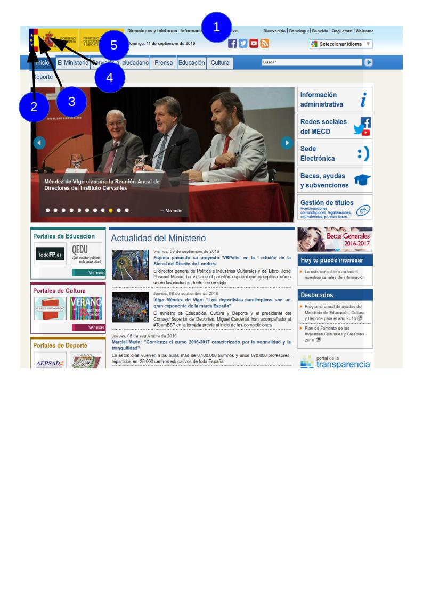
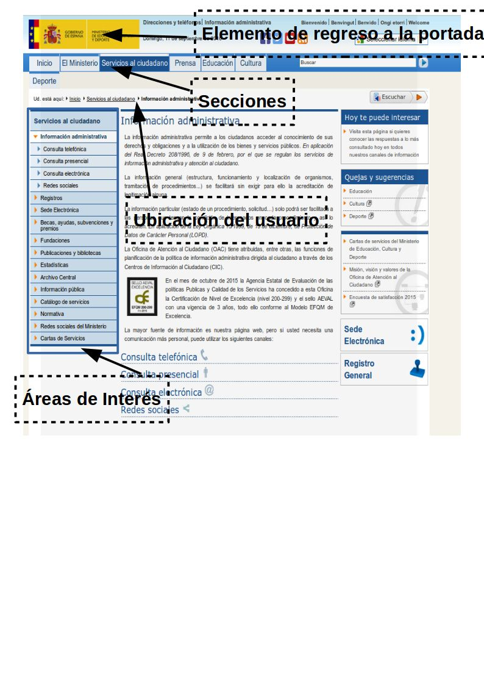

# Componentes y estructura

## Componentes de una interfaz Web.

Son muchos los elementos de los que puede estar compuesta una interfaz Web. El número de elementos empleados dependerá del objetivo del sitio. Así, un portal de noticias, o un portal de un organismo público seguramente utilizará un mayor número de elementos que una página Web de un restaurante o una página personal. Los más destacados son:
• Elementos de Identificación.
• Elementos de Navegación.
• Elementos de Contenidos.
• Elementos de Interacción.
Ejemplo sobre la portada del sitio Web del Ministerio de Educación y Ciencia. Esta portada cumple con las características de ser usable, visual, educativa y actualizada.

### Elementos de Identificación

Son aquellos que identifican plenamente al sitio Web. El usuario, a la vista de estos elementos, debe saber a quién pertenece el sitio Web.

En el ejemplo son: 1. Título: Portada - Ministerio de Educación y Ciencia 2. La imagen parcial de la bandera de la Unión Europea 3. La imagen parcial de la bandera de España 4. El escudo de España 5. Nombre del organismo titular del sitio We

### Elementos de Navegación

Son aquellos que están presentes en cada una de las pantallas de un sitio Web
Permiten al usuario moverse por las diferentes secciones del sitio y retornar de nuevo a la portada.

intuitivos para que el usuario sepa qué es lo que hay que hacer para acceder a un contenido en concreto:

- Haciendo clic en cualquier zona de la imagen se retorna a la Portada independientemente de la zona del sitio Web en la que se encuentre el usuario.
- Haciendo clic en las zonas enmarcadas con un rectangulo se accede a las diferentes páginas del sitio Además de los ya mencionados, hay otros elementos de navegación en la página de portada del sitio Web del Ministerio de Educación y Ciencia: Noticias de actualidad, Destacados, etcétera.

Si queremos que nuestra página sea usable, el usuario debe conseguir navegar por la página sin perderse y sin tener la sensación de perderse. Para conseguirlo, el sistema de navegación debería constar de una serie de elementos:

- Elemento de regreso a la portada.
- Menú de secciones y/o áreas de interés.
- Información sobre la ubicación del usuario dentro del sitioWeb.

  

### Elementos de Contenidos

Son las zonas en las que se muestra la información relevante de cada una de las páginas web que componen el sitio. Dentro de la zona de contenidos se debe distinguir la zona de Título del Contenido y la zona del Contenido propiamente dicho.

El contenido es la parte esencial de una página Web. Es importante que los contenidos estén expresados en un lenguaje claro y conciso y, presentados en un formato agradable y de fácil lectura.

La página de la portada del Ministerio de Educación y Ciencia vista anteriormente, no tiene Elementos de Contenido propiamente dichos porque todo en ella son elementos de Navegación.

Aunque no forma parte de la portada, la siguiente imagen muestra otra página del sitio Web del Ministerio de Educación y Ciencia donde sí podemos ver la zona de Contenidos.

### Elementos de Interacción.

Son las zonas del sitio Web en las que se ofrece la realización de acciones a los usuarios del sitio Web Haciendo clic en el menú contextual de la derecha le permite al usuario cambiar el idioma del sitio Web.

En la zona enmarcada en la barra del menu a la derecha de la imagen el usuario puede escribir un texto dentro del rectángulo blanco y, posteriormente, hacer clic en el rectángulo de fondo azul con el texto “Buscar” en negrita. Esto permite al usuario realizar búsquedas en el sitio Web de todo aquello que esté relacionado con lo que haya escrito dentro del rectángulo.

Los elementos que permiten la interacción son muy variados y cada uno de ellos cumple una función concreta:

- **Botón**. Elemento que permite al usuario realizar una acción. Se suele utilizar para su representación un rectángulo con efecto de relieve y con un texto escrito que sirve para orientar al usuario sobre la acción que se realizará al presionarlo. Su diseño debe mantenerse en todo el sitioWeb.
- **Áreas de texto**. Son rectángulos en los que el usuario puede escribir. Deben ir acompañadas de una etiqueta que describa el tipo de información que se le pide al usuario.
- **Botones de opción**. Son elementos excluyentes entre sí que están agrupados bajo una misma descripción. Constan de una circunferencia acompañada de un texto descriptivo. Se identifica el que está seleccionado porque contiene un círculo negro.
- **Casillas de verificación**. Al contrario de lo que sucede con los botones de opción, las casillas de verificación no son excluyentes entre sí. El usuario puede no seleccionar ninguna, o bien, seleccionar una, algunas o todas las casillas. Suelen ir agrupadas bajo una misma descripción y acompañadas cada una de ellas por un texto descriptivo. Tienen forma de cuadrado que cuando se selecciona queda marcado con una uve “V” o con una doble aspa “X”

### Conclusión

Como puedes ver por ejemplo aquí comentado, la portada del portal del Ministerio de Educación y Ciencia contiene Elementos de Identificación, Navegación e Interacción pero no contiene Elementos de Contenidos propiamente dichos.

## Maquetación Web.

A la hora de realizar la maquetación Web, deberemos pensar previamente:

- Cuáles son los elementos que va a contener cada una de nuestras páginas.
- Cómo irán colocados cada uno de esos elementos dentro de las páginas teniendo en cuenta siempre el espacio disponible, es decir, la ventana del navegador.

Si hemos hablado con el cliente, tendremos los datos suficientes para realizar una serie de bocetos preliminares de lo que será nuestro sitio Web.

Ten en cuenta que un boceto debe reflejar la **interactividad y la funcionalidad** del sitio Web.

Para diseñar un sitio web, debemos comenzar por hacer una distribución de los grandes bloques de elementos de información. Una muestra de cómo suelen estar distribuidos estos grandes bloques se muestra en la imagen, aunque no todos los sitios web colocan estos bloques de la misma manera. Todo dependerá de la complejidad del sitio. Lo que sí es importante tener en cuenta, es que se debe ser consistente en el diseño de todas las páginas del sitio. Todas ellas deben mantener una misma estructura.

El **bloque de Encabezado** está situado siempre en la parte superior de cualquier página. Suele contener además de los elementos identificativos del sitio Web: el logotipo, el nombre de la empresa, elementos de acción que permiten cambiar el idioma de lectura, realizar búsquedas, e incluso, si el sitio es muy grande, puede contener elementos de navegación que permanecen a la vista en todas las páginas del sitio.
El bloque de Encabezado se repite en todas las páginas de un sitio Web y debe permanecer visible en todas ellas siempre que sea posible y la complejidad del sitio nos lo permita.

El **bloque de Navegación** es donde se coloca el sistema de navegación del que ya hemos hablado en el apartado Zonas de navegación, contenido, interacción.

El **bloque de Contenido** es aquel en el que se muestran los contenidos. Los contenidos representan la meta del usuario y la razón por la que visita nuestro sitio Web por lo que debemos prestar mucha atención al diseño de este bloque. Debemos reservar una zona lo suficientemente grande para que el usuario pueda leer los contenidos cómodamente, sin necesidad de realizar grandes desplazamientos.Es importantísimo evitar que el usuario tenga que realizar desplazamientos horizontales para leer el final de cada línea.

El **bloque de Pie de página** está situado al final de la página y, al igual que el encabezado, se repite en todas las páginas del sitio. Normalmente se emplea el pie como zona de navegación complementaria a la zona superior situada en el encabezado. En ellas se repiten algunos enlaces que se suelen colocar en el encabezado como el enlace al Mapa del sitio (que veremos en el próximo apartado) o, el enlace a la información de contacto y, además, se colocan algunos enlaces nuevos como los enlaces a la información relativa a los derechos de autor, privacidad e información legal.

El diseño del pie no suele estar tan elaborado como el del encabezado, ya que su importancia es menor. El usuario tiene que ser consciente de que lo que está viendo es el pie. Esto es de gran importancia en aquellos casos en los que, por ser el tamaño vertical de la página mayor que la ventana del navegador, el usuario se ve obligado a desplazarse verticalmente, pudiendo perder de vista el encabezado. Con un diseño más sencillo del pie respecto al resto de los bloques conseguimos esa percepción por parte del usuario

## Mapa de navegación.

Cuando un sitio Web es muy grande y complejo, como el sitio del Ministerio de Educación y Ciencia, es conveniente tener un mapa del sitio que ayude a los usuarios a encontrar lo que buscan. En nuestro ejemplo, la página de portada permite consultar el Mapa del sitio tanto en el encabezado como en el pie de la página

a vez pulsado el enlace del Mapa del sitio verás la imagen mostrada. Las elipses sombreadas muestran la ubicación de los enlaces al Mapa del sitio tanto en la página de portada como en la propia página del mapa. También se ha sombreado el título Mapa Web que es lo que identifica el lugar en el que se encuentra el usuario.

El mapa del sitio proporciona a los visitantes un lugar donde buscar de forma sencilla los contenidos que le interesan si es que no los ha encontrado ya en la página principal.

**_La obligación de crear un mapa del sitio es directamente proporcional a la complejidad y extensión de nuestro sitio_**. Así, si nuestro sitio consta de una única página donde sólo hay enlaces a páginas ajenas al sitio, no tendremos que poner un enlace al Mapa del sitio. Si por el contrario, nuestro sitio consta de una página principal de portada con enlaces a secciones, que a su vez están divididas en subsecciones, sí sería conveniente crear el Mapa del sitio y poner un enlace a él en la portada

### Prototipos.

Ahora que ya conoces algunos mapas de navegación, vamos a ver cuáles son las estructuras más habituales.
El mapa de un sitio Web va a tener una estructura que dependerá de la relación que tengan las páginas del sitio entre sí. Esta relación puede ser de diferentes tipos:

- Lineal.
- Reticular.
- Jerárquica.
- Lineal jerárquica.

La **estructura lineal** es adecuada en aquellos sitios compuestos por páginas donde la lectura de las mismas es secuencial. Su estructura es similar a la de un libro donde avanzas de página en página, pero puedes volver a la página anterior y desde ésta a la anterior para releer algún párrafo.

La **estructura reticular** se emplea en aquellos sitios en los que todas sus páginas están relacionadas entre sí. No resulta adecuado cuando el sitio está compuesto por muchas páginas porque el usuario puede llegar a perderse.

**La estructura jerárquica es la más común**. Se emplea en aquellos sitios donde existen varias secciones bien diferenciadas pero de poca complejidad de modo que el usuario no tiene porque navegar de una sección a otra.

La estructura lineal jerárquica es también de las más empleadas cuando cada una de las secciones tiene un volumen de información más elevado y conlleva una lectura secuencial del contenido de la sección. También se emplea este método en aquellos sitios en los que sus secciones representan grados de dificultad de la información presentada y se permite la navegación entre secciones.
