# Elementos del Diseño

## Concepto de diseño

!!! note ""

    **Diseño** se define como el proceso previo de configuración mental, "preconfiguración", en la búsqueda de una solución en cualquier campo.

Diseñar requiere principalmente consideraciones **funcionales** y **estéticas**. Las personas dedicadas al diseño deben comunicar las ideas y conceptos, de una forma clara y directa, por medio de los **elementos gráficos**. Por tanto, la eficacia de la comunicación de los mensajes visuales que elaboran estas personas dependerá de la elección que haga de los elementos a emplear y del conocimiento que tenga de ellos.

La construcción de mensajes visuales conlleva siempre una intención comunicativa que tendrá éxito cuando el receptor del mensaje sea capaz de decodificarlo correctamente de acuerdo con las intenciones del emisor del mismo. Por lo que cuando se realiza un diseño se debe conocer al público al que va dirigido.

## Elementos

### Conceptuales: punto, línea, plano, volumen

Los elementos conceptuales del diseño son la base del mismo, sobre ellos se asientan los demás elementos que veremos más adelante.

-   
  **PUNTO**. Es concebido en la imaginación pequeño y redondo. \*\*Un punto indica posición\*\*. No tiene largo ni ancho ni ocupa una zona del espacio.
-   
  **LÍNEA** .La línea **delimita espacios** dando lugar a las formas, representa el perfil o el contorno ( Conjunto de las líneas que limitan una figura o composición ) de las cosas.
- 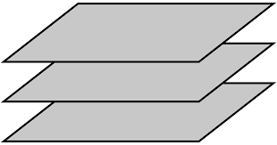  
  **PLANO**. Un plano tiene largo y ancho pero no grosor, **tiene posición y dirección**.Es la porción de superficie limitada por una línea cerrada. Define los límites extremos de un volumen ( Espacio ocupado por un cuerpo ).

-   
  **VOLUMEN**. Tiene una posición en el espacio y está limitado por planos. En un diseño bidimensional, el volumen es ilusorio ( Engañoso, irreal, ficticio ).

### Elementos visuales: forma, medida, color, textura

Cuando dibujamos una línea en un papel. Así, cuando los elementos conceptuales se hacen visibles, tienen forma, medida, color y textura.

- **FORMA**. Identificamos lo que percibimos porque lo que vemos posee una forma. Una forma se define como un área que se destaca del espacio que la rodea debido a un límite definido explícita o implícitamente. 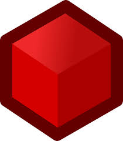
- **MEDIDA**. Todas las formas tienen un volumen o una dimensión. El tamaño de las formas se puede establecer de forma relativa, por comparación de unas con otras, pudiendo decir así que una forma es más grande o más pequeña que otra pero, en cualquier caso, es físicamente medible.  
  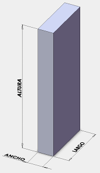

- **COLOR**. Todo lo que existe en la naturaleza tiene color. Las cosas que vemos no sólo se diferencian entre sí por su forma y tamaño, sino también por su colorido. El color y, el contraste de color en particular, se utiliza también para llamar la atención sobre una parte determinada de la imagen.  
   

- **TEXTURA.** Es la característica visual o táctil de todas las superficies. El material con el que se hacen los objetos aporta a su superficie una textura determinada con unas determinadas características de rugosidad, suavidad, aspereza, homogeneidad, etcétera.
  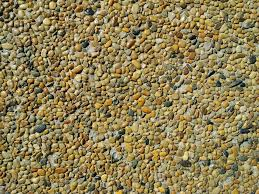
  

### Elementos de relación: dirección, posición, espacio, gravedad

Algunos, como la dirección y la posición, pueden ser percibidos y otros, como el espacio y la gravedad, pueden ser sentidos.

- **DIRECCIÓN**. La dirección de una forma depende de su relación con el observador, con el marco que la contiene o con otras formas cercanas con las cuales se compara.
- **POSICIÓN**. La posición es juzgada por su relación respecto al cuadro que la contiene o a la estructura global del diseño.
- **ESPACIO**. Las formas por muy pequeñas que sean, ocupan un espacio. . Se puede utilizar la perspectiva para organizar y sugerir el espacio creando la ilusión de profundidad. Se pueden superponer objetos de modo que el observador percibe como más cercano el objeto que está delante de los demás. También podemos lograr la profundidad dentro del campo visual utilizando el contraste y la variación de tamaño en las formas.
- **GRAVEDAD**. La sensación de gravedad no es visual, es psicológica. Tenemos tendencia a aplicar cualidades tales como pesadez o ligereza, estabilidad o inestabilidad, tanto a las formas individuales como a los grupos deformas

### Elementos prácticos: representación, significado,función

Cuando vas por la calle y ves de pie en la acera o anclado sobre la pared un objeto más o menos circular con un agujero ¿por qué sabes que es una papelera? No hay ningún cartel que lo indique y, sin embargo, lo sabes.

- **REPRESENTACIÓN**. Una forma es representativa cuando se deriva de la naturaleza o del mundo hecho por el ser humano. La representación puede ser realista, estilizada ( interpretar convencionalmente la forma de un objeto, haciendo más delicados y finos sus rasgos ) o medio abstracta ( que no pretende representar seres o cosas concretos y atiende solo a elementos de forma, color, estructura, proporción, etc ).
- **SIGNIFICADO**. Es la imagen conceptual que se representa en nuestra mente cuando el diseño transporta un mensaje visual. Cada receptor del mensaje le dará una interpretación, un significado distinto, según sean sus conocimientos y experiencias previas.  
   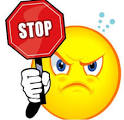
- **FUNCIÓN**. La función se hace presente cuando un diseño debe servir a un determinado propósito. La imagen anterior cumple una función muy importante.

## Detección de patrones

> **Los principios (Gestalt.)** de percepción visual se pueden aplicar al diseño de Interfaces para ayudar así al usuario a comprender de forma más rápida su funcionamiento.

Un Patrón de Diseño es una solución a un problema concreto que se puede usar repetidamente en problemas similares haciendo pequeñas variaciones.
La finalidad de las personas que diseñan de interfaces Web debe ser la de desarrollar unos diseños centrados en la **usabilidad, la eficiencia, la eficacia y la satisfacción del usuario**. Para lograrlo, puede apoyarse en los principios de la Gestalt como principios de organización de elementos dentro de la interfaz y aplicarlos en la creación de los patrones de Diseño.

### Principios de Figura-fondo y Puntos focales

#### Figura-fondo

Una de las primeras cosas que hacemos cuando vemos una composición es determinar cuál es la figura y cuál es el fondo. Esta relación ayuda a establecer un contexto para todo lo demás en dicha composición. La figura y el fondo necesitan contrastar uno del otro o al espectador se le hará difícil saber cuál es cuál.
En la imagen distinguimos el triángulo de color claro como una forma sobre un rectángulo de color azul que está de fondo, debido a que asimilamos mejor la forma triangular que la poligonal. Si esto no fuera así, estaríamos viendo un trianguloa la izquierda y una forma poligonal a la derecha.

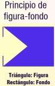{width=300px}

Un ejemplo de la aplicación de principios es esta imagen . En ella podemos ver la zapatilla como objeto principal situado sobre un fondo de de color rojo.

#### Puntos focales

Son elementos de atracción e interés. Están diseñados para verse diferente de sus alrededores inmediatos. El contraste es lo que los ayuda a resaltar y llamar la atención. El elemento que llama más la atención en la composición es el elemento dominante.

### Principios de proximidad y de Semejanza

#### Principio de proximidad

Nuestra mente tiende a agrupar los elementos en función de la distancia que hay entre ellos..
En la imagen nuestra mente agrupa los elementos formando filas columnas y separados.

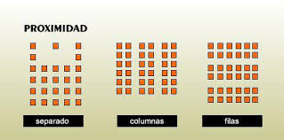{ width=500px }

En un ejemplo de una web podemos percibir que la página esta dividida en 3 columnas y cada una de ellas muestra contenido agrupado, pero no existe ninguna linea dibujada que limite el espacio entre columna y columna.

{ width=500px }

#### Principio de semejanza

Nuestra mente tiende a agrupar aquellos elementos que son similares en su aspecto visual: forma, color, tamaño, etcétera
En la siguiente imagen agrupamos por color tamaño, color y forma.

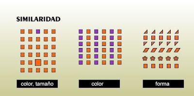{ width=500px }

Un ejemplo de la aplicación de este principio lo puedes ver en la imagen de una de las páginas del sitio de la Xunta de Galicia. En esta imagen se han agrupado dentro de aquellos elementos que, siendo todos enlaces a diferentes páginas del sitio, son similares entre sí tanto en forma como en tamaño.

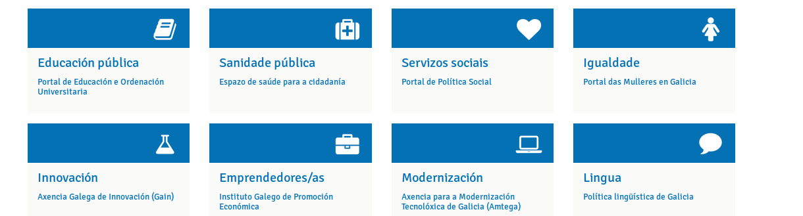

### Principios de simetría y de continuidad

#### Principio de simetría

Nuestra mente tiende a percibir como un único elemento aquellos que están dispuestos simétricamente.

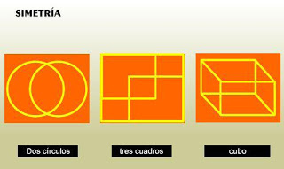{ width=500px }

Este principio lo puede aplicar a lo que se conoce como balance composicional de las paginas web.
El balance composicional incluye la organización de elementos positivos y espacios negativos, de modo que ningún área del diseño domine otras áreas. Todo funciona y encaja junto en un todo sin interrupciones. Las partes individuales contribuyen en el todo, pero no tratan ser el todo.

Una composición sin balance puede crear tensión. Cuando los elementos de diseño de páginas web no tienen balance, los elementos individuales dominan todo y la composición se convierte cada vez menos en la suma de todo. En algunos proyectos, los diseños de páginas web sin balance pueden ser adecuados para el mensaje que tratas de comunicar, pero, por lo general, debes tener composiciones con balance.

El balance visual influyen dos elementos:

- **Peso visual**: Es el peso que se percibe de un elemento visual. Es una medida de cuán atractivo es un elemento de una página en los ojos del espectador.
- **Dirección visual**: Es la dirección que se percibe de una fuerza visual. Es la dirección en que pensamos que debe tomar un elemento si se le diese la oportunidad de moverse de acuerdo a las fuerzas que actúan en ella
  Existe más de una forma de crear balance en un composición:

El **Balance simétrico** ocurre cuando se colocan pesos iguales en lados iguales de una composición, con balance alrededor del punto de apoyo o eje en el centro. El balance simétrico evoca un sentido de formalidad (es llamado, a veces, balance formal) y elegancia. Una invitación a una boda es un buen ejemplo de una composición que debería tener balance simétrico.

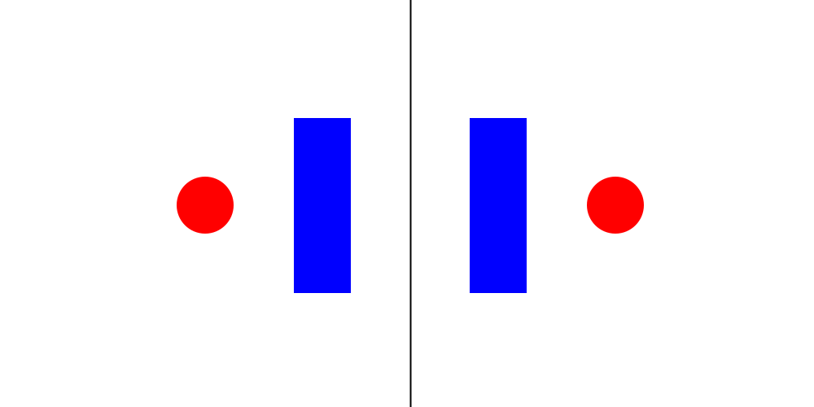{ width=500px }

La desventaja del balance simétrico es que es estático y, a veces, calificado como aburrida. Ya que la mitad de la composición imita la otra mitad, al menos la mitad de una composición es predecible.

El balance asimétrico resulta de un peso visual desigual en cada lado de una composición. Un lado de una composición puede contener un elemento dominante, que podría ser balanceado con un par o más puntos focales en el otro lado. Un elemento visualmente pesado en un lado puede ser balanceado por varios elementos menos pesados en el otro.

El balance asimétrico es más dinámico e interesante. Evoca un sentido de modernidad, movimiento, energía y vitalidad. Ofrece una variedad más visual, aunque puede ser más difícil de lograr porque la relación entre los elementos con más complejos.

{ width=500px }

El balance radial ocurre cuando los elementos se irradian desde un centro común. Los rayos solares y las olas en una fuente luego de que se lanza una piedra brindan ejemplos de esto. Mantener un punto focal (punto de apoyo) es fácil porque siempre está en el centro.
Ya que todo se irradia desde un centro común, todo lleva a dicho centro, haciéndolo el punto fuerte de atracción

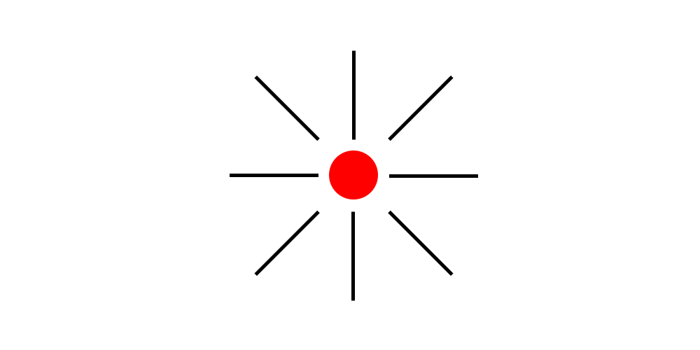{ width=500px }

El balance de mosaicos ( o balance) cristalográfico resulta de un caos con balance. Piensa en las pinturas de Jackson Pollock. La composición carece de puntos focales distintivos, y los elementos comparten un énfasis uniforme. La falta de jerarquía brinda un ruido visual a primera vista. Sin embargo, de alguna forma, todo funciona junto.

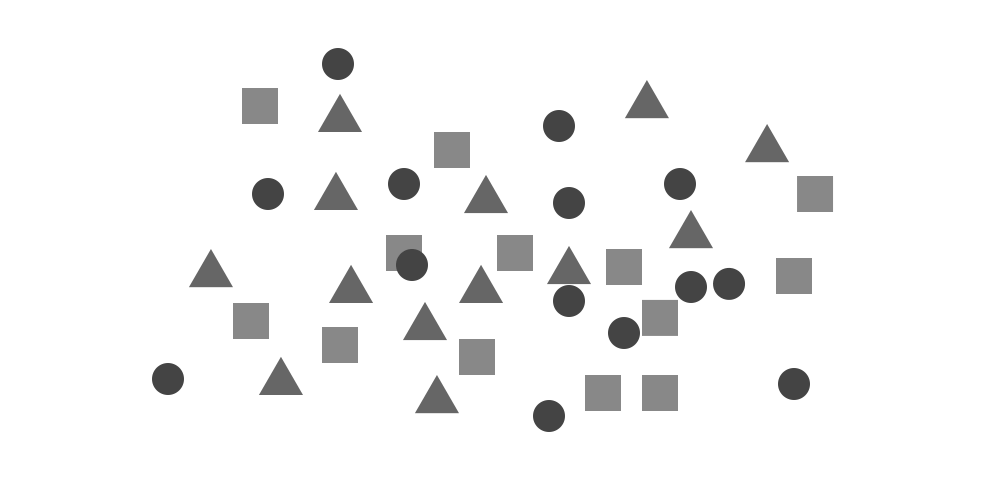{ width=500px }

##### Ejemplos de balance simétrico

El diseño de la página web entera de Helen & Hard está balanceado simétricamente. La captura de pantalla es la página “About”, pero las demás páginas tienen un balance similar.
Todo se refleja alrededor es un eje vertical debajo del centro de la página. El logo está centrado, la barra de navegación está centrada, las imágenes circulares están centradas, el encabezado está centrado y las tres columnas de texto también están centradas.
El balance no es perfecto simétricamente. Por ejemplo, las columnas tienen cantidades de textos diferentes.
Sin embargo, nota la parte superior de la página. Tanto el logo como la barra de navegación están centradas. Mi ojo quiere que el encabezado esté centrado en el signo “&”, o al menos cerca a él. Los tres ítemes de menú del lado derecho de la barra de navegación tienen más letras que aquellas del lado izquierdo. Mi ojo quiere que las columnas sean la misma y que el centro se encuentre entre los enlaces hacia “About” y “People”.

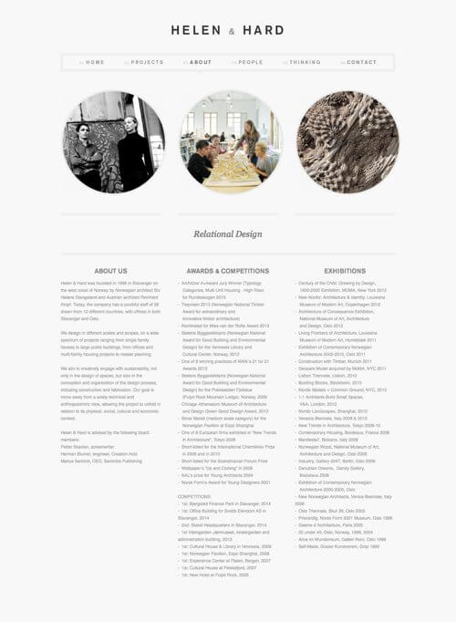{ width=500px }

#### Principio de continuidad

Los detalles que mantienen un patrón o dirección tienden a agruparse juntos, como parte de un modelo. Es decir, percibir elementos continuos aunque estén interrumpidos entre sí. Manejar una buena continuidad en un sitio web, permite que se visualicen mejor los menús y elementos principales del mismo.

{ width=500px }

### Principios de cierre y de área o tamaño relativo

#### Principio de cierre

Nuestra mente tiende a percibir figuras completas o cerradas a partir de
contornos, incluso aunque éstos estén incompletos.

{ width=500px }

Utilizar formas aplicando el principio del cierre en los sitios web, puede permitir resaltar la información más importante del mismo, para que los usuarios accedan con mayor facilidad a ella.

{ width=500px }

En el caso del logotipo de Ubuntu notamos como estas tres personas se acercan para un abrazo grupal que representa para nosotros el trabajo en equipo, y es ejemplo de cierre porque parece ser un circulo cerrado y es lo que vemos en el primer vistazo.

#### Principio de área o tamaño relativo

Nuestra mente tiende a percibir como objeto el más pequeño de dos objetos que se superponen, percibiendo el objeto de mayor tamaño como fondo.
El hexágono se percibe como el objeto principal de la imagen y el cuadrado azul se percibe como el fondo sobre el cual se encuentra el hexágono.

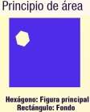{ width=500px }

Un ejemplo de la aplicación de este principio lo puedes ver en las zonas enmarcadas mediante círculos en la parte derecha de la imagen. La circunferencia roja representa el fondo y los círculos pequeños son los elementos de interés. La parte izquierda de la imagen se corresponde con el aspecto original de la páginaweb de la empresa Golfitness style Donde se pueden ver las imágenes que están debajo de los círculo y que se corresponden con la zona de navegación de la página.

### Ley de simplicidad, pregnancia o buena forma

!!! note

    Todos los principios vistos con anterioridad quedan recogidos en la Ley de la buena forma.

**Ley de simplicidad, pregnancia** ( Cualidad de las formas visuales que captan la atención del observador por la simplicidad,equilibrio o estabilidad de su estructura. ) o buena forma.

Nuestra mente tiende a percibir **las formas más simples**, facilitando así su recuerdo. Es un principio de organización de los elementos que componen una experiencia perceptiva, por el cual se reducen las ambigüedades o efectos distorsionadores, permitiéndonos centrarnos en un objeto separándolo del entorno con facilidad.

En la imagen de la izquierda nuestra mente percibe un círculo de color claro y otro círculo de color oscuro aunque estén colocados detrás de los rombos. No percibe las figuras que podemos observar en la imagen de la derecha, las cuales se han separado a propósito para evitar la percepción inevitable de la forma.

{ width=500px }

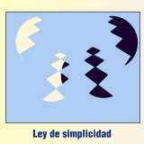{ width=500px }
