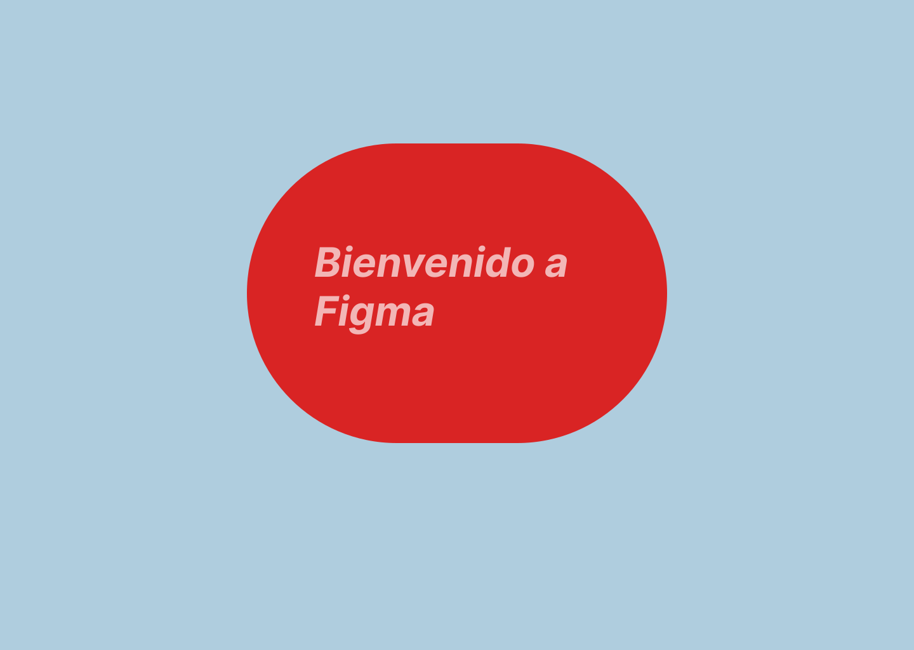

# Actividades

## Actividad 1

En este ejercicio tenéis que asociar los principios que hemos visto con las siguientes acciones:

- Contraste de elementos. (color, tipografias)
- Similitud (agrupaciones).
- Composición.

Basate en los los principios de Gestalt y que acción es la que se quiere conseguir.

Analiza las siguientes

- [David Simon](http://davidsimon.com/)
- [electric plup](http://electricpulp.com/)

## Actividad 2

Analiza la guía de estilos de Material Design. Contesta a las siguientes preguntas:

1. ¿Cuantos colores utiliza ?
2. ¿Qué fuentes esta utilizando?.
3. Lee las sección shape( forma). ¿Qué funciones realiza la forma en un interfaz?.

## Actividad 3

Analiza el siguiente juego. [User inyerface](https://userinyerface.com/) que reproduce los peores errores de diseño de interfaces de usuario. Contesta a las siguientes preguntas:

- ¿Cómo de fácil es moverse por el sitio?
- Describe 15 errores de diseño que hayas encontrado.

## Actividad 4

Instala y prueba las siguientes extensiones de navegadores:

- ColorZilla.
- Fire Shot o Full Page Screen Capture.
- Responsive Web Designe Tester.
- Page Ruler.
- Highlight H1,H2,H3 & highlight nofolow.

## Actividad 5

Detecta en las siguientes webs los elementos de identificación, navegación y contenidos

- blog.gluubo.com
- google.com
- ua.es

## Actividad 6

En archive.org se puede ver la evolución de casi cualquier web a lo largo de los años. Observa la evolución de las webs propuestas anteriormente.

- elpais.com
- google.com
- ua.es

## Actividad 7

Visualiza el siguiente mapa del sitio [gva-mapa](https://www.gva.es/va/inicio/mapa_web). ¿Cuantas páginas tiene? ¿cuantas categorías hay?. ¿Te parece útil el mapa del sitio?.

## Actividad 8

En una universidad quieren realizar una web para que los alumnos , profesores y profesionales puedan encontrar, publicar , leer, comentar artículos fácilmente. Vamos a diseñar nuestra web en base a nuestros usuarios. Lo primero, necesitamos conseguir conocer a nuestros **usuarios objetivo** , para lo cual necesitamos saber de ellos la siguiente información:

- Nombre, trabajo e información personal.
- Requisitos (sobre la web).
  – Necesidades(sobre la web).

### Ejemplos.Información sobre personas:

|**Persona 1**

- **Nombre, trabajo e información personal**
  - Nombre y apellidos: Walter Mattaus.
  - Departamento de administración y tecnologías.
  - casado con dos hijos
  - Poco tiempo para leer.
- **Requisitos**

  - Lee sobre las últimas tendencias.
  - Comparte sus conocimientos.
  - Encuentra revisión de trabajo.

- **Neccesidades**
  - Puedo escribir artículos.
  - Puedo leerlo en mi tablet.
  - Puedo guardar artículos.

|**Persona 2**

- **Nombre, trabajo e información personal**
  - Nombre y apellidos: Elisa warner.
  - Pasante
  - Soltera sin hijos.
- **Requisitos**

  - Sigue a sus compañeros.
  - Consigue pagos por revisiones.
  - Lee artículos sobre química.

- **Neccesidades**

  - Puedo leer artículos desde el teléfono.
  - Puedo escribir artículos desde el teléfono.
  - Puedo recibir alertas de las novedades.

Ahora el trabajo que tenéis que hacer es construir y verificar lo siguiente:

- Identificar la **características principales** de las personas que he creado. Es solo una, que es común a las dos personas.
- Entender porqué las personas necesitan estas.
- Buscar como **otras personas** han solucionado este problema. Es decir, investiga webs que solucionen el problema.
- Crear un boceto vuestro dando solución a esos problemas. (coger y dibujar una estructura de una web con las soluciones. Todavía no hemos visto la herramientas para tal cosa pero las veremos)
- Testar nuestro diseño con las personas objetivo.

## Actividad 9

En esta actividad vamos a crear nuestra primer diseño en la aplicación Figma.

1. Crea un team, en el botón Create new team de la barra lateral izquierda o visita este enlace: https://www.figma.com/files/create-team , e inserta a un compañero de clase y a mi con el siguiente corre-e
   j.martinez2@edu.gva.es.
2. Crea el siguiente diseño que se muestra la imagen de abajo. **El archivo tiene que estar en el proyecto de nuestro grupo.**

   

3. Crea un link que que me tienes que hacer en la entrega de la tarea. Con este link solo podré hacer una copia del fichero en mi espacio.
4. Exporta el diseño a un tipo de fichero svg.
5. Muestra el CSS asociado a nuestro diseño.

**_Nota:Me tenéis que entregar un fichero de texto que contenga el css ,el link y el fichero SVG_**

## Actividad 10

En esta actividad, si acedemos al siguiente [link](https://www.figma.com/file/4bjwFph5AbBbITD1oZxX2B/Asigna-fuentes) nos mostrará un fichero pero no lo podemos editar. **Para editarlo** tenéis que hacer una copia del link que se crea en el sistema de ficheros (con el botón derecho).
En él hay dos columnas, la primera nos muestra la web que vamos a hacer y la segunda el porqué de este tipo de tipografía.

**_Recuerda que cada fuente, el autor, tiene una disposición que generalmente viene declarada en su documentación. En google fonts en la sección about._**

## Actividad 11

Cuando creamos una web el máximo de fuentes que elegiremos será dos. En el siguiente ejercicio tenemos un título y un párrafo con una temática cada una.
Una gran inspiración de selección de fuentes puede ser carteles o otras webs que traten de los mismos temas.

[Asigna-Fuentes](<https://www.figma.com/file/Gvkmj8au5bXwV2yUXsIRBp/Actividad-11-(Asignaci%C3%B3n-de-fuentes)?node-id=8%3A11>)

## Actividad 12

Esta actividad tiene varios propósitos; crear nuestra paleta de colores con respecto a una fotografía y saber como se introduce una imagen en figma. Además, de como se utiliza las mascaras para mostrar una parte de la foto.

Haz click [aquí](https://www.figma.com/file/T9Tb9vKCVL4KDT6n28tkDG/Actividad12Color?node-id=0%3A1) para acceder al fichero del ejercicio.

El primer ejercicio será insertar una imagen que cubra el 50% en el 2 frame. Como en el otro. Para ello vamos a realizar los siguientes pasos:

1. Descargar una imagen en el siguiente [link](https://unsplash.com/es). En esta dirección podemos descargar imágenes que se pueden utilizar "libremente" (De esto ya hablaremos en siguientes temas).
2. Inserta un **cuadrado** que ocupe la mitad del segundo frame.
3. Inserta un objeto, **una imagen**, en el frame. Lo más seguro es que sea más grande que frame. Date cuenta que se inserta como layer(capa). Esta es la forma de trabajar que tienen la mayoría de los programas de dibujo. Desde el menú, en la parte de la izquierda, de las capas las podemos poner en orden diferente arrastrándola. Comprueba lo que pasa. Nuestro objetivo es redimensionar la imagen de tal forma que ocupe la parte del cuadrado por encima del cuadrado. Si lo que queremos es mantener las proporciones, deberemos mantener el **shift** apretado.
4. Otra forma de insertar la imagen, pero esta vez como background del cuadrado antes de insertar la imagen deberemos seleccionar el cuadrado y después insertar la imagen. Pruébala , deshazlo y dejalo como en el paso anterior.
5. Ahora vamos a utilizar el concepto de máscara para mostrar una porción de la imagen. De la siguiente manera:

   1. Elija el rectángulo que desee usar como máscara y colóquelo detrás de la imagen en el menú de capas
   2. Seleccione todas las capas que formarán parte del objeto de máscara.
   3. Haga clic en  en la barra de herramientas

Una vez que tengamos el primer ejercicio vamos a recoger los colores más importantes de la foto. Para lo cual:

1. Seleccionar el mask group del panel de layers, una vez que lo hayamos seleccionado nos saldrá en la parte inferior derecha un conjunto de efectos.
2. Aplicaremos el efecto de layer blur de más o menos 24 para darnos una paleta de colores más adecuada.
3. A continuación utilizaremos el color picker para rellenar cuadrados, que tenéis que hacer, de los colores principales y secundarios de la foto. Color picker selecciona el color de un pixel y es por eso que hemos hecho el paso anterior. **Cuatro o cinco colores**
4. Ahora en la parte de la izquierda dibuja un cuadrado y ponlo en el fondo.
5. Cambia los colores de ese cuadrado y de los textos probando la mejor combinación.

Una vez que tengamos los colores podemos mejorarlos porque generalmente estos colores no son muy brillantes o disponen de una saturación ideal.
Mejora los colores y compara los diseños que hagas, copiando y pegando los frames.

## Actividad 13

Ahora vamos a practicar la manera de colocar y alinear los elementos dentro de un frame.

1. Crea un deskop frame.
2. Selecciona Layout Grid. En 12 columnas.
3. Establece un margen de 140 por los lados.
4. Establece un gutter (margen entre las columnas) de 20px.
5. Con Ctrl+G se ve o no el grid.
6. Cambia el color de fondo del frame y el color del grid para que haga contraste.
7. Ahora vamos a crear nuestra barra de navegación que ocupa todo el frame. Esta va a ser un rectangulo de 70px . Cambiale el color y hazlo transparente (para que se vea las columnas)
8. Vamos a crear un logo con un rectangulo redondeado en sus esquinas, dentro de la barra de navegación, que ocupe dos columna en la parte de la izquierda del frame.
9. A partir del logo duplicamos , los atajos depende si lo estamos utilizando desde el navegador o si lo tenemos instalado. Para saber que atajo disponemos, nos vamos a la Ayuda. En mi caso es Ctrl+D, duplico el objeto seleccionado. Con esto podemos crear los elementos del menú que ocupen una columna en la parte derecha. Si Seleccionamos todos los objetos con Shift. Podemos alinearlos, utilizando las opciones de alineamiento de la parte superior derecha. **En este caso deberemos alinearlos verticalmente**.
10. Haz ahora un título, párrafo y un botón a partir del logo. Y disponlos como en la imagen.

## Actividad 14

A partir del fichero del siguiente [link](https://www.figma.com/file/P7tAqMHgWlHgCVOikH37J5/Actividad14Jerarquia?node-id=55%3A26), crea una jeraquía visual. Es decir qué es lo queremos que el usuario vea primero, segundo, tercero y cuarto. Además, cambia tipografía, color. Utiliza el grid de doce columnas para ayudarte. Observa bien los objetos y colores para saber si combinan bien.

## Actividad 15

En este [link](https://www.figma.com/file/azENmIOmbmISGQ2Iu8lxPr/Actividad15Imagen-Overlays?node-id=2%3A1) encontrarás un fichero de figma donde hay dos frames. Utiliza las técnicas de overlay para hacer contraste entre el texto y la foto que os descarguéis para hacer de fondo. Para lo cual:

1. Descarga una foto que sea adecuada y llevarla al fondo.
2. Selecciona esta capa y añade un relleno (fill) de color negro y con transparencia (prueba rangos) que podamos ver el fondo claro.
3. Desatura la imagen a blanco y negor
4. Cambia el relleno que has instroducido en el paso tres. Prueba degradados, colores etc.
5. Cambia colores de botones, texto etc.. Todo ello con el fin que haga contraste. **Recuerda todos los colores no valen.**

## Actividad 16

En este [link](https://www.figma.com/file/BXN9drusYrLzy96lfkopcr/Actividad16recortes) encontrarás un fichero de figma donde hay dos frames. Utiliza el primer frame la técnica de crop y en el segundo el crop soft.

## Actividad 17

Analiza las dos imágenes de la misma web. En base a los siguientes parámetros:

- Contraste de elementos. (color, tipografías)
- Similitud (agrupaciones).
- Composición.
- Imagen
- Direccionalidad.

## Actividad 18

Crea un fichero en Figma dentro del grupo que tienes conmigo. Este fichero tiene que tener un frame por cada una de las imágenes que te muestro a continuación.

Una vez que tengas los dos frames. Modificalos mediante la técnica de superposición,para darle más importancia a las imágenes.

## Actividad 19

En este [link](https://www.figma.com/file/K0NcOQQahOxlwMlmroAq0k/Actividad19Tension?node-id=1%3A2) encontrarás un fichero de figma donde encontrarás un frame con una imagen y el texto. Crea tensión en el diseño.

Consejos:

- Haz cropping sobre la imagen en un trapecio que divida la pantalla o también puede ser un ovoide etc.
- Mueve el texto
- Utiliza el contraste
- Utiliza la superposición.

## Actividad 20

Para crear diseños aceptables, cuando estamos empezando a diseñar, es coger inspiración de otros sitios. Uno de los primeros errores que se comenten es utilizar Google para buscar webs parecidas. **Pero lo que hace Google es buscar contenido**. Para ello vamos a utilizar páginas que son consultadas por diseñadores.

- [dribbble](https://dribbble.com/)
- [pinterest](https://www.pinterest.fr/).

Después de todas las actividades que has realizado estas en disposición de crear tu primer prototipo de web. Quiero que me crees un prototipo de web que muestre lo que puede hacer una **App de chat**. Para ello te dejo este [fichero](https://www.figma.com/file/49ilcZ3LkX1l3lXz2PY239/Actividad20PrimeraWeb?node-id=107%3A2) con la intención que te sirva de inspiración **no para que lo calques pixel a pixel**.

El primer frame es una imagen de una aplicación sobre llamadas que he copiado de dribbble. Es en el segundo frame donde tienes que hacer nuestra web sobre una App de chat. Date cuenta que he buscado algo relacionado con la comunicación.

**Que debes incluir en tu prototipo:**

- Todas las secciones que compone el frame 1.
- La misma composición del contenido en cada una de las secciones. Es decir, "Have your best call" puede estar colocado al lado de la composición de fotos pero con otro texto. La composición de fotos también puede esta situada en la misma posición, pero no es muy apropiada para un chat, cambia la composición.

A partir modifica todo el diseño. Color, texto,fotos, etc.

**_Consejos: Utiliza las anteriores páginas para coger inspiración sobre por ejemplo colores. etc._**

## Actividad 21

Elige un tema sobre el que realizar el proyecto de un sitio web. A lo largo de las unidades se dará forma al proyecto mediante diferentes ejercicios.

1. Planifica la web. Coge a dos usuarios objetivos y realiza los pasos de la Actividad 8
2. Crea como lo que se conoce como moodBar. En un fichero de Figma dispone de todas las webs, poster et... desde donde vas a inspirate para la web.
3. Crea la guía de estilos de tu sitio web.
   1. Estilos y tamaño de las fotografías.
   2. Logotipo .
   3. Tipografía (no sólo la fuente principal y secundaria, también como son las cabeceras)
   4. Paleta de colores.
   5. Iconos.
4. Desarrolla la idea de tu proyecto mediante un boceto y después crear un prototipo en Figma. Sólo de tu página principal
