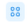
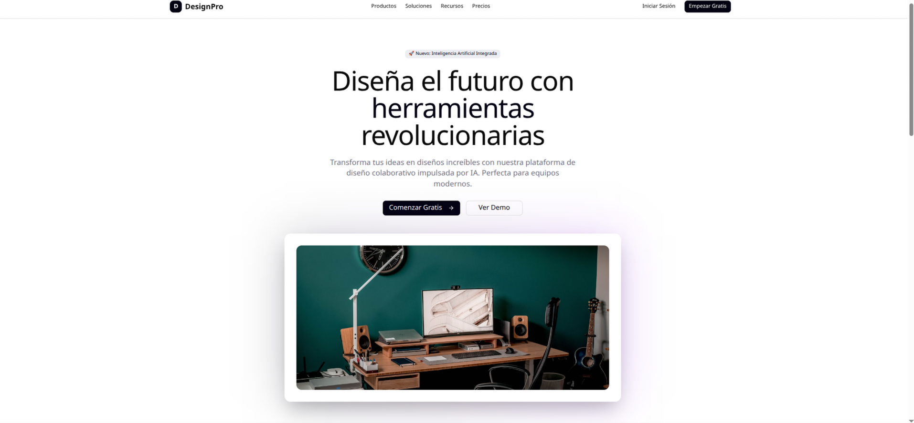
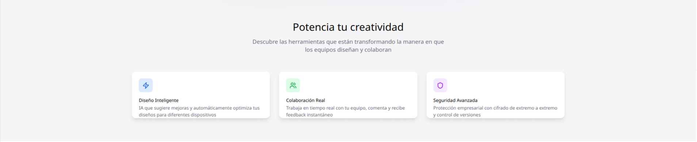
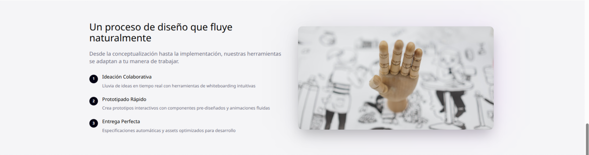
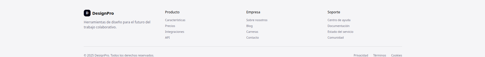

# Tutorial Completo: Creando el Diseño DesignPro en Figma

## 📋 Introducción
Guía paso a paso para recrear el diseño de la landing page "DesignPro" en Figma.

**Requisito:** Debes tener una cuenta de Figma creada. Ve a [figma.com](https://figma.com), crea una cuenta gratuita y confirma tu email antes de comenzar.

**¿Qué vamos a crear?**
Una landing page con las siguientes secciones:
- Header con navegación
- Hero section (sección principal)
- Sección de características
- Testimonios
- Proceso paso a paso
- Call-to-action final
- Footer

**Tiempo estimado:** 3-4 horas  
**Herramienta:** Figma (web o app de escritorio)

---

## 🚀 Preparación Inicial

### Paso 1: Crear un nuevo archivo

1. En la pantalla principal, haz clic en "New design file".
2. Nombra tu archivo: "DesignPro Landing Page".
3. Crea el archivo en el Team conmigo para que pueda ver el progreso.

### Paso 2: Configurar el frame principal

1. Selecciona la herramienta "Frame" (tecla F).
2. En el panel derecho, busca "Desktop" y selecciona "Desktop (1440 x 1024)".
3. Renombra el frame como "DesignPro Landing Page".

---

## 🎨 Sistema de Colores y Tipografía

### Paso 3: Crear el sistema de colores

**Colores principales:**

- **Primary:** #030213 (negro azulado)
- **Background:** #ffffff (blanco)
- **Muted:** #ececf0 (gris claro)
- **Muted Foreground:** #717182 (gris medio)
- **Border:** #e5e5e5 (gris borde)

**Colores de características:**

- **Blue:** #3b82f6 (azul)
- **Green:** #10b981 (verde)
- **Purple:** #8b5cf6 (morado)

**Cómo aplicar colores en Figma:**

1. Selecciona cualquier elemento (rectángulo, texto, etc.).
2. En el panel derecho, busca la sección "Fill" (Relleno).
3. Haz clic en el cuadradito de color.
4. En la ventana que se abre, pega el código de color (ej: #030213).
5. Presiona Enter.

**Crear estilos de color (avanzado):**

1. Crea un rectángulo pequeño.
2. Rellénalo con el color #030213.
3. Con el rectángulo seleccionado, en el panel derecho busca "Fill".
4. Haz clic en los 4 puntos  junto al color.
5. Selecciona "Create style".
6. Nómbralo "Primary".
7. Repite para cada color.

### Paso 4: Configurar tipografía

**Tamaños de texto que vas a usar:**

   - **Títulos grandes:** Inter, 64px, Bold (#030213).
   - **Títulos medianos:** Inter, 32px, SemiBold (#030213).
   - **Títulos pequeños:** Inter, 24px, SemiBold (#030213).
   - **Texto normal:** Inter, 16px, Regular (#717182).
   - **Texto de botones:** Inter, 16px, Medium (blanco o #030213).

**Cómo aplicar tipografía en Figma:**

   1. Selecciona la herramienta "Text" (presiona T).
   2. Haz clic donde quieras escribir.
   3. Escribe tu texto.
   4. Con el texto seleccionado, en el panel derecho verás:
      - **Font:** Cambia a "Inter" (si no aparece, usa "Arial").
      - **Size:** Cambia el número (ej: 64 para títulos grandes).
      - **Weight:** Elige Bold, SemiBold, Regular o Medium.
      - **Color:** Haz clic en el cuadradito y usa los códigos de color.

!!! note "Si no tienes la fuente 'Inter', puedes usar 'Arial' o 'Helvetica'."

**Cómo crear estilos de tipografía en Figma:**

1. Selecciona un texto que ya tenga el estilo que deseas guardar.
2. En el panel derecho, busca la sección "Text".
3. Haz clic en los 4 puntos  junto al estilo de texto.
4. Selecciona "Create style".
5. Nombra el estilo (por ejemplo, "Título Grande").
6. Repite este proceso para cada estilo de texto que quieras guardar.

---

<figure markdown="span">
 { align=center }
  <figcaption>Header y Hero</figcaption>
</figure>

## 📱 Creando el Header

### Paso 5: Estructura del header
1. Dibuja un rectángulo que cubra todo el ancho (1440px) y altura de 80px.
2. Posiciónalo en la parte superior del frame.
3. Aplica color de fondo blanco.
4. Añade una sombra sutil:
   - X: 0, Y: 1, Blur: 3, Color: rgba(0,0,0,0.1).

### Paso 6: Logo de DesignPro
1. **Crear el ícono del logo:**
   - Dibuja un cuadrado de 32x32px.
   - Aplica el color "Primary".
   - Redondea las esquinas a 8px.

2. **Añadir la letra "D":**
   - Usa la herramienta Text.
   - Escribe "D".
   - Fuente: Inter, 18px, Bold.
   - Color: blanco.
   - Centra la "D" en el cuadrado.

3. **Añadir texto "DesignPro":**
   - Texto: "DesignPro".
   - Aplica el estilo "Heading 3".
   - Posiciónalo junto al ícono con 8px de separación.

4. **Agrupar el logo:**
   - Selecciona el ícono y el texto.
   - Ctrl/Cmd + G para agrupar.
   - Nombra el grupo "Logo".

### Paso 7: Navegación

1. **Crear menú de navegación:**
      - Añade textos: "Productos", "Soluciones", "Recursos", "Precios".
      - Aplica estilo "Body".
      - Separa cada elemento con 32px.
      - Agrúpalos y nómbralos "Navigation".

### Paso 8: Botones del header

1. **Botón "Iniciar Sesión":**

      - Dibuja un rectángulo de 120x40px.
      - Sin relleno, borde de 1px color "Border".
      - Redondear esquinas a 8px.
      - Añadir texto "Iniciar Sesión" centrado.

2. **Botón "Empezar Gratis":**

      - Rectángulo de 140x40px.
      - Relleno color "Primary".
      - Redondear esquinas a 8px.
      - Texto "Empezar Gratis" en blanco, centrado.

### Paso 9: Posicionar elementos del header

   1. Centra verticalmente todos los elementos en el header.
   2. Logo: margen izquierdo de 80px.
   3. Navegación: centrada horizontalmente.
   4. Botones: margen derecho de 80px con 12px entre ellos.

---

## 🎯 Hero Section (Sección Principal)

### Paso 10: Contenedor del hero

   1. Dibuja un rectángulo de 1440x600px debajo del header.
   2. Sin relleno (transparente).
   3. Este será nuestro contenedor guía.

### Paso 11: Fondo del hero

1. Selecciona el contenedor del hero.
2. Aplica un relleno degradado:
   - De arriba: color "Primary" (#030213).
   - A abajo: color "Background" (#ffffff).
   - Ángulo: 180 grados.

### Paso 12: Título principal

1. **Crear el título:**

      - Texto: "Diseña el futuro con herramientas revolucionarias".
      - Aplicar estilo "Heading 1" pero aumentar a 64px.
      - Centrar el texto.
      - Ancho máximo: 800px.

2. **Destacar palabra "herramientas":**
      - Selecciona solo la palabra "herramientas".
      - Cambia su color al "Primary".

### Paso 13: Descripción

   1. **Añadir párrafo descriptivo:**
      - Texto: "Transforma tus ideas en diseños increíbles con nuestra plataforma de diseño colaborativo impulsada por IA. Perfecta para equipos modernos."
      - Aplicar estilo "Body" pero aumentar a 20px.
      - Color "Muted Foreground".
      - Ancho máximo: 600px.
      - Centrar texto.

### Paso 14: Botones del hero

   1. **Botón principal:**
      - Rectángulo 180x48px.
      - Relleno "Primary".
      - Esquinas redondeadas 8px.
      - Texto "Comenzar Gratis" + ícono flecha (→).
      
   2. **Botón secundario:**
      - Rectángulo 140x48px.
      - Sin relleno, borde "Border".
      - Esquinas redondeadas 8px.
      - Texto "Ver Demo".

   3. **Posicionar botones:**
      - Separación de 16px entre ellos.
      - Centrar horizontalmente.

### Paso 15: Imagen principal del hero

   1. **Crear contenedor de imagen:**
      - Rectángulo de 800x400px.
      - Relleno degradado de "Primary" con opacidad 20%.
      - Redondear esquinas a 16px.
      
   2. **Añadir imagen:**
      - Dentro del rectángulo, añade una imagen placeholder.
      - Puedes usar una imagen de un workspace moderno.
      - O crear un rectángulo con color gris claro como placeholder.

### Paso 16: Organizar el hero

   1. **Disposición vertical:**
      - Badge en la parte superior.
      - 24px de espacio.
      - Título.
      - 24px de espacio.
      - Descripción.
      - 32px de espacio.
      - Botones.
      - 48px de espacio.
      - Imagen.

2. **Centrar todo horizontalmente** en el frame.

---

<figure markdown="span">
 { align=center }
  <figcaption>Características</figcaption>
</figure>

## ⭐ Sección de Características

### Paso 17: Contenedor de características
1. Dibuja un rectángulo de 1440x500px.
2. Relleno color "Muted" con opacidad 50%.
3. Posicionar debajo del hero.

### Paso 18: Título de la sección

1. **Texto principal:**
      - "Potencia tu creatividad".
      - Estilo "Heading 2" (32px).
      - Centrar horizontalmente.

2. **Subtítulo:**
      - "Descubre las herramientas que están transformando la manera en que los equipos diseñan y colaboran".
      - Estilo "Body" (20px).
      - Color "Muted Foreground".
      - Ancho máximo: 600px.
      - Centrar.

### Paso 19: Tarjetas de características
Vamos a crear 3 tarjetas idénticas:

**Tarjeta base:**

   1. Rectángulo de 360x200px.
   2. Relleno blanco.
   3. Esquinas redondeadas 12px.
   4. Sombra: X:0, Y:4, Blur:20, Color: rgba(0,0,0,0.1).

**Para cada tarjeta, añadir:**

**Tarjeta 1 - Diseño Inteligente:**

   1. **Ícono:**
      - Círculo de 48x48px.
      - Relleno azul claro (#dbeafe).
      - Ícono rayo (⚡) en azul (#3b82f6).

   2. **Contenido:**
      - Título: "Diseño Inteligente" (Heading 3).
      - Descripción: "IA que sugiere mejoras y automáticamente optimiza tus diseños para diferentes dispositivos".

**Tarjeta 2 - Colaboración Real:**

   1. **Ícono:**
      - Círculo de 48x48px.
      - Relleno verde claro (#d1fae5).
      - Ícono usuarios (👥) en verde (#10b981).

   2. **Contenido:**
      - Título: "Colaboración Real".
      - Descripción: "Trabaja en tiempo real con tu equipo, comenta y recibe feedback instantáneo".

**Tarjeta 3 - Seguridad Avanzada:**

   1. **Ícono:**
      - Círculo de 48x48px.
      - Relleno morado claro (#ede9fe).
      - Ícono escudo (🛡️) en morado (#8b5cf6).

   2. **Contenido:**
      - Título: "Seguridad Avanzada".
      - Descripción: "Protección empresarial con cifrado de extremo a extremo y control de versiones".

### Paso 20: Disposición de las tarjetas

1. Coloca las 3 tarjetas en fila horizontal.
2. Separación de 32px entre tarjetas.
3. Centra las tarjetas en la sección.
4. Margen superior de 64px desde el título.

---

<figure markdown="span">
 { align=center }
  <figcaption>Header y Hero</figcaption>
</figure>

## 💬 Sección de Testimonios

### Paso 21: Contenedor de testimonios
1. Rectángulo de 1440x400px.
2. Fondo blanco.
3. Posicionar debajo de características.

### Paso 22: Título de testimonios

1. **Título principal:**
      - "Equipos que confían en nosotros".
      - Estilo "Heading 2".
      - Centrar.

2. **Subtítulo:**
      - "Más de 50,000 equipos ya están creando increíbles experiencias".
      - Estilo "Body" (20px).
      - Color "Muted Foreground".

### Paso 23: Tarjetas de testimonio

Crear 2 tarjetas de testimonio:

**Estructura base de cada tarjeta:**
   1. Rectángulo de 500x200px.
   2. Relleno blanco.
   3. Borde sutil color "Border".
   4. Esquinas redondeadas 12px.
   5. Padding interno de 32px.

**Testimonio 1:**

   1. **Estrellas:** 5 estrellas amarillas (★★★★★).
   2. **Texto:** "DesignPro ha revolucionado nuestro flujo de trabajo. La colaboración en tiempo real nos ha permitido reducir los tiempos de desarrollo en un 40%."
   3. **Avatar:** Círculo de 48x48px con degradado azul-morado, iniciales "MR".
   4. **Nombre:** "María Rodríguez".
   5. **Cargo:** "Directora de Diseño, TechCorp" (texto pequeño, color gris).

**Testimonio 2:**
   1. **Estrellas:** 5 estrellas amarillas.
   2. **Texto:** "La integración de IA es increíble. Nos ayuda a tomar mejores decisiones de diseño y a mantener la consistencia en todos nuestros productos."
   3. **Avatar:** Círculo de 48x48px con degradado verde-azul, iniciales "CL".
   4. **Nombre:** "Carlos López".
   5. **Cargo:** "Head of Product, StartupXYZ".

### Paso 24: Posicionar testimonios

   1. Coloca las tarjetas lado a lado con 32px de separación.
   2. Centra ambas tarjetas horizontalmente.
   3. Margen superior de 64px desde el título.

<figure markdown="span">
 { align=center }
  <figcaption>Proceso</figcaption>
</figure>

## 🔄 Sección de Proceso

### Paso 25: Contenedor del proceso

   1. Rectángulo de 1440x500px.
   2. Relleno color "Muted" con opacidad 50%.
   3. Dividir en 2 columnas iguales (720px cada una).

### Paso 26: Columna izquierda - Contenido

   1. **Título:**
      - "Un proceso de diseño que fluye naturalmente".
      - Estilo "Heading 2".

2. **Descripción:**
      - "Desde la conceptualización hasta la implementación, nuestras herramientas se adaptan a tu manera de trabajar."
      - Estilo "Body" (20px), color "Muted Foreground".

3. **Lista de pasos:**
   
     - **Paso 1:**
         - Círculo numerado "1" (32x32px, relleno "Primary").
         - Título: "Ideación Colaborativa".
         - Descripción: "Lluvia de ideas en tiempo real con herramientas de whiteboarding intuitivas".
      
      - **Paso 2:**
         - Círculo numerado "2".
         - Título: "Prototipado Rápido".
         - Descripción: "Crea prototipos interactivos con componentes pre-diseñados y animaciones fluidas".
      
      - **Paso 3:**
         - Círculo numerado "3".
         - Título: "Entrega Perfecta".
         - Descripción: "Especificaciones automáticas y assets optimizados para desarrollo".

### Paso 27: Columna derecha - Imagen
   1. Rectángulo de 600x400px.
   2. Esquinas redondeadas 16px.
   3. Relleno con imagen de proceso creativo o placeholder.
   4. Sombra pronunciada para darle profundidad.

---

<figure markdown="span">
 { align=center }
  <figcaption>Call-to-action</figcaption>
</figure>

## 📢 Sección Call-to-Action

### Paso 28: Contenedor CTA
   1. Rectángulo de 1440x300px.
   2. Fondo blanco.
   3. Centrar contenido vertical y horizontalmente.

### Paso 29: Contenido del CTA

1. **Título:**
      - "¿Listo para transformar tu proceso de diseño?".
      - Estilo "Heading 2".

2. **Descripción:**
      - "Únete a miles de diseñadores y equipos que ya están creando el futuro".
      - Estilo "Body" (20px), color "Muted Foreground".

3. **Botones:**
      - "Comenzar Gratis" (primario).
      - "Hablar con Ventas" (secundario).
      - Separación de 16px.

4. **Texto legal:**
      - "Sin tarjeta de crédito requerida • Cancelación gratuita".
      - Texto pequeño (14px), color gris.

---
<figure markdown="span">
 { align=center }
  <figcaption>Footer</figcaption>
</figure>

## 🦶 Footer

### Paso 30: Contenedor del footer
1. Rectángulo de 1440x300px.
2. Relleno color "Muted" con opacidad 50%.
3. Borde superior sutil.

### Paso 31: Contenido del footer
**Dividir en 4 columnas iguales:**

**Columna 1 - Logo y descripción:**
- Logo de DesignPro (reutilizar del header).
- Texto: "Herramientas de diseño para el futuro del trabajo colaborativo."

**Columna 2 - Producto:**
- Título: "Producto".
- Enlaces: Características, Precios, Integraciones, API.

**Columna 3 - Empresa:**
- Título: "Empresa"  
- Enlaces: Sobre nosotros, Blog, Carreras, Contacto.

**Columna 4 - Soporte:**
- Título: "Soporte".
- Enlaces: Centro de ayuda, Documentación, Estado del servicio, Comunidad.

### Paso 32: Footer inferior
1. Línea divisoria horizontal.
2. **Lado izquierdo:** "© 2025 DesignPro. Todos los derechos reservados."
3. **Lado derecho:** Enlaces: Privacidad, Términos, Cookies.

---

## ✅ Finalización y Consejos

### Paso 33: Revisión final
1. **Verificar alineación:** Todos los elementos deben estar perfectamente alineados.
2. **Consistencia de espaciado:** Usar medidas consistentes (16px, 24px, 32px, etc.).
3. **Jerarquía visual:** Los títulos deben destacar claramente.
4. **Contraste:** Verificar que el texto sea legible en todos los fondos.

### Paso 34: Organización del archivo
1. **Renombrar todas las capas** con nombres descriptivos.
2. **Agrupar elementos relacionados** (header, hero, features, etc.).
3. **Crear páginas adicionales** si quieres versiones móviles.
4. **Añadir comentarios** en áreas complejas.

### Paso 35: Exportación
1. Selecciona todo el diseño.
2. Ve a "Export" en el panel derecho.
3. Elige formato (PNG para imagen, PDF para presentación).
4. Ajusta la calidad y exporta.

---

## 🎓 Conceptos Aprendidos

Al completar este tutorial habrás aprendido:

### Conceptos básicos de Figma:
- ✅ Crear y organizar frames.
- ✅ Herramientas básicas (rectángulo, texto, formas).
- ✅ Sistema de colores y estilos.
- ✅ Tipografía y jerarquía visual.
- ✅ Agrupación y organización de elementos.

### Conceptos de diseño:
- ✅ Layout y composición.
- ✅ Espaciado y alineación.
- ✅ Jerarquía visual.
- ✅ Sistemas de componentes.
- ✅ Responsive thinking.

### Mejores prácticas:
- ✅ Nomenclatura clara de capas.
- ✅ Organización del archivo.
- ✅ Reutilización de estilos.
- ✅ Consistencia visual.

---

## 🚀 Próximos Pasos

Una vez completado este tutorial, puedes:

1. **Crear variaciones:** Diseña versiones móvil y tablet.
2. **Añadir interactividad:** Usa el modo "Prototype" para hacer la página navegable.
3. **Crear componentes:** Convierte elementos repetitivos en componentes reutilizables.
4. **Experimentar con colores:** Crea variaciones de tema (modo oscuro, diferentes paletas).
5. **Añadir animaciones:** Explora las transiciones y micro-interacciones.

### Recursos adicionales recomendados:
- Figma Academy (tutoriales oficiales).
- Figma Community (plantillas e inspiración).
- YouTube: canales de diseño UI/UX.
- Libros: "Don't Make Me Think" de Steve Krug.

---

## ❓ Solución de Problemas Comunes

**"No puedo alinear elementos correctamente"**
- Usa las guías inteligentes (aparecen automáticamente).
- Activa la cuadrícula: View > Layout Grids.
- Usa las herramientas de alineación en el panel derecho.

**"Los colores no se ven como esperaba"**
- Verifica que estés usando el perfil de color correcto.
- Asegúrate de no tener filtros o efectos aplicados.
- Comprueba la configuración de pantalla.

**"El texto se ve diferente al diseño de referencia"**
- Verifica que tienes la fuente Inter instalada.
- Revisa los tamaños de fuente y interlineado.
- Asegúrate de usar los pesos correctos (Regular, Medium, Bold).

**"No puedo encontrar una herramienta"**
- Usa la barra de búsqueda (Ctrl/Cmd + /).
- Revisa los atajos de teclado más comunes:
  - R: Rectángulo
  - T: Texto  
  - F: Frame
  - V: Mover/Seleccionar

---

¡Felicidades! Has completado tu primer diseño completo en Figma. Este proyecto te ha dado una base sólida para continuar aprendiendo diseño digital y uso de herramientas profesionales.

**Tiempo total invertido:** 3-4 horas.
**Nivel alcanzado:** Intermedio básico.
**Próximo reto:** Crear la versión móvil del mismo diseño.