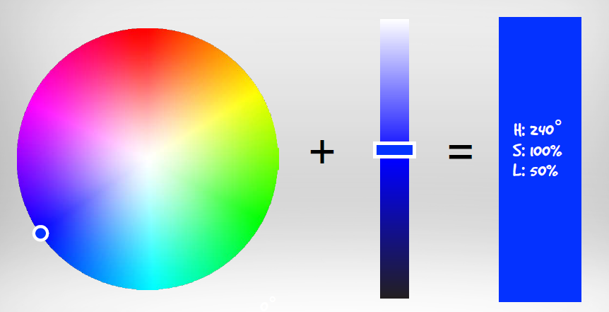
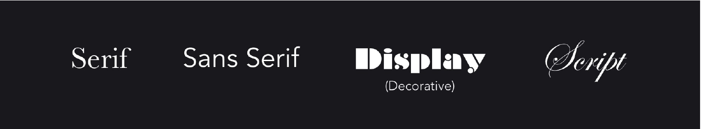
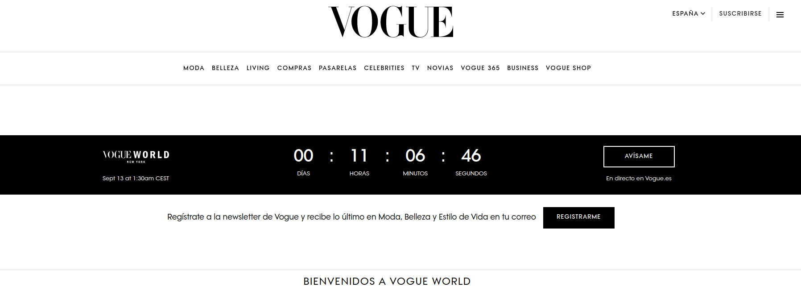
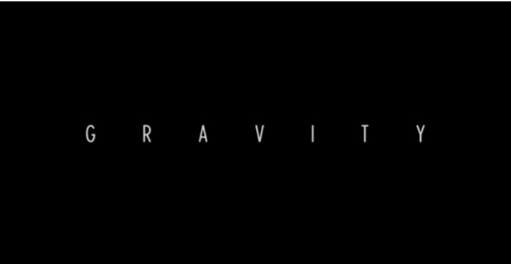
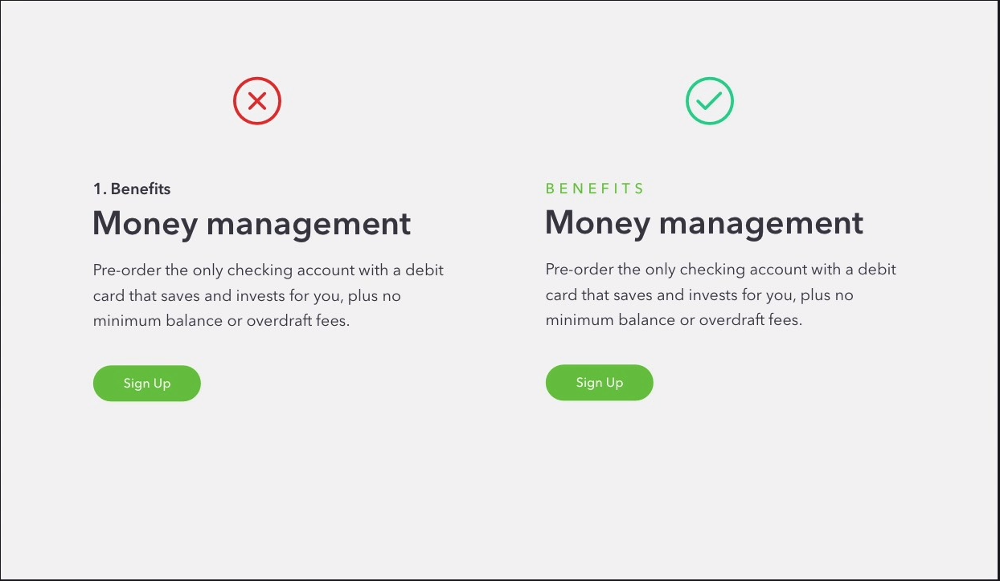
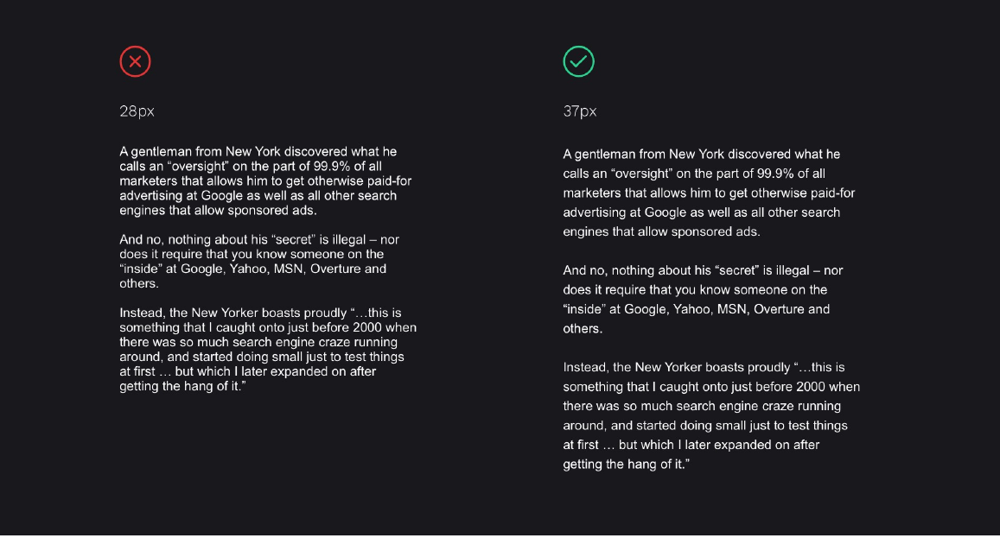
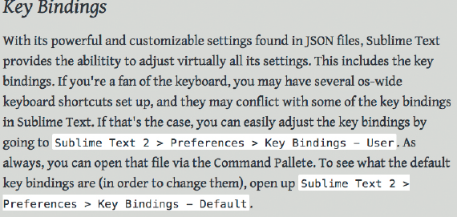
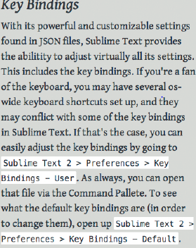

# Otros Elementos

## Color

Ten en cuenta que una misma página se puede ver de distinta forma según la plataforma, sistema operativo, navegador y monitor empleados.
Los colores están relacionados entre sí. La rueda de color formada por 12 colores es una herramienta gráfica importante para crear combinaciones cromáticas y que nos permite hacer distintas clasificaciones de los colores:

- **Colores primarios, secundarios y terciarios.**
  - Hay tres **colores primarios**:  rojo , \* amarillo  y  azul , que están dispuestos en la rueda formando un triángulo equilátero.
  - En el lado de la rueda opuesto a cada uno de los colores primarios se sitúan los tres **colores secundarios**:  verde,  púrpura  y naranja . Cada uno de los colores secundarios se consigue con la mezcla de sus dos colores primarios adyacentes. El verde viene de la mezcla del amarillo y el azul, el púrpura viene de la mezcla del azul y el rojo y, el naranja viene de la mezcla del rojo y el amarillo. Los tres colores secundarios forman también un triángulo equilátero.
  - Por último, están los **seis colores terciarios** que son los que se consiguen con la mezcla delcolor primario y del color secundario adyacente al mismo. Así, tenemos el azul-verdoso, el amarillo-verdoso, el amarillo-anaranjado, el rojo-anaranjado, el rojo-púrpura y el azul-púrpura.
- **Colores fríos y colores cálidos.**
  - **Son colores fríos** todos los colores situados en la rueda de color entre el amarillo-verdoso y el púrpura.
  - **Son colores cálidos**, todos los colores situados en la rueda de color entre el rojo-púrpura y el amarillo.
- **Colores complementarios, análogos y monocromáticos.**

  - **Los colores complementarios** son los colores que están en lados opuestos de la rueda de color. Se utilizan para crear contraste.
  - **Los colores análogos** son los colores que se encuentran juntos en la rueda de color. Se suelen usar para crear la armonía del color.
  - **Los colores monocrómáticos** son todos los tonos y matices de un mismo color.

  En los siguientes enlaces puedes ver una página Web donde podrás ir comprobando la información que te daremos sobre los colores. Además te serán de gran ayuda cuando diseñes los colores de tu sitio Web.
  http://colorschemedesigner.com/ inglés

### Sistema RGB

El ojo humano percibe sólo los colores rojo, verde y azul .Y el resto de los colores se consiguen con la adición de estos tres colores en diferentes proporciones. El blanco se consigue con la mezcla de los tres colores puros y se considera el negro como la ausencia de color. A estos colores se les llama colores aditivos y el ordenador se basa en este sistema para la representación de los colores dando lugar a lo que conocemos como Modo de color RGB. RGB es el acrónimo de los nombres de los colores rojo, verde y azul en inglés: Red, Green, Blue.

Los ordenadores emplean estos tres colores para representar cualquier color de la escala cromática. El ordenador utiliza 8 bits de información para representar cada color. La escala monocromática de un color viene dada por todas las posibles combinaciones de estos 8 bits, en total 256. El resto de los colores se consiguen mezclando estos tres ¿cuántos colores tenemos en total? Para saberlo tenemos que calcular todas las combinaciones que existen multiplicando tres veces el número de grados de cada color: 256 x 256 x 256, lo que nos da 16.777.216 colores.

A la hora de representar cada color utilizamos este modelo RGB y lo podemos hacer empleando tanto el sistema de numeración decimal como el sistema de numeración hexadecimal.
En la imagen puedes ver las diferentes informaciones suministradas por la página web sobre esquemas de colores de diseño cuyo enlace tienes disponible en la página anterior de este mismo apartado. Se ha elegido en el sistema RGB una tríada compuesta por un color primario: el azul y los equidistantes a su color complementario. En la parte inferior de la imagen puedes ver los códigos hexadecimales correspondientes a cada combinación de color y, en la parte de la derecha de la imagen, sobre un fondo blanco, puedes ver la equivalencia en decimal de estos códigos hexadecimales.

### Sistema CMY (subtractivo)

Trabaja mediante la absorción de la luz (colores secundarios). Los colores que se ven son la parte de luz que no es absorbida. En CMY, magenta más amarillo producen rojo, magenta más cian producen azul, cian más amarillo generan verde y la combinación de cian, magenta y amarillo forman negro.

### Modelo HSL

Se conoce como modelo perceptivo de color por tomar sus atributos de la observación del funcionamiento de la percepción humana de la luz.

- **Matiz (Tono)** es el nombre técnico de lo que normalmente llamamos "color" o sea la longitud de la onda luminosa. El espectro visible del matiz está entre el rojo y el violeta, es decir entre 380 y 780 nanómetros de longitud de onda.
- **Saturación (Croma)** es la mezcla de los colores entre si. Es decir la interferencia de unas ondas con otras de diferentes frecuencias. Una alta saturación indica que vemos el color en toda su pureza, sin interferencias.
  Una menor saturación indica que el color tiene mezcla con otros colores con los que interfiere. Cuando las ondas de todos los colores se perciben con igual valor, el matiz no se diferencia y sólo se ve el color blanco.
- **Brillo (Valor)** es la intensidad lumínica. Es la frecuencia de la onda luminosa. Una luminosidad alta hace que el color se aprecie más vibrante e intenso, una luminosidad baja hace que el color se apague y tienda hacia el negro.

### Colores Seguros

Recuerda que una misma página se puede ver de distinta forma según la plataforma, sistema operativo, navegador y monitor empleados. ¿Acaso los colores no son siempre los mismos? El color rojo siempre es y será rojo. Pero, ¿es posible que quede algún usuario con un monitor muy antiguo o con una versión del navegador muy anticuada? Sí, es posible y debemos tenerlo en cuenta.
Hay monitores que sólo permiten visualizar 256 colores. Hay navegadores que poseen una paleta de sólo 216 colores conocidos en el ámbito del diseño web como colores seguros. Emplear estos colores seguros es una forma de garantizar que nuestro sitio Web se verá del mismo modo en todos los navegadores.

Los colores seguros son los que se forman con las combinaciones de los tres colores rojo, verde y azul pero **sólo con los valores hexadecimales:** 00, 33, 66, 99, CC y FF. Son seis grados distintosde cada color y por eso hay 216 colores en total ya que 216 es el resultado de multiplicar 6 x 6 x 6.
En el siguiente enlace, puedes ver una imagen relacionada con la psicología del color. En ella podrás observar la escala de colores desde el rojo al marrón y unos consejos sobre cuándo se debe emplear cada uno de los colores.

- http://www.slideshare.net/Nivck/psicologa-del-color-en-el-diseo-grfico
- http://www.creativosonline.org/blog/psicologia-del-color.html
- [Aquí](https://www.psicologiadelcolor.es/colores-psicologicos/) hay una lista de colores psicológicos y su significado.

El uso de una fuente familiar al usuario aumenta la facilidad de lectura. A la hora de elegir la tipografía más adecuada hay que tener en cuenta varios aspectos.

### La fuente

No todas las fuentes se leen con la misma facilidad y no todas las fuentes se ven igual en todas las plataformas. La fuente ARIAL es una fuente muy extendida que asegura una correcta visibilidad en todos los tamaños y, en todas las plataformas y navegadores.

Páginas para descargar fuentes:

- [FreeFonts](https://www.1001freefonts.com/es/)
- [DaFont](https://www.dafont.com/es/)
- [GoogleFont](https://google.com/fonts)

#### Personalidad

Cada estilo tiene una personalidad, Algunas son divertidas, otras son estrictas y contundentes, y algunas otras más academicas y elegantes.Es muy importante la elección de su estilo. Podríamos decir que es un 25% de la web.

Hay diferentes categorias. Podemos agruparlas en cuatro grandes categorias que son:

En primer lugar, la mayoría de los tipos de letra se incluyen en estos dos grupos. Serif o Sans Serif.
La diferencia esta en las colas en la letra se llaman serifas. En francés "sans" significa "sin". Entonces, "Sans Serif" significa "Sin serif".

- **Serif**: Hay tres estilos importantes dentro de esta:

  - **OdlStyle**: Este es el estilo más utilizado en la impresión y la mayoría de los libros se configurarán en este tipo de letra.Sin embargo, en el diseño web, las fuentes Oldstyle Serif comienzan a aparecer ahora.

    El material impreso tiene una definición más alta en general que la pantalla. Las serifas diminutas en las letras son más difíciles de ver en la pantalla debido a las resoluciones más bajas y al parpadeo de la pantalla.

    Estas pueden ser utilizadas para webs que quieren mostrar refinamiento o una apariencia clásica. Por ejemplo, restaurantes exclusivos, instrumentos musicales, bufetes de abogados, etc.

    **Ejemplo de fuentes:** **Baskerville,Garamond,Palantino**

  - **Modern**: La mejor manera de saber si la fuente es moderna es mediante la serifa plana. Otra característica muy distintiva es el contraste entre gruesos y delgados.
    Los tipos modernos se utilizan con frecuencia para la moda y todas las cosas de lujo. Aunque no están limitados a esto. Se puede utilizar para retratar una personalidad **seria, moderna y refinada**.

    **Ejemplo de fuentes:** **Onyx,Bodoni,Didot**.

    **Consejo**: el estilo moderno lo utilizaría para títulos grandes.

  

  - **slab**: Este es un estilo, que como el anterior, es utilizado para títulos. Es adecuado para sea **mecánica o fuerte.**
    **Ejemplo de fuentes:** **Rockwell,Josefin slab, Roboto Slab**.

- **San Serif**: Será el tipo principal que usarás en la mayoría de los proyectos.Es el más versátil, puede encajar en un diseño con mucha personalidad.
  Es la apuesta más segura de todos los estilos. Puede funcionar perfectamente tanto para texto de párrafo como para títulos.
  La personalidad de las fuentes, en general, Sans Serif podemos catagorizar en **moderna, seria y neutral.**
  **Ejemplo de fuentes:** **Helvetica,Arial, Open Sans**.

- **Display**: De personalida muy marcada. Por lo que si elegimos mal , podemos encontrar una web muy tonta. Su personalidad puede variar desde el tipo que se escribe en una pizarra, hasta algo que puede ser muy elegante. Con todo esto, este tipo de estilo debermos utilizarlo solo para títulos.

  **Ejemplo de fuentes:** **Chalkduster,Braqqadocio,Metropolis**.

- **Script**: Se basan en la escritura a mano. Al igual que Display, hay que estar seguros cuando la utilicemos. Por ejemplo, sería muy util. Si tuvieramos que diseña un sitio web para una guardería. Pero solo para el título.

Todo estilo de fuente siempre tiene una sección About donde el autor explica para que ha sido creada. Es muy importante que la leamos.

**_Para una web deberemos eleguir como máximo dos fuentes._**

#### Espaciado entre las letras

Este es una de la propiedades que podemos cambiar en la web. Cambiando la cantidad de espacio entre ellas podemos crear efectos. Generalmente se utilizan en titular y siempre con mayúsculas. Vemos un ejemplo.

Como vemos solo con la separación de las letra hemos conseguido dar importancia al titular.

Por ejemplo, podemos utilizar esta técnica cuando necesitemos un título además del que tenemos en el parrafo. Observemos, la siguiente imagen.

Hay que seguir dos reglas cuando utilicemos esta técnica, además de utilizarla con mayúsculas y en titulares. Deberemos incrementar el espacio cuando se utilice fuentes pequeñas o más finas y disminnuir el espacio cuando sean grandes o gruesas.

#### Espaciado entre líneas

Es el espacio que hay entre cada una de las líneas. Este viene determinado por la fuente que hayas elegido. Algunas fuente están bien balanceadas pero otras no. Así que la regla que vamos a utilizar es la del 140% (1.4x el tamaño de la fuente en el body).

En esta imagen podemos ver la diferencia entre los dos párrafos con el mismo tipo de fuente.

#### Grosor de la fuentes. Font Weight.

Light, regular,semi-bold, bold, heavy. Aquí hay algun ejemplo de lo que decimos que son diferentes grosores. Por lo menos,**deberemos tener 4** para la fuente principal.

#### Número de plabras por línea.

El número de palabras por linea son de 50-70 palabras incluyendo espacios. Para ello deberemos controlar siempre el `max-width`.

Ejemplo: Con una vista sobre un deskop, si el ancho es 730px con una fuente de 22px tenemos una media de 70-80cpl

Ejemplo: Pero en móviles, con 360px con una tamaño de fuente de 19px. Nos deja una media de 40-50cpl.

## Iconos

Los iconos de los sitios web representan acciones y evitan el uso excesivo de textos. Elegir correctamente los iconos es necesario para que los usuarios interpreten fácilmente su significado y así ahorrar tiempo en la visualización del sitio web.

Es importante respetar una apariencia similar entre todos los iconos para disponer de una buena armonía y navegabilidad.
Los iconos se pueden encontrar en formatos diferentes:

- **Mapa de bits**:PNG, GIF y JPG.
- **Imagen vectorizada**: SVG.
- **Fuentes tipográficas**: las fuentes de texto pueden ofrecer iconos sencillos para la representación de elementos de la interfaz.

Páginas para descargar iconos:

- <a class="mfn-link mfn-link-7 " href="https://www.flaticon.es/" style="" data-hover="Flaticon" ontouchstart="this.classList.toggle('hover');">Flaticon</a>
- <a class="mfn-link mfn-link-7 " href="https://www.iconfinder.com/free_icons" style="" data-hover="IconFinder" ontouchstart="this.classList.toggle('hover');">IconFinder</a>
- <a class="mfn-link mfn-link-7 " href="https://www.freepik.es/iconos-populares" style="" data-hover="Freepik" ontouchstart="this.classList.toggle('hover');">Freepik</a>
- <a class="mfn-link mfn-link-7 " href="https://fontawesome.com/" style="" data-hover="FontAwesome" ontouchstart="this.classList.toggle('hover');">FontAwesome</a>

## Guía de estilo: color, tipografía e iconos

Para asegurar la consistencia de las interfaces gráficas de una web es fundamental plasmar las pautas de estilo en una guía que pueda seguir el equipo de desarrollo (programadores, analistas, diseñadores gráficos, etc.) durante el proceso de desarrollo del sitio. Estas guías se llaman guías de estilo o “look and feel”.

Las guías de estilo recogen los criterios y normas que deben seguir los desarrolladores de un sitio web para que tenga una apariencia uniforme y atractiva para el usuario.

Desde el punto de vista de los programadores y los diseñadores, estas guías de estilo son esenciales para favorecer el desarrollo de una página web, tanto en el diseño como en su posterior mantenimiento. Este aspecto es muy importante ya que el mantenimiento puede ser llevado cada vez por una persona.

En las guías de estilo se recogen datos como la gama de colores utilizada, los iconos, la tipografía, el tamaño de las letras, etc. A continuación se muestra un ejemplo de guía de estilo en la que se detallan los colores, las tipografías, los botones y los iconos de referencia.

### Ejemplos guías de estilo

Veamos ahora el siguiente tablero de Pinterest en el que se han recogido diferentes guías de estilo.

- <a class="mfn-link mfn-link-7 " href="https://material.io/design/" style="" data-hover="Material Design" ontouchstart="this.classList.toggle('hover');">Material Design</a>
- <a class="mfn-link mfn-link-7 " href="https://www.youtube.com/intl/es/yt/about/brand-resources/#logos-icons-colors" style="" data-hover="Youtube" ontouchstart="this.classList.toggle('hover');">Youtube</a>
- <a class="mfn-link mfn-link-7 " href="https://developer.apple.com/design/human-interface-guidelines/" style="" data-hover="Apple" ontouchstart="this.classList.toggle('hover');">Apple</a>
