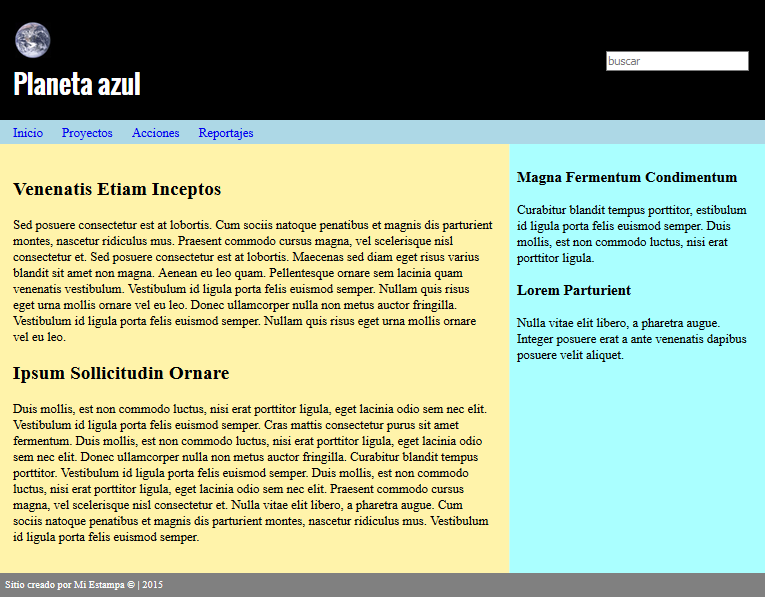

# Ejercicios

## Ejercicio 1

Crea la siguiente página web que se muestra en la siguiente imagen.



La primera versión será mediante **el diseño float y la segunda con el diseño mediante tables**. Es decir, me tenéis que entregar dos versiones de la página principal.

Utiliza etiquetas que tengan sentido pertenecientes a la version **html5**.

**Par la zona de navegación**, podemos poner un elemento `<ul>`. Cada vínculo `<a>` está situado en elementos `<li>`.
Su código **html** es el siguiente:

```html
<nav">
  <ul id="menu">
    <li><a href="#">Inicio</a></li>
    <li><a href="#">Proyectos</a></li>
    <li><a href="#">Reportajes</a></li>
    <li><a href="#">Contacto</a></li>
  </ul>
</nav>
```

Los elementos `<li>` se muestran en modo de inline-block, a fin de que aparezcan alineados horizontalmente y de poder utilizar todas las propiedades de las cajas. Cada elemento `<li>` tiene un margen derecho de 20 píxeles.

**Para las siguientes páginas, podrás utilizar o bien tablas o float para estructurarlas.**

Crea la **página contacto.html** e inserta un formulario de contacto que solicite los siguientes datos.

- Nombre (30 caracteres como máximo y solo permita letras y números)
- Email
- Edad (entre 18-99 años).
- Teléfono.
- Campo de consulta
- checkbox de aceptación de política de privacidad y cookis.

Además todos los campos deberán ser obligatorios, el foco debes ponerlo en campo nombre y todos los inputs deben tener placeholder.

Crea ahora la página de **proyectos.html**. Incluye una tabla que contenga un mínimo de 3 columnas y 5 filas. Debe disponer de etiqueta de encabezado `<th>` y de etiqueta de `<caption>`. Describe los proyectos que ofreces o utiliza un lorem ipsum para rellenar los datos de la tabla.

## Ejercicio 2

Realiza la validación de tu código html y corrige los errores encontrados. Mediante la extensión HTMLHint y el validador w3.org. ¿Hay alguna diferencia?

## Ejercicio 3

Accede a la documentación de google mediante el link que te pongo en teoría. Investiga y contesta a las siguientes preguntas.

1. ¿El contenido copiado afecta al posicionamiento de la web en el buscador?
2. ¿Afecta en el posicionamiento la utilización de http en lugar de https?
3. ¿Cuál de las dos URL son mejores y por qué?
   `https://www.brandonsbaseballcards.com/folder1/22447478/x2/14032015.html https://www.brandonsbaseballcards.com/article/ten-rarest-baseball-cards.html`
4. ¿Qué es Search Console?

## Ejercicio 4

Verifica que cumples cada uno de los factores HTML clave para mejorar el SEO y aplica cambios necesarios en tu proyecto.

!!! note Forma de entrega

      Realiza todos los ejercicios.**UN FICHERO POR CADA EJERCICIO EN FORMATO MARKDOWN**. Revisa la documentación de como generar ficheros y su sintaxis básica de markdown. https://tutorialmarkdown.com/sintaxis. **SI EN EL EJERCICIO TE DICE QUE GENERES UNA PÁGINA HTML NO HACE FALTA QUE GENERES UN FICHERO MD**.
