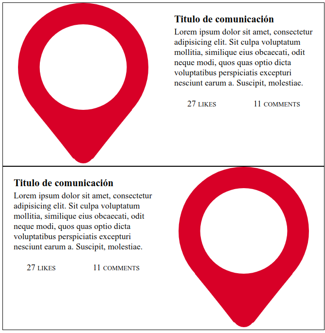
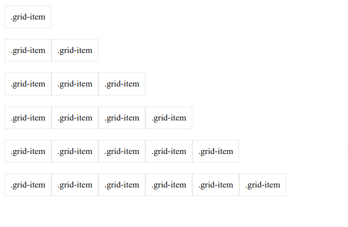
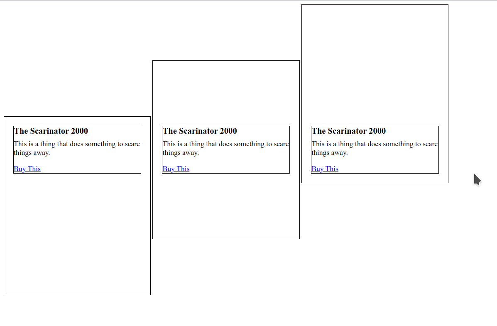
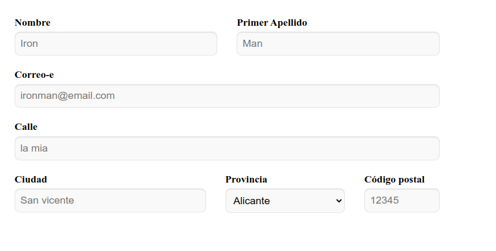
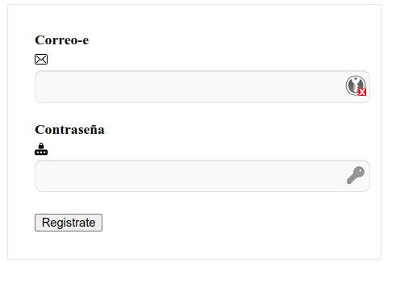
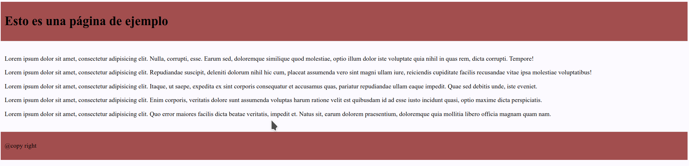
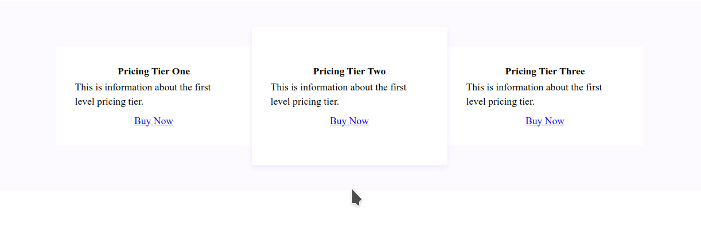

# FlexBox

En esta actividad vamos a practicar con las propiedades de flex que hemos visto en la teoría. Descarga te el html y el css de los ejercicios. Ahora os muestro para cada uno de los ejercicios una imagen como debería quedar.

## Ejercicio 1

## Ejercicio 2

## Ejercicio 3

## Ejercicio 4

## Ejercicio 5

## Ejercicio 6

## Ejercicio 7

