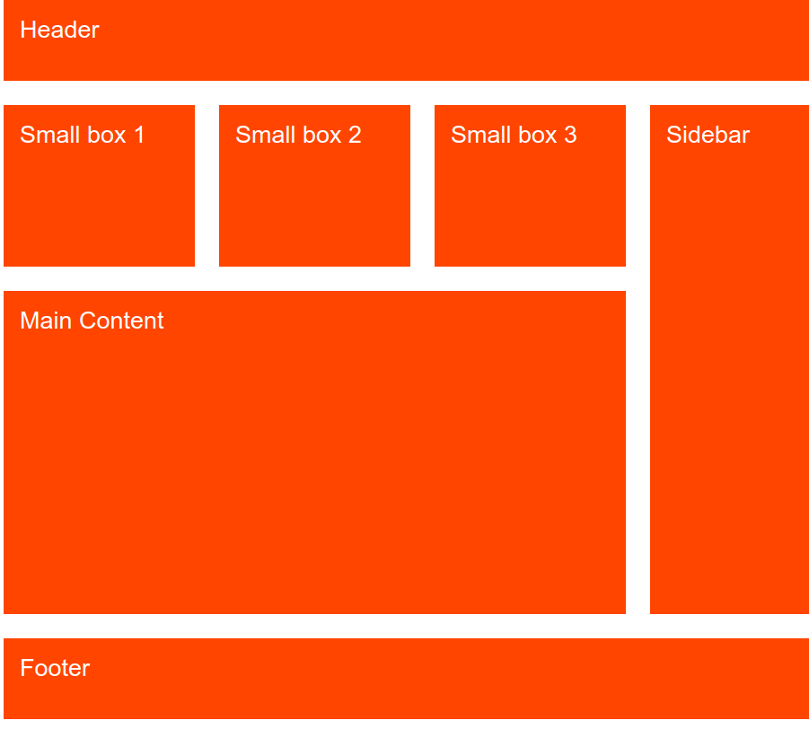

# Actividad Grid

## Objetivo

Crea la siguiente página web mediante Grid. Utiliza el siguiente código html

```html
<div class="container">
  <div class="header">Header</div>
  <div class="small-box small-box-1">Small box 1</div>
  <div class="small-box small-box-2">Small box 2</div>
  <div class="small-box small-box-3">Small box 3</div>
  <div class="main">Main Content</div>
  <div class="sidebar">Sidebar</div>
  <div class="footer">Footer</div>
</div>
```

## Screenshot de la web



## Mi proceso

### Construido con

- Semantic HTML5.
- CSS custom properties.
- Grid.

### ¿Qué he aprendido?

Recopila los aspectos más importantes y aquello que te haya costado más en el momento de construcción de la web. Además de herramientas que te hayan servido de apoyo. En un fichero README.md (fichero markdown).

En este fichero contesta a la siguiente pregunta ¿Se podría utilizar la grid para adaptarlo a diferentes pantallas?

Si quieres obtener más ayuda para escribir Markdown,consulta la [Guía de Markdown](https://www.markdownguide.org/) para obtener más información. En el inspector de Firefox y Chrome disponemos ayuda para la visión de todos los
