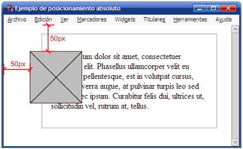
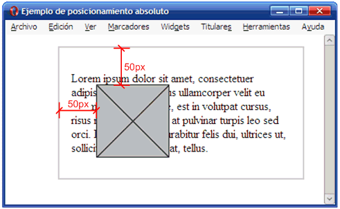
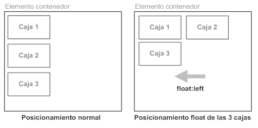

# Conceptos básicos

## Aspectos básicos

El organismo W3C (World Wide Web Consortium), encargado de crear todos los estándares relacionados con la web, propuso la creación de un lenguaje de hojas de estilos específico para el lenguaje HTML y se presentaron nueve propuestas. Las dos propuestas que se tuvieron en cuenta fueron la CHSS (Cascading HTML Style Sheets) y la SSP (Stream-based Style Sheet Proposal).

La propuesta CHSS fue realizada por Håkon Wium Lie y SSP fue propuesto por Bert Bos. Entre finales de 1994 y 1995 Lie y Bos se unieron para definir un nuevo lenguaje que tomaba lo mejor de cada propuesta y lo llamaron CSS (Cascading Style Sheets).

En 1995, el W3C decidió apostar por el desarrollo y estandarización de CSS y lo añadió a su grupo de trabajo de HTML. A finales de 1996, el W3C publicó la primera recomendación oficial, conocida como "CSS nivel 1".

A principios de 1997, el W3C decide separar los trabajos del grupo de HTML en tres secciones: el grupo de trabajo de HTML, el grupo de trabajo de DOM y el grupo de trabajo de CSS.

### Incorporar estilos al documento

Los navegadores proveen estilos por defecto que, pero para cambiar estos con los nuestros podemos utilizar diferentes técnicas:

- **Estilos en línea:** Una de las técnicas más simples para incorporar estilos CSS a un documento HTML es la de asignar los estilos dentro de las etiquetas por medio del atributo style . Pero no es recomendable para aplicar estilos a todo el documento.

```html
<p style="”font-size:" 20px”>Mi texto</p>
```

- **Estilos embebidos:** Una mejor alternativa es insertar los estilos en la cabecera del documento y luego usar referencias para afectar los elementosHTML correspondientes.

```html
p { font-size: 20px }
</style>
```

El elemento `<style>` permite a los desarrolladores agrupar estilos CSS dentro del documento.
Este método sería bueno si sólo tuviéramos un documento en nuestra página, pero como habitualmente tendremos páginas formadas por varios documentos, el método siguiente es el más recomendable.

- **Archivos externos:** La solución es mover todos los estilos a un archivo externo, y luego utilizar el elemento `<link>` para insertar este archivo dentro de cada documento que los necesite. Este método nos permite cambiar los estilos por completo, simplemente, incluyendo un archivo diferente.
  También nos permite modificar o adaptar nuestros documentos a cada circunstancia o dispositivo.

```html
<link rel="”stylesheet”" href="”misestilos.css”" />
```

Con la línea anterior le decimos al navegador que cargue el archivo misestilos.css, que contendrá todos los estilos necesarios para presentar el documento en pantalla.

### Funcionamiento básico de las reglas CSS


En la anterior imagen tenemos las partes que conforman un estilo básico.

Que vamos a definir a continuación:

- **Regla:** cada uno de los estilos que componen una hoja de estilos CSS. Cada regla está compuesta por una parte denominada "selectores", un símbolo de "llave de apertura" ({), otra parte denominada "declaraciones" y, por último, un símbolo de "llave de cierre" (}).
- **Selector:** indica el elemento o elementos HTML a los que se aplica la regla CSS.
- Declaración: especifica los estilos que se aplican a los elementos. Está compuesta por una o más propiedades CSS.
- **Propiedad:** permite modificar el aspecto de una característica del elemento.
- **Valor:**indica el nuevo valor de la característica modificada en el elemento.
  Un archivo CSS puede contener infinitas reglas CSS, cada regla puede contener infinitos selectores y cada declaración puede estar formada por un número infinito de pares propiedad/valor

## Elementos de bloque y en linea

Un elemento en bloque siempre se inicia en una nueva línea y ocupa todo el ancho disponible (se extiende hacia la izquierda y la derecha tanto como sea posible).
La etiqueta `<div>` es un elemento de bloque
La etiqueta `<div>` :

- Se utiliza para contener otros elementos.
- No requiere atributos

Otros ejemplos de elementos de bloque:`<h1> - <h6> ,<p> <form>`

Para crear la siguiente página:


Introduciríamos el siguiente código html

```html
<div style="background-color:black;color:white;padding:20px;">
  <h2>London</h2>
  <p>
    London is the capital city of England. It is the most populous city in the
    United Kingdom, with a metropolitan area of over 13 million inhabitants.
  </p>
  <p>
    Standing on the River Thames, London has been a major settlement for two
    millennia, its history going back to its founding by the Romans, who named
    it Londinium.
  </p>
</div>
```

En el ejemplo anterior podemos observar que al contenedor `<div>` se le añadido el atributo style para poder conseguir el efecto de la imagen.

Un elemento en línea no se inicia en una nueva línea y sólo ocupa tanto de ancho como sea necesario.

Esto es un elemento en linea `<span>` dentro de un párrafo.
La etiqueta `<span>`:

- Es utilizado para contener algún texto.
- No requiere atributos.

Otros ejemplos de elementos en linea: `<a>,`
Para crear la siguiente página:

Introduciríamos el siguiente código html:

```html
<h1>My <span style="color:red">Important</span> Heading</h1>
```

<div class="page"/>

## Modelo de cajas

El W3C nos señala que todos los elementos HTML aparecen en forma de "caja". Estas cajas se caracterizan por varias propiedades CSS:

- Contenido definido en anchura (propiedad width) y altura (propiedad height).
- Dicho contenido puede espaciarse con un relleno interno (propiedad padding).
- Un borde (propiedad border) puede delimitar la caja.
- Un margen externo para establecer un espacio exterior alrededor de la caja (propiedad margin).

Así es una caja:


Para saber cuáles serán las dimensiones reales de las cajas en pantalla, hay que combinarlas todas: contenido + rellenos + bordes + márgenes.

Por ejemplo, si tenemos un contenido de 250 píxeles de ancho (width), un relleno en los cuatro lados de 10 píxeles (padding), un borde idéntico de 5 píxeles (border) y un margen de 20 píxeles en los cuatro lados de la caja, **el ancho en pantalla será: 20 + 5 + 10+ 250 + 20 + 5 + 20 = 320** píxeles ocupados en pantalla.

### Los márgenes de los elementos

Por defecto, casi todos los elementos HTML tienen márgenes superior e inferior, en especial los elementos textuales, como los párrafos (`<p>`) o los encabezados `(<h1> a <h6>)`.

Todos estos elementos están separados unos de otros por estos márgenes superior e inferior.


Pero cuando hay dos elementos seguidos, el margen inferior de la primera caja y el superior de la segunda se fusionan.


Si los valores de los márgenes son distintos, se utiliza el mayor para crear este margen combinado.

### Visualización de los elementos

Las CSS 2.1 definen todos los elementos HTML, la visualización en la página, con la propiedad intrínseca display.
Los principales valores de esta propiedad son:

- **block:** los elementos aparecen unos debajo de otros. Es el caso de los elementos `<p>, <h1> a <h6>, <ol>, <form>`, etc.
- **inline:** los elementos aparecen unos al lado de otros, en la línea de texto. Es el caso de los elementos `<a>, <em>, <strong>, <span>, etc`.
- **list-item:** para los elementos <li> que tienen una disposición de tipo block, pero que pueden utilizar el formato CSS de las listas con viñetas y las numeradas.
- **inline-block**: para los elementos `<input> y <select>`que tienen una disposición de tipo inline, pero que pueden dimensionarse.
- **table y los valores asociados:** todos los elementos de la tablas `(<table>, <thead>, <tr>, <td>, etc.)` tienen su propio valor en pantalla.

En esta [URL](http://www.w3.org/TR/CSS2/visuren.html#propdef-display) tiene la lista de los valores de la propiedad display

### Visualización en flujo normal

El primer principio de la visualización se lleva a cabo en el flujo normal. **El flujo normal** es la visualización por defecto de los elementos HTML. El orden de visualización en el flujo normal viene determinado por el orden de introducción en el código. Para este flujo normal disponemos de tipos de visualizaciones, que determina la propiedad display de cada elemento HTML:

- **display: block** muestra los elementos unos debajo de otros.
- **display: inline** muestra los elementos unos al lado de otros.
- **display: table** muestra los elementos en forma de tabla.

Veamos un ejemplo:


Tenemos dos elementos de tipo block (vista block), el `<h1> y el <h2>` que aparecen uno debajo del otro. A continuación, tenemos el elemento `<p>` (vista block) con dos elementos alineados (vista inline), `<strong> y <a>` que aparecen en la línea de texto del párrafo. Este ejemplo se termina con una tabla con vista table.

### Posicionamiento absoluto

Podemos sacar del flujo normal para colocarlo en un plano superior, encima del flujo normal. Se trata del posicionamiento absoluto, que coloca donde queramos cualquier elemento. Los elementos del flujo normal permanecen debajo de los elementos en posición absoluto.


La caja 2 está posicionada de forma absoluta, lo que provoca que el resto de elementos de la página modifiquen su posición. En concreto, la caja 3 deja su lugar original y pasa a ocupar el hueco dejado por la caja 2.

Determinar la referencia utilizada para interpretar los valores de **top, right, bottom y left** de una caja posicionada de forma absoluta es un proceso complejo que se compone de los siguientes pasos:

- Se buscan todos los elementos contenedores de la caja hasta llegar al elemento `<body>` de la página.
- Se recorren todos los elementos contenedores empezando por el más cercano a la caja y llegando hasta el <`body>`
- El primer elemento contenedor que esté posicionado de cualquier **forma diferente a position: static** se convierte en la referencia que determina la posición de la caja posicionada de forma absoluta.
- Si ningún elemento contenedor está posicionado, la referencia **es la ventana del navegador**, que no debe confundirse con el elemento `<body>` de la página.

Una vez determinada la referencia del posicionamiento absoluto, la interpretación de los valores de las propiedades top, right, bottom y left se realiza como sigue:


- El valor de la propiedad **top** indica el desplazamiento desde el borde superior de la caja hasta el borde superior del elemento contenedor que se utiliza como referencia.
- El valor de la propiedad **right** indica el desplazamiento desde el borde derecho de la caja hasta el borde derecho del elemento contenedor que se utiliza como referencia.
- El valor de la propiedad **bottom** indica el desplazamiento desde el borde inferior de la caja hasta el borde inferior del elemento contenedor que se utiliza como referencia.
- El valor de la propiedad **left** indica el desplazamiento desde el borde izquierdo de la caja hasta el borde izquierdo del elemento contenedor que se utiliza como referencia.

### Posicionamiento relativo

Este tipo de diseño **no saca los elementos del flujo normal**. **Un elemento en posición relativa permanece en el flujo normal, pero se ubica con respecto su posición original establecida mediante el posicionamiento normal.**


En la imagen anterior, la caja 2 se ha desplazado lateralmente hacia la derecha y verticalmente de forma descendente. Como el resto de cajas de la página no modifican su posición, se producen solapamientos entre los contenidos de las cajas.

En el siguiente ejemplo:

```css
.ajustar {
  position: relative;
  left: 10px;
  bottom: 15px;
  border: 1px solid #333;
  background-color: #fce;
}
Y este es su código HTML:

... laoreet lorem vel dolor tempus vehicula.
<span class="ajustar">Excepteur sint obcaecat cupiditat</span> non proident
culpa. Gallia est omnis divisa...
```

Y obtenemos esto:


### Ejemplos Absolute-Relative

#### Posicionamiento Absoluto.

A continuación, se muestra el código HTML y CSS de la página original:

```html
div { border: 2px solid #ccc; padding: 1em; margin: 1em 0 1em 4em; width: 300px;
}

<div>
   alt="Imagen genérica" />
  <p>
    Lorem ipsum dolor sit amet, consectetuer adipiscing elit. Phasellus
    ullamcorper velit eu ipsum. Ut pellentesque, est in volutpat cursus, risus
    mi viverra augue, at pulvinar turpis leo sed orci. Donec ipsum. Curabitur
    felis dui, ultrices ut, sollicitudin vel, rutrum at, tellus.
  </p>
</div>
```

En primer lugar, se posiciona de forma absoluta la imagen mediante la propiedad position y se indica su nueva posición mediante las propiedades
top y left:

```css
div img {
  position: absolute;
  top: 50px;
  left: 50px;
}
```

La imagen posicionada de forma absoluta no toma como referencia su elemento contenedor <div>, sino la ventana del navegador, tal y como demuestra la siguiente imagen



Para posicionar la imagen de forma absoluta, el navegador realiza los siguientes pasos:

1. Obtiene la lista de elementos contenedores de la imagen: `<div> y <body>`.
2. Recorre la lista de elementos contenedores desde el más cercano a la imagen (el `<div>`) hasta terminar en el `<body>`buscando el primer elemento contenedor que esté posicionado.
3. El posicionamiento de todos los elementos contenedores es el normal o estático, ya que ni siquiera tienen establecida la propiedad position
4. Como ningún elemento contenedor está posicionado, la referencia es la ventana del navegador.
5. A partir de esa referencia, la caja de la imagen se desplaza 50px hacia la derecha **(left: 50px) y otros 50px de forma descendente (top: 50px)**.

Como la imagen se posiciona de forma absoluta, el resto de elementos de la página se mueven para ocupar el lugar libre dejado por la imagen. Por este motivo, el párrafo sube hasta el principio del <div> y se produce un solapamiento con la imagen posicionada que impide ver parte de los contenidos del párrafo.

A continuación, se modifica el ejemplo anterior posicionando de forma relativa el elemento `<div>` que contiene la imagen y el párrafo. La única propiedad añadida al `<div>` es position: relative por lo que el elemento contenedor se posiciona pero no se desplaza respecto de su posición original:

```css
div {
  border: 2px solid #ccc;
  padding: 1em;
  margin: 1em 0 1em 4em;
  width: 300px;
  position: relative;
}

div img {
  position: absolute;
  top: 50px;
  left: 50px;
}
```

La siguiente imagen muestra el resultado obtenido:



En este caso, como el elemento contenedor de la imagen está posicionado, se convierte en la referencia para el posicionamiento absoluto. El resultado es que la posición de la imagen es muy diferente a la del ejemplo anterior:

La referencia del posicionamiento absoluto es el elemento contenedor de la imagen.Por tanto, si se quiere posicionar un elemento de forma absoluta respecto de su elemento contenedor, es imprescindible posicionar este último. Para ello, sólo es necesario añadir la propiedad position: relative, por lo que no es obligatorio desplazar el elemento contenedor respecto de su posición original.

##### Otro ejemplo:

En la siguiente imagen se muestra varios párrafos con posicionamiento absoluto. En esa página los valores están expresados en porcentaje (que se interpretan como porcentajes de la ventana completa).

```css
h1 {
  margin: 0px;
}

p {
  position: absolute;
  border: black 1px solid;
  overflow: hidden;
  font-family: monospace;
  font-size: 150%;
  margin: 0px;
}

p#p1 {
  left: 10%;
  width: 70%;
  top: 15%;
  height: 10%;
}
p#p2 {
  left: 10%;
  right: 20%;
  top: 30%;
  height: 10%;
}
p#p3 {
  right: 20%;
  width: 70%;
  top: 45%;
  height: 10%;
}

p#p4 {
  left: 10%;
  width: 20%;
  top: 60%;
  height: 30%;
}
p#p5 {
  left: 40%;
  width: 20%;
  top: 60%;
  bottom: 10%;
}
p#p6 {
  left: 70%;
  width: 20%;
  bottom: 10%;
  height: 30%;
}
```


De estas seis propiedades, basta con indicar cuatro de ellas: dos para la posición horizontal (a elegir entre left, right y width) y dos para la posición vertical (a elegir entre top, bottom y height). Si el elemento tiene un tamaño definido (por ejemplo, una imagen), es suficiente con utilizar una propiedad para la posición horizontal y otra para la vertical.

En caso de que se establezcan las tres propiedades de una dimensión:

- En horizontal, los navegadores hacen caso de las propiedades left y width y descartan el valor de right, como puede comprobarse en la siguiente imagen. En esa página los valores están expresados en porcentaje (que se interpretan como porcentajes de la ventana completa).

  

```css
div {
  border: black 1px solid;
  font-family: monospace;
  font-weight: bold;
  font-size: 150%;
  margin: 0px;
  height: 10%;
  position: absolute;
}
div.lrw {
  left: 10%;
  right: 10%;
  width: 50%;
  top: 10%;
}
div.lwr {
  left: 10%;
  width: 50%;
  right: 10%;
  top: 25%;
}
div.rlw {
  right: 10%;
  left: 10%;
  width: 50%;
  top: 40%;
}
div.rwl {
  right: 10%;
  width: 50%;
  left: 10%;
  top: 55%;
}
div.wlr {
  width: 50%;
  left: 10%;
  right: 10%;
  top: 70%;
}
div.wrl {
  width: 50%;
  right: 10%;
  left: 10%;
  top: 85%;
}
```

- En vertical, los navegadores hacen caso de las propiedades top y height y descartan el valor de bottom, como puede comprobarse en la siguiente imagen. En este ejemplo los valores están expresados en porcentaje (que se interpretan como porcentajes de la ventana completa).
  

```css
div {
  border: black 1px solid;
  font-family: monospace;
  font-weight: bold;
  font-size: 150%;
  margin: 0px;
  width: 10%;
  position: absolute;
}
div.tbh {
  left: 5%;
  top: 10%;
  bottom: 10%;
  height: 50%;
}
div.thb {
  left: 20%;
  top: 10%;
  height: 50%;
  bottom: 10%;
}
div.bth {
  left: 35%;
  bottom: 10%;
  top: 10%;
  height: 50%;
}
div.bht {
  left: 50%;
  bottom: 10%;
  height: 50%;
  top: 10%;
}
div.htb {
  left: 65%;
  height: 50%;
  top: 10%;
  bottom: 10%;
}
div.hbt {
  left: 80%;
  height: 50%;
  bottom: 10%;
  top: 10%;
}
```

**El posicionamiento absoluto puede ser problemático en pantallas pequeñas**, cuando la posición utiliza un valor alto. Por ejemplo, un elemento con una posición fija a 850 píxeles desde la parte superior, será invisible en las pantallas de los notebook, en las tabletas o en los smartphones.

### Posicionamiento fijo

El posicionamiento fijo determina la posición de un elemento dado en la página HTML. Incluso si el usuario llega a utilizar la barra de desplazamiento, este elemento fijo no se "moverá" en la ventana del navegador.

Las propiedades disponibles son las mismas que las del posicionamiento absoluto, excepto para el valor de la propiedad position, que es fixed.
Estos serían los estilos CSS para una caja simple:

```css
#caja-fija {
  position: fixed;
  z-index: 3;
  top: 0px;
  left: 0px;
  border: 1px solid #333;
  background-color: #6cf;
}
#caja-fija p {
  margin: 0;
}
```

Código HTML añadido al final del código anterior:

```html
<div id="caja-fija">
<p>Caja fija esquina superior izquierda</p>
</div>
</body>

</html>
```

Al utilizar la barra de desplazamiento, la caja permanece en su lugar en la esquina superior izquierda:


**Nos encontramos con los mismos problemas potenciales que con el posicionamiento absoluto**.

### Posicionamiento Flotante

El posicionamiento flotante es el más difícil de comprender pero al mismo tiempo es el más utilizado. La mayoría de estructuras de las páginas web complejas están diseñadas con el posicionamiento flotante.

Cuando una caja se posiciona con el modelo de posicionamiento flotante, automáticamente se convierte en una caja flotante, lo que significa que se desplaza hasta la zona más a la izquierda o más a la derecha de la posición en la que originalmente se encontraba.
La siguiente imagen muestra el resultado de posicionar de forma flotante hacia la derecha la caja 1:
![]img/conceptosBasicos/flotante.gif" alt="Picture" style="display: block; margin: 10px auto"/>

Cuando se posiciona una caja de forma flotante:

- **La caja deja de pertenecer al flujo normal de la página**, lo que significa que el resto de cajas ocupan el lugar dejado por la caja flotante.
- **La caja flotante se posiciona lo más a la izquierda o lo más a la derecha posible** de la posición en la que se encontraba originalmente.

Si en el anterior ejemplo la caja 1 se posiciona de forma flotante hacia la izquierda, el resultado es el que muestra la siguiente imagen:


La caja 1 es de tipo flotante, por lo que desaparece del flujo normal de la página y el resto de cajas ocupan su lugar. El resultado es que la caja 2 ahora se muestra donde estaba la caja 1 y la caja 3 se muestra donde estaba la caja 2.

Al mismo tiempo, la caja 1 se desplaza todo lo posible hacia la izquierda de la posición en la que se encontraba. El resultado es que la caja 1 se muestra encima de la nueva posición de la caja 2 y tapa todos sus contenidos.

Si existen otras cajas flotantes, al posicionar de forma flotante otra caja, se tiene en cuenta el sitio disponible. En el siguiente ejemplo se posicionan de forma flotante hacia la izquierda las tres cajas:


En el ejemplo anterior, las cajas no se superponen entre sí porque las cajas flotantes tienen en cuenta las otras cajas flotantes existentes. Como la caja 1 ya estaba posicionada lo más a la izquierda posible, la caja 2 sólo puede colocarse al lado del borde derecho de la caja 1, que es el sitio más a la izquierda posible respecto de la zona en la que se encontraba.

Si no existe sitio en la línea actual, la caja flotante baja a la línea inferior hasta que encuentra el sitio necesario para mostrarse lo más a la izquierda o lo más a la derecha posible en esa nueva línea:



Las cajas flotantes influyen en la disposición de todas las demás cajas.**Los elementos en línea hacen sitio a las cajas flotantes adaptando su anchura al espacio libre dejado por la caja desplazada. Los elementos de bloque no les hacen sitio, pero sí que adaptan sus contenidos para que no se solapen con las cajas flotantes**

#### Ejemplos sobre elementos en linea

##### Letra capital

Se puede crear una letra capital aplicando la propiedad float a la primera letra de un párrafo. En los ejemplos siguientes se utiliza una etiqueta `<span>` o la
pseudo-clase :first-letter.

```css
span.capital {
  background-color: pink;
  color: red;
  float: left;
  font-family: monospace;
  font-size: 400%;
}
```


```css
p.capital:first-letter {
  background-color: pink;
  color: red;
  float: left;
  font-family: monospace;
  font-size: 400%;
}
```


##### Posicionamiento flotante de imágenes.

Las imágenes son elementos en línea, es decir, que se insertan como si fueran caracteres,formando parte del párrafo o del elemento de bloque en el que se insertan. La altura de la línea ven la que está insertado el elemento aumenta lo necesario para poder alojar la imagen, como muestra el siguiente ejemplo, en el que la hoja de estilo no contiene ninguna propiedad relacionada con la imagen.

)

Si se quiere que una imagen aparezca a la izquierda (o a la derecha) de un texto, es decir,que el texto fluya a lo largo de la imagen, hay que utilizar la propiedad float. Esta propiedad sólo admite dos valores, left y right, que sitúan la imagen a la izquierda o a la derecha, como muestran los ejemplos siguientes.

````css
img {
float: left;
}


img {
float: right;
}```

Si queremos tener una imagen a la izquierda y otra a la derecha, debemos definir clases y asignarlas a la imagen correspondiente
```css
img.izquierda {
float: left;
}

img.derecha {
float: right;
}

<p>Texto</p>
````


Para que las imágenes salgan correctamente alineadas con el texto, la imagen debe insertarse al principio del texto, independientemente de la posición final que vaya a tener la imagen. Los siguientes ejemplos muestran las diferencias.

Las dos imágenes están insertadas antes del texto:

```html
<p>Texto</p>
```

![floatImagen5]img/conceptosBasicos/floatImagen5.png)

La imagen izquierda está situada antes del texto y la imagen derecha al final del texto:

```html
<p>Texto</p>
```


Las dos imágenes están insertadas al final del texto:

```html
<p>Texto</p>
```


### La propiedad clear

Al crear una imagen flotante, el navegador sitúa los elementos que se encuentran a continuación de la imagen a su lado mientras haya sitio, aunque no pertenezcan al mismo bloque, como muestra el siguiente ejemplo:

```css
img {
  float: left;
}
```

![clear]img/conceptosBasicos/clear.png)

Para impedir que ocurra esto, es necesario que la flotación de la imagen se interrumpa. La propiedad clear hace que un elemento no tenga elementos flotantes a su lado. Los posibles valores de clear son:

- left, que hace que no hayan elementos flotantes a la izquierda,
- right, que hace que no hayan elementos flotantes a la derecha,
- both, que hace que no hayan elementos flotantes ni a derecha ni a izquierda,
- none, que permite que hayan elementos flotantes a derecha y a izquierda (valor por omisión).

Se puede asignar la propiedad clear a cualquier elemento. En el ejemplo siguiente se ha asignado a una línea horizontal, de manera que la línea ya no flota a la derecha de la imagen, sino que se muestra a continuación de la imagen:

```css
hr {
  clear: both;
}

img {
  float: left;
}
```


### Tamaño de los elementos que contienen elementos flotantes

Los elementos flotantes no se tienen en cuenta al calcular el tamaño de los elementos que los contienen. Por ejemplo, si un imagen flotante forma parte de una división con borde, la imagen puede "salirse" del borde, como se ve en siguiente ejemplo:

```css
div {
  border: black 3px solid;
}
img {
  float: left;
}
```

 alt="Picture)

Si se quiere que la división incluya la imagen, se puede conseguir de varias maneras:

Una primera solución podría ser dar la propiedad clear: both al segundo párrafo

```css
div {
  border: black 3px solid;
}
p.limpia {
  clear: both;
}
img {
  float: left;
}
```


Una segunda solución podría ser insertar un tercer párrafo vacío con la propiedad clear: both (y no ponérsela al segundo párrafo). En la primera solución, el segundo párrafo ya no fluye a la derecha de la imagen, mientras que en la segunda sí lo hace.

```css
div {
  border: black 3px solid;
}
p.limpia {
  clear: both;
}
img {
  float: left;
}
```


Una tercera solución sería dar una altura muy pequeña a la división y establecer la propiedad: overflow: hidden.

```css
div {
  border: black 3px solid;
  height: 1%;
  overflow: hidden;
}
img {
  float: left;
}
```


