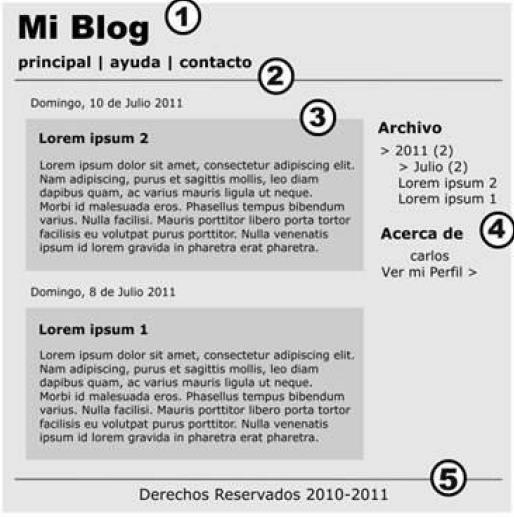

# HTML5

## Introducción

HTML es un lenguaje de marcas, un lenguaje estructurado que le permite identificar las secciones comunes de una página web, tales como encabezados, párrafos y listas con etiquetas de marcas que definen cada sección.

Las páginas Web son simplemente documentos de texto que utilizan HTML para decirle al navegador como se estructura e información del Contenido.

Normalización. Versiones de HTML

El problema surgió en cuanto unos navegadores incorporaron elementos HTML que el resto no traducía,con lo que aparecieron diferentes dialectos HTML. Así una página se podía mostrar de forma totalmente diferente según el navegador.

La solución pasó por intentar **estandarizar** el lenguaje. Por ello el propio Tim Bernes Lee fundó la World Wide Web Consortium (abreviado W3C) como organismo de estandarización del lenguaje HTML ante la industria.

En la actualidad las directrices de W3C son seguidas por la mayoría de navegadores aunque no al 100 , lo que sigue generando problemas a los creadores de páginas web.

Hay y habido diferentes estándares como HTML 4.01, XHTML 1.0 y 1.1 pero el HTML 5 es el estándar que actualmente se está imponiendo

## El primer documento HTML

Las páginas HTML se dividen en dos partes: la cabecera y el cuerpo. La cabecera incluye información sobre la propia página, como por ejemplo su título y su idioma. El cuerpo de la página incluye todos sus contenidos, como párrafos de texto e imágenes.

Veamos, a continuación, el esqueleto de un documento HTML5

```html
<!DOCTYPE html>

<html lang="es">
  <head>
    <meta charset="utf-8" />
    <title>Plantilla HTML5</title>
    <meta name="description" content="HTML5" />
    <meta name="author" content="Julio Martinez" />
    <link rel="stylesheet" href="css/estilos.css" />
  </head>
  `
  <body>
    `
  </body>
</html>
```

### El Doctype

En primer lugar, tenemos el tipo de declaración de documento o doctype . Esto es, simplemente, una manera de decirle al navegador, o cualquier otro software que analice nuestro código, de qué tipo de documento se trata. En el caso de los archivos HTML, indica la versión específica.

Por ejemplo, anteriormente, la declaración de tipo de documento era farragosa y difícil de recordar. Para XHTML 1.0 Strict:

```html
<!DOCTYPE html PUBLIC "-//W3C//DTD XHTML 1.0 Strict//EN" "http://www.w3.org/TR/xhtml1/DTD/xhtml1-strict.dtd">
```

Y para HTML4 Transitional:

```html
<!DOCTYPE html PUBLIC "-//W3C//DTD HTML 4.01 Transitional//EN" "http://www.w3.org/TR/html4/loose.dtd">
```

HTML5 ha acabado con esa monstruosidad indescifrable. Ahora todo lo que indicamos es lo siguiente:

```html
<!DOCTYPE html>
```

Lo primero que podemos observar es que el 5 está ausente de la declaración. Aunque la iteración actual del lenguaje de marcado se conoce como "HTML5", en realidad es sólo una evolución de los estándares anteriores, y las futuras especificaciones serán, simplemente, un desarrollo de lo que tenemos hoy. Dado que los navegadores tienen que soportar todo el contenido existente en la web, no se confía en el tipo de documento para indicar qué características deben soportarse en un documento dado.

La validación es el proceso que asegura que un documento escrito en un determinado lenguaje, por ejemplo HTML5, cumple con las normas y restricciones de ese lenguaje.

El proceso de validación consiste en probar página a página si el código HTML5 pasa la prueba de validación. Los validadores son las herramientas que se utilizan para validar cada página. El organismo W3C ha creado una herramienta que se puede utilizar gratuitamente a través de [Internet](http://validator.w3.org/).

### El elemento html

El siguiente paso en cualquier documento HTML es el elemento <html> , que no ha cambiado significativamente con HTML5. En nuestro ejemplo, hemos incluido el atributo lang con un valor de es , que especifica que el documento está en español. En la sintaxis basada en XHTML, estaríamos obligados a incluir un atributo xmlns . En HTML5, esto ya no es necesario, e incluso podríamos prescindir del atributo lang y el documento validaría y funcionaría correctamente.

### El elemento head

La siguiente parte de nuestro documento es la sección `<head>` . La primera línea dentro de la cabecera es la que define la codificación de caracteres que se utiliza en el documento. Este es otro elemento que se ha simplificado. Anteriormente,hacíamos esto:

```html
<meta http-equiv="Content-Type" content="text/html; charset=utf-8" />
```

HTML5 reduce este meta a la mínima expresión:

```html
<meta charset="utf-8" />
```

Es importante que la declaración de la codificación del documento esté incluida dentro de los primeros 512 caracteres del documento. También es imprescindible que esté antes de la aparición de cualquier elemento de contenido (como el elemento `<title>` que le sigue en nuestro ejemplo).

La siguiente parte de nuestro head es la siguiente:

```html
<title>Plantilla HTML5</title>
<meta name="description" content="HTML5" />
<meta name="author" content="Alejandro Amat" />
<link rel="stylesheet" href="css/estilos.css" />
```

En estas líneas, HTML5 apenas se diferencia de sintaxis anteriores. El título permanece igual que antes, y las etiquetas `<meta>` que hemos incluido no son más que ejemplos opcionales.

Sí que vemos una sutil diferencia a la hora de incluir la hoja de estilo. A primera vista, es probable que no hayas notado nada diferente, pero habitualmente, elementos de enlace incluirían un atributo type con un valor de text/css.

Curiosamente, esto nunca fue necesario en XHTML o HTML 4, incluso cuando utilizábamos doctype strict . La sintaxis basada en HTML5 nos anima a omitir el atributo de tipo, ya que todos los navegadores reconocen el tipo de contenido de las hojas de estilo vinculadas sin requerir del atributo extra.

### El resto no cambia

Mirando el resto del documento básico, vemos que tenemos el elemento `<body>` y la etiqueta de cierre `</html>` , las cuales, no varían en relación a versiones anteriores del HTML.
Al igual que se señaló anteriormente con el elemento link , la etiqueta `<script>` no requiere que se declare un atributo type . En XHTML, para validar una página que contiene scripts externos, su etiqueta `<script>` debería tener este aspecto:

```html
<script src="js/scripts.js" type="text/javascript"></script>
```

Dado que, a todos los efectos prácticos, JavaScript es el único lenguaje de programación real utilizado en la Web, todos los navegadores asumirán que estamos usando JavaScript, incluso cuando no lo declaremos explícitamente, por lo tanto, el atributo de tipo es innecesario en los documentos HTML5:

```html
<script src="js/scripts.js"></script>
```

### Diferencias con XHTML

En XHTML todos los elementos deben ser cerrados, ya sea con la etiqueta de cierre correspondiente (como </html> ) o, en el caso de elementos vacíos, una barra al final de la etiqueta. Estos últimos son elementos que no pueden contener elementos secundarios (tales como input , img o link ). En HTML5, ya no es necesario agregar esta barra.

El validador de HTML 5 sólo dará error para las cuestiones de código que amenazan con afectar al documento de alguna manera. Por ejemplo, para el validador, las siguientes cinco líneas son idénticas:

```html
<link rel="stylesheet" href="css/styles.css" />
<link rel="stylesheet" href="css/styles.css" />
<link rel="stylesheet" href="css/styles.css" />
<link rel="stylesheet" href="css/styles.css" />
<link rel=stylesheet href=css/styles.css>
```

En HTML5, podemos usar **minúsculas, mayúsculas, o mayúsculas y minúsculas en los nombres o atributos de etiqueta, así como introducir valores de atributos sin
comillas (siempre y cuando estos valores no contengan espacios u otros caracteres reservados), y todo será correcto para el validador**.

En HTML5, los atributos **booleanos** (sólo pueden tomar los valores “on” “off”), simplemente, se pueden especificar sin valor. Por lo tanto, este código XHTML: `<input type="text" disabled="disabled" />` se puede escribir de la siguiente manera: `<input type="text" disabled>`

En cualquier caso, es muy recomendable seguir unas directrices a la hora de codificar nuestras páginas, por ejemplo, sería una buena práctica mantener las restricciones en cuanto a mayúsculas y minúsculas y/o seguir poniendo los valores de los atributos entre comillas.

## HTML5

HTML5 incorpora nuevos elementos que ayudan a identificar cada sección del documento y organizar el cuerpo del mismo. En HTML5 las secciones más importantes son diferenciadas y la estructura principal ya no depende más de los elementos `<div>` o `<table>`.

A continuación, veremos cuáles fueron los motivos que llevaron a los desarrolladores de HTML5 a crear nuevos elementos.

### La semántica de los elementos

Cuando introducimos un elemento HTML en un documento, lo hacemos por un propósito determinado, **cada elemento tiene un significado**, y ese significado es lo que conocemos como semántica del elemento. Por ejemplo, cuando introducimos un elemento `<h1>` estamos indicando que contiene un título de nivel 1, cuando introducimos un elemento `<p>` estamos indicando que contiene un párrafo de texto, etc.

El hecho de que seamos capaces de describir la estructura del documento de esta manera es importante, porque, de esta forma, podremos **separar los contenidos que mostramos de la forma en que los mostramos**. El resultado es que una página web, si está bien estructurada, podrá leerse fácilmente en un ordenador de escritorio, en un teléfono móvil o en cualquier otro dispositivo no visual, por ejemplo, un conversor de texto a voz.

Con este objetivo se observó que HTML4 dispone de dos atributos que le permiten ampliar la semántica de los elementos: **id y class**. El atributo id es un identificador único, pero, en lugar de una cadena aleatoria, el identificador suele ser una palabra significativa, puede tener valor semántico. Por el contrario, el atributo class no es único, distintos elementos pueden tener el mismo valor en este atributo, además, un elemento puede tener aplicadas múltiples clases.

Con esto en mente se realizó un estudio , en 2005 se realizaron varios estudios que analizaban cómo los autores estaban usando los valores id y class en la web.
El diagrama que sigue muestra los 20 resultados que más veces aparecían en cada categoría y los nuevos elementos de HTML5 correspondientes.


### Elementos estructurales

La estructura de las páginas web suele dividirse en diferentes secciones donde suelen aparecer una cabecera, una barra de navegación, una zona de contenidos, etc.

En la siguiente imagen, observaremos este diseño web típico aplicado a la página web de un blog.



En este ejemplo, se puede identificar claramente cada parte del diseño considerado anteriormente.

1. Cabecera
2. Barra de Navegación
3. Sección de Información Principal
4. Barra Lateral
5. El pie o la barra Institucional

#### Cabecera

La especificación WHATWG lo describe como “a group of introductory or navigational aids”, que viene a ser “un grupo de ayudas introductorias o de navegación”.

En esencia, esto significa que todo el contenido que acostumbrábamos a incluir dentro de un elemento `<div id="header">`, ahora se incluiría en un `<header>`. Pero hay un aspecto que diferencia el `<header>` del `<div id="header">`, mientras que sólo podemos tener un elemento `<div id="header">` en toda la página, no existe esta restricción para el elemento `<header>`, se puede incluir un nuevo elemento de encabezado para introducir cada sección del sitio. Podemos interpretar una sección como cualquier parte de contenido que pueda necesitar su propio encabezado.

Un elemento `<header>` puede ser utilizado para incluir contenido introductorio o ayudas a la navegación que sean específicas de una sola sección de la página, que se aplican a la totalidad de la página, o ambas cosas.

Normalmente, el `<header>` se colocará en la parte superior de una página o sección, pero su definición es independiente de su posición. Es decir, podemos tener un `<header>` que se encuentre a la izquierda, a la derecha, o incluso debajo del contenido que describe.

#### El elemento section

El siguiente elemento con el que debemos familiarizarnos es el elemento `<section>` de HTML5.
La especificación WHATWG lo define de la siguiente manera:

!!!note

    El elemento section representa una sección genérica de un documento o aplicación. Una sección, en este contexto, es una agrupación temática de los contenidos, por lo general, con un título.

Se explica, además, que una **sección no debe ser utilizada como un contenedor genérico** que existe sólo con fines de estilo o scripting, en esos casos utilizaremos el elemento `<div>` que es para lo que se creó.

Volviendo a la definición de las especificaciones, el contenido del elemento de sección debe ser "temático", por lo que sería incorrecto utilizarlo de una manera genérica para envolver piezas sin relación de contenido.

Algunos ejemplos de usos aceptables para elementos `<section>` incluyen:

- Secciones individuales de una interfaz con pestañas.
- Segmentos de una página "Acerca de", por ejemplo, la página "Acerca de" de una empresa podría incluir secciones sobre la historia de la empresa, su misión y su equipo.
- Diferentes partes de los “términos de servicio” de la página.
- Distintas secciones de un sitio de noticias en línea, por ejemplo, los artículos se podrían agrupar en secciones que cubren los deportes, los asuntos mundiales, y las noticias económicas.

`<section>` es genérico, por lo que, si un elemento semántico más específico es apropiado (como`<article>`, `<aside>`, o `<nav>`), lo utilizaremos en su lugar.

`<section>` tiene significado semántico, **esto implica que la información que contiene está relacionada** de alguna manera. Si no somos capaces de describir sucintamente todo el contenido que estamos tratando de poner en una sección utilizando sólo unas pocas palabras, lo más probable es que necesitemos un contenedor semánticamente neutral (`<div>`) en su lugar.

También debemos tener en cuenta que, si es apropiado, es correcto utilizar elementos `<section>` anidados dentro de otros elementos `<section>` existentes. Por ejemplo, para un sitio web de noticias en línea, la sección de noticias del mundo podría subdividirse en una sección para cada región global importante.

#### El elemento article

El elemento`<article>` es similar al elemento `<section>`, pero hay algunas diferencias notables. He aquí la definición según WHATWG:

!!! note

    El elemento`<article>` representa una composición auto-contenida en un documento, página, aplicación o sitio, y que es, en principio, distribuible de forma independiente o reutilizable, por ejemplo, en la sindicación.

Los términos claves en esta definición son la composición autónoma e independientemente distribuible. Mientras que `<section>` puede contener cualquier contenido que se puede agrupar tematicamente,`<article>` debe ser una sola pieza de contenido que puede valerse por sí misma. En caso de duda, haremos la prueba de sindicación: **si una parte del contenido se puede publicar en otro sitio sin ser modificada o enviada como una actualización a través de RSS o en las redes sociales (sitios como Twitter o Facebook), tiene los ingredientes para ser un`<article>`**.

Aquí hay algunas sugerencias de uso de`<article>`:

- mensajes en el foro.
- Artículos de revistas o periódicos.
- Las entradas de un blog.
- los comentarios enviados por los usuarios, etc.

Por último, al igual que los elementos `<section>`, los elementos `<article>` se pueden anidar. También podemos anidar una sección dentro de un artículo, y viceversa.

#### El elemento nav

Podemos asumir que este elemento aparecerá en, prácticamente, todos los proyectos. `<nav>` representa un grupo de vínculos de navegación. Lo más habitual será que contenga una lista desordenada de enlaces, aunque hay otras opciones. En cualquier caso, el `<nav>` se debe reservar para la navegación que es de primordial importancia.


Será adecuado un elemento `<nav>` en cualquiera de los siguientes casos:

- Si tenemos una barra de navegación principal del sitio web.
- Si tenemos un conjunto secundario de enlaces que apuntan a diferentes partes de la página actual (mediante anclajes).
- Para un formulario de búsqueda que constituye el principal medio de navegación de un sitio (como es el caso de Google).

#### El elemento aside

!!!note

    Este elemento representa una parte de la página que está "tangencialmente relacionado con el contenido que se encuentra alrededor, y que podría considerarse separado de ese contenido".


El elemento `<aside>` podría ser utilizado para envolver una porción de contenido que es tangencial a:

- una pieza independiente de contenido específico (por ejemplo, un artículo o una sección)
- una página entera o documento, como se ha hecho habitualmente cuando añadimos una "barra lateral" (sidebar) a una página o sitio web.

El elemento `<aside>` nunca debe ser usado para envolver las secciones de la página que son parte del contenido principal. El contenido de un `<aside>` puede valerse por sí mismo, pero aún debe ser parte de un todo más grande.

Algunos usos posibles para un `<aside>` serían: una barra lateral, una lista secundaria de enlaces, o un espacio para la publicidad. También hay que señalar que el elemento `<aside>` (como en el caso del `<header>`) no se define por su posición en la página. Podría ser en un "lado", o podría estar en otro lugar. Es el contenido en sí, y su relación con otros elementos, lo que lo define.

#### El elemento footer

Al igual que con el `<header>`, podemos tener varios `<footer>` en una sola página. Un elemento `<footer>`, de acuerdo a la especificación, “representa un pie de página de la sección de contenido que es su ancestro más cercano”.


La "sección" de contenido podría ser todo el documento, o podría ser un `<section>`, un `<article>` o un `<aside>`. A menudo, un pie de página contendrá información sobre el copyright, las listas de enlaces, información del autor, y contenido similar que, normalmente, consideramos como el final de un bloque de contenido. Sin embargo, al igual que `<aside>` y `<header>`, un elemento `<footer>` no se define en términos de su posición en la página, por lo que no tiene porqué aparecer al final de una sección, o en la parte inferior de una página. Lo más probable es que sí, pero esto no es necesario.

Por ejemplo, la información sobre el autor de un blog es posible que aparezca por encima del mensaje en lugar de debajo de ella, y todavía será considerada como información de pie de página.

#### El elemento main

El elemento `<main>` especifica el contenido principal del documento. Las características principales de este elemento según la especificación son:

- Representa el contenido principal del cuerpo (`<body>`) de una web o aplicación.
- Incluye el contenido que es único en la página, y excluye contenido que se repite en todas las páginas de la web (menú, pie de página, barra lateral, etc.).
- No debe incluirse más de un elemento `<main>` por página.
- No debe incluirse el elemento `<main>` dentro de elementos como `<article>`, `<aside>`, `<footer>`, `<header>` o `<nav>`.

La forma más fácil de ver cuando debemos usar el elemento `<main>` es sustituyendo los <div> que tienen como id principal (main) o contenidos (content).

```html
<body>
  `
  <header role="banner">[...]</header>
  <main>[…]</main>
  <footer>[...]</footer>
</body>
```

## Organizando el diseño de la página con elementos HTML5


Imagen : típico diseño utilizando elementos HTML5

En esta imagen se muestra el típico diseño presentado en el tema anterior, pero esta vez con los correspondientes elementos HTML5 (incluyendo etiquetas de apertura y cierre). Si dentro del contenido principal tuviéramos artículos agrupados por diferentes temáticas, cada grupo estaría dentro de un elemento `<section>`.

### El esquema del documento

En versiones anteriores de HTML, podemos elaborar un esquema de cualquier documento mirando los diferentes niveles de encabezados (`<h1>` hasta `<h6>` ) contenidos en la página.

Por ejemplo, estas etiquetas:

```html
<h1>Titulo</h1>
<h2>SubTitulo</h2>
<h3>Otro nivel más</h3>
```

Producirían el esquema de documento que se muestra en la siguiente imagen:


Imagen: Esquema de documento

Es preferible que cada página tenga un solo elemento `<h1>` , seguido de otros epígrafes de forma secuencial. Con el fin de hacer que el contenido sea más fácil de sindicar y más portable, la especificación HTML5 cambia un poco esta filosofía, de forma que, cada elemento que entra en la categoría de "contenido de seccionamiento" crea un nuevo nodo en el esquema del documento.
Veamos un ejemplo:

```html
<section>
  <h1>Title</h1>

  <article>
    <h1>Article Title</h1>
    ⋮
    <h2>Article Subtitle</h2>
  </article>
  <article>
    <h1>Another subtitle</h1>
    ⋮
  </article>
</section>
```

Cada pieza de contenido de seccionamiento (los elementos `<article>` en este ejemplo) crea una nueva rama en el árbol de documentos, por lo que puede tener su propio `<h1>` . De esta manera, cada sección tiene su propio esquema de documento.

La ventaja de esto, es que podemos mover una sección entera a un documento totalmente diferente conservando el mismo esquema de documento.

### Otros elementos semánticos

Además de los elementos estructurales vistos anteriormente, HTML5 introduce otros elementos con contenido semántico. A continuación, veremos los más importantes.

#### Los elementos figure y figcaption

El elemento `<figure>` se explica en las especificaciones de la siguiente forma: “El elemento se utilizará para anotar ilustraciones, diagramas, fotos, listados de código, etc, a los cuales se refiera el contenido principal del documento, pero que podrían, sin afectar al flujo del documento, ser movidos lejos de ese contenido primario, por ejemplo, a un lado de la página, a las páginas dedicadas, o a un apéndice”.

El elemento `<figcaption>` es, simplemente, una manera de marcar un título para una parte del contenido que aparece en el interior de una figura.

Cuando utilizamos el elemento `<figure>` , el contenido que coloquemos en su interior debe tener alguna relación con el contenido principal en el que aparece. Si se puede eliminar por completo de un documento, y el contenido del documento no pierde sentido, probablemente no deberíamos utilizar este elemento.

```html
<figure>
  <figcaption>Screen Reader Support for WAI-ARIA</figcaption>
  
</figure>
```

#### El elemento mark

El elemento`<mark>` “ indica una parte del documento que ha sido remarcada por la importancia que tiene para la actividad actual del usuario ”.
Es cierto que podemos imaginar muy pocos usos para este elemento, posiblemente, el más habitual sea en el contexto de una búsqueda, donde queremos destacar las palabras clave que se han buscado dentro de los resultados.

Por ejemplo, si un usuario ha llegado a un artículo en nuestro sitio utilizando una
búsqueda en Google de la palabra "HTML5", podríamos resaltar esta palabra en el
artículo usando el elemento `<mark>` , así:

```html
<h1>Sí, usted puede utilizar <mark> HTML5 </mark> Hoy!</h1>
El elemento
<mark>
  se puede agregar al documento, ya sea usando código del lado del servidor, o
  JavaScript una vez que la página se haya cargado.</mark
>
```

#### El elemento time

Las fechas y horarios son partes fundamentales de los contenidos de las páginas web. Los motores de búsqueda son capaces de filtrar los resultados basándose en el tiempo y, en algunos casos, un resultado de búsqueda específico puede recibir más o menos peso en función de cuando fue publicado por primera vez.

El elemento `<time>` ha sido diseñado específicamente para tratar con el problema
de la lectura de las fechas y horas. Veamos el siguiente ejemplo:

```html
<p>La siguiente conferencia de HTML5 será el próximo 12 de Octubre.</p>
```

Aunque cuando una persona lee el párrafo anterior tiene claro cuándo se va a producir el evento, si es una máquina la que está analizando la información, probablemente, encuentre problemas para deducirlo. A continuación, veremos el mismo párrafo, pero introduciendo el elemento`<time>`

```html
 <p> La siguiente conferencia de HTML5 será el próximo
    <time datetime=" 2014-10-12">12 de Octubre</time>.
  </p></time>
```

El elemento `<time>` se encuentra representado en un formato de 24 horas, o en una fecha precisa en el calendario Gregoriano utilizando, opcionalmente, el horario y zona horaria. Veamos algunos ejemplos:

- Sin el atributo datetime el contenido debe ser válido:
  `<time>2009-11-13</time>`
- Con el atributo datetime el contenido puede ser cualquier cosa:

  ```html
  <time datetime="2009-11-13">13 Noviembre</time>
  <time datetime="20:00">Comienza a las 8pm</time>
  ```

- Utilizando la zona horaria:
  `<time datetime="2009-11-13T20:00+00:00">Comienza a las 8pm</time>`
- Utilizando la zona horaria “Z” (La zona“Z” la utilizamos para representar Universal Coordinated Time (UTC)):
  `<time datetime="2009-11-13T20:00Z">Comienza a las 8pm</time>`
- Por otro lado, también podemos escribir fechas que no se encuentren completas:

  ```html
  <time datetime="1905"> significa el año 1905</time>
  <time datetime="1905-11"> significa Noviembre 1905</time>
  <time datetime="11-13"> significa el 13 de Noviembre (cualquier año)</time>
  <time datetime="1905-W21"> significa semana 21 de 1905 </time>
  ```

- También podemos indicar duraciones utilizando el prefijo P para períodos, D para días, H para horas, M para minutos, y S para segundos.

```html
<time datetime="P4D"> es una duración de 4 días.</time>
<time datetime="PT23H9M30S">
  es una duración de 23 horas, 9 minutos y 30 segundos.</time
>
```

```html
<article>
  <header>
    <h1>Evento HTML5 en Madrid</h1>
    <p>Próximo <time datetime="2014-05-15">15 de Mayo</time></p>
  </header>
  <p>El 15 de mayo...</p>
</article>
```

### Elementos con la semántica redefinida

HTML5 fue desarrollado con la intención de simplificar, especificar y organizar el código. Para lograr este propósito, nuevas etiquetas y atributos fueron agregados y HTML fue completamente integrado a CSS y Javascript. Estas incorporaciones y mejoras de versiones previas no solo están relacionadas con nuevos elementos, también con cómo usamos los ya existentes.

#### El elemento small

La nueva especificidad de HTML es también evidente en elementos como <small> . Previamente, este elemento era utilizado con la intención de presentar cualquiertexto con letra pequeña. La palabra clave referenciaba el tamaño del texto independientemente de su significado. Esto hizo que dicho elemento dejara de usarse, ya que, con la aparición de las páginas CSS todo lo que estuviera relacionado con la presentación de los contenidos debía indicarse mediante CSS.

En HTML5, el nuevo propósito del elemento `<small>` es presentar la llamada letra pequeña como impresiones legales, descargos, etc...
`<small>`Derechos Reservados &copy; 2015 Julio Martinez`</small>`

#### El elemento cite

Otro elemento que ha cambiado su naturaleza para volverse más específico es `<cite>` . Ahora las etiquetas `<cite`> encierran el título de un trabajo, como un libro, una película, una canción, etc.
`<span>Me encanta la película <cite>Gladiator</cite></span>`

#### El elemento address

El elemento `<address>` es un viejo elemento convertido en un elemento estructural.
Podría ubicarse perfectamente en algunas situaciones en las que debemos presentar información de contacto relacionada con el contenido del elemento `<article>` o el cuerpo completo.
Por ejemplo, podríamos incluirlo dentro de un `<footer>` , como en el siguiente ejemplo:

```html
<article>
<header>
<h1>Título del mensaje </h1>
</header>
<p>Este es el texto del mensaje</p>
<footer>
<address>
Escrito por: <a href=”http://www.mario.com”>Mario</a>
</address>
</footer>
</article>
```

## Categorías de elementos HTML5

Los elementos de una página HTML pertenecen a una de dos categorías: **en bloque** (incluyen un salto de línea antes y después del elemento) y **en línea** (no incluyen salto de línea).

Aunque los navegadores todavía presentan los elementos como elementos en bloque o en línea, la especificación HTML5 va un paso más allá a la hora de clasificarlos, y los divide en las siguientes categorías:

- **Metadatos (metadata content)**: los datos que no están presentes en la propia página, pero afectan a la presentación de la misma o incluyen otra información sobre ella. Esto incluye elementos como `<title>` , `<link> , <meta>y <style>`
- **Elementos que afectan al flujo de contenidos de la página (flow content)**: Incluye casi todos los elementos que se utilizan en el cuerpo ( `<body>` ) de un documento HTML, por ejemplo `<header>` , `<footer>` , e incluso `<p>`.
- **Elementos de seccionamiento (sectioning content):** Hemos hablado en puntos anteriores del término genérico "sección" para referirnos a un bloque de contenido que pudiera contener un `<header> , <footer> o <aside> .En HTML5, esto incluye <article> , <aside> , <nav> , y <section>`
- **Encabezados (heading content):** Este tipo de contenido define el encabezado de una sección determinada, e incluye los elementos de encabezado ( `<h1> , <h2>` , etc.).
- **Contenido de frase (phrasing content):** Esta categoría incluye los elementos en línea, como por ejemplo `<em> , <strong> , <cite>` y similares.
- **Contenido incrustado (embedded content):** Elementos que son incrustados en una página, como ` , <object> , <embed> , <video> , <canvas> y otros`.
- **Contenido interactivo (interactive content):** Esta categoría incluye cualquier contenido con el que los usuarios pueden interactuar. Se compone principalmente de elementos de formulario, así como enlaces y otros elementos que son interactivos sólo cuando ciertos atributos están presentes.

Como se puede deducir de la lista anterior, algunos elementos pueden pertenecer a más de una categoría. Para más información sobre la clasificación de los elementos de contenido, podéis consultar la siguiente [link ](URL https://developer.mozilla.org/en-US/docs/Web/Guide/HTML/Content_categories)

## Navegadores antiguos

Como hemos visto, HTML5 incluye una serie de nuevos elementos, tales como article , section , etc. Se podría pensar que esto es un gran problema para los navegadores más antiguos, pero no es así en la mayoría de los casos. En realidad, no importa los tags que utilicemos. Si tuviéramos un documento HTML con una etiqueta `<recipiente>` en él y, mediante CSS, asociáramos algunos estilos a este elemento, casi todos los navegadores procederían como si esto fuera totalmente normal y aplicarían los estilos sin problema.
Por supuesto, este documento hipotético no validaría, pero funcionaría bien en casi todos los navegadores, con la excepción de Internet Explorer. Antes de la versión 9, IE impedía aplicar estilos a elementos no reconocidos, y esta característica afecta a los nuevos elementos de HTML5.

Afortunadamente, hay una solución: una pieza muy simple de JavaScript conocida como "HTML5 shiv" o “HTML5 shim”, y desarrollada originalmente por John Resig, puede hacer que los nuevos elementos de HTML5 sean visibles para versiones antiguas de IE.

Debemos incluir este javascript en nuestros documentos rodeado de comentarios condicionales. Los comentarios condicionales son una característica propia implementada por Microsoft en Internet Explorer que nos proporciona la posibilidad de aplicar estilos o enlazar scripts sólo para versiones específicas de este navegador.
Este comentario condicional está diciendo al navegador que el contenido encerrado sólo debe aparecer para los usuarios que visualizan la página con versiones de Internet Explorer anteriores a la versión 9:

```html
<!--[if lt IE 9]>
  <script src="http://html5shiv.googlecode.com/svn/trunk/html5.js"></script>
<![endif]-->
```

Debe tenerse en cuenta que si utilizamos una biblioteca de JavaScript que se ocupa de las características de HTML5 o las nuevas API, es posible que ya tenga implementada esta funcionalidad, por lo que se puede eliminar la referencia a este script. Un ejemplo de esto sería Modernizr , una biblioteca JavaScript que detecta características nuevas de HTML y CSS. Modernizr incluye código que permite utilizar los elementos de HTML5 en versiones antiguas de IE, por lo que el script anterior sería redundante.

Evidentemente, los usuarios que tengan el javascript deshabilitado en su navegador y utilicen una versión de IE inferior a la 9, no podrán beneficiarse de las nuevas características de HTML5, esto es algo que debemos asumir, pero está demostrado que el porcentaje de usuarios que trabaja con esta configuración es ínfimo.

Otra cosa que debemos tener en cuenta es que algunos navegadores no reconocerán los nuevos elementos y, aunque esto no sea demasiado problema, debemos asegurarnos de que el navegador ubica los elementos estructurales como elementos en bloque. Para ello, bastará con establecer la propiedad display: block; en la hoja de estilos.

Siempre deberíamos insertar la siguiente regla css en nuestra hoja de estilos:

```css
article,
section,
aside,
nav,
header,
footer,
figure,
figcaption,
main {
  display: block;
}
```

## Formularios

Los objetivos al crear un formulario HTML5 deben ser los siguientes:

- El proceso de inserción de datos por parte del usuario debe ser sencillo.
- Intentar que la experiencia de usuario sea lo más agradable posible.
- Intentar que los datos introducidos **estén en un formato predecible** y esperado.
- Reducir los errores al introducir datos en la medida de lo posible.
- Comunicar claramente si ocurren errores al introducir datos.

Para comenzar con la creación de un formulario, el primer paso es indicar una etiqueta contenedora `<form>`.

La etiqueta `<form>` dispone de varios atributos para utilizar:

| Atributo         | Valor        | Descripción                                                                    |
| ---------------- | ------------ | ------------------------------------------------------------------------------ |
| `action`         | URL          | Dirección URL del back-end donde se enviará la información del formulario.     |
| `method`         | get ,post    | Método HTTP de envío. GET a través de URL, POST para envío extenso.            |
| `name`           | nombre       | Nombre del formulario. Útil para procesar posteriormente.                      |
| `target`         | destino      | Nombre del lugar donde se abrirá el formulario. `\_blank` para nueva pestaña.  |
| `enctype`        | tipo         | Codificación para el envío del formulario. Importante para envío de archivos.  |
| `autocomplete`   | on ,off      | Activa o desactiva el autocompletado para todos los campos del formulario.     |
| `novalidate`     | Boolean      | Con este atributo presente, el formulario obvia la validación HTML5.           |
| `accept-charset` | codificación | Fuerza a utilizar una codificación en los parámetros de texto del formulario . |

A continuación vamos a detallar que tipos de datos podemos recoger del usuario.

| Información          | Ejemplos                                     | Etiqueta y atributo a utilizar             |
| -------------------- | -------------------------------------------- | ------------------------------------------ |
| Texto                | Nombres, apellidos, direcciones físicas...   | `<input>` `<textarea>`                     |
| Números              | Edades, precios, cuantías...                 | `<input>` para números                     |
| Fechas u horas       | Fecha de nacimiento, inicio de evento...     | `<input>` para fechas                      |
| Verdadero/falso      | Si/No, Opción A/B, ON/OFF...                 | `<input type="checkbox">`                  |
| Opción única         | (Elegir una opción de 2 ó más posibles)      | `<input type="radio"><select>`             |
| Varias opciones      | (Elegir varias opciones de 2 ó más posibles) | `<select multiple><input type="checkbox">` |
| Opción única abierta | (Elegir una opción o indicar una propia)     | `<datalist>`                               |
| Selección de color   | (Escoger un color o tonalidad)               | `<input type="color">`                     |
| Selección de archivo | (Escoger un archivo para enviar)             | `<input type="file">`                      |

Como hemos visto la etiqueta `<input>` depende casi toda la recogida de datos. Este, tiene una gran cantidad de atributos.

| Atributo       | Valor                 | Descripción                                                             |
| -------------- | --------------------- | ----------------------------------------------------------------------- |
| `type`         | tipo de campo         | Indica el tipo de campo del que se trata.                               |
| `name`         | nombre del campo      | Indica el nombre del campo para hacer referencia más tarde.             |
| `value`        | valor por defecto     | Indica el valor inicial que tendrá ese campo de datos.                  |
| `form`         | nombre del formulario | Asocia este campo de datos con un formulario específico.                |
| `placeholder`  | sugerencia            | Indica una sugerencia al usuario antes de escribir.                     |
| `size`         | número                | Tamaño visual (número de carácteres) del campo de datos.                |
| `autocomplete` | on , off              | Activa o desactiva el autocompletado para este campo.                   |
| `autofocus`    | -                     | Establece el foco (coloca el cursor) en este campo al cargar la página. |

### Campos de texto

En el siguiente ejemplo podemos observar todos los diferentes tipos de texto que podemos introducir.

```html
<form name="formulario" method="post" action="/send.php">
  <!-- No aparecerá información escrita anteriormente en ese campo.-->

  <input
    type="text"
    name="nombre"
    autocomplete="off"
    placeholder="Introduce tu nombre de usuario"
    spellcheck="true"
  />
  <!-- Campo de entrada de teléfono -->
  Teléfono:
  <input type="tel" name="telefono" placeholder="+XX XXX XXXXXX" />
  <!-- Campo de entrada de email -->
  Email:
  <input type="email" name="correo" placeholder="nombre@dominio.com" />
  <!-- Campo de entrada de url -->
  Página web:
  <input type="url" name="web" placeholder="https://pagina.com/" />
  <!-- Campo de entrada de password -->
  Password:
  <input type="password" name="pass" placeholder="Contraseña" />
  <!-- Campo oculto: Este campo no se verá en el navegador -->
  <input type="hidden" name="informacion" value="72625" />
  <textarea
    name="texto"
    cols="80"
    rows="10"
    placeholder="Escribe aquí el texto..."
  >
    Este es el valor por defecto
  </textarea>
</form>
```

Si utilizamos **tel** en vez de text, al hacer clic en el campo del formulario desde un smartphone/tablet, se nos desplegará el teclado numérico en lugar del teclado habitual, lo que nos facilitará en gran medida escribir el dispositivo móvil, ya que la intención es utilizar sólo caracteres para números. Lo mismo ocurre con los campos de tipo email o url, ya que nos mostrará un teclado con botones especiales con @, .com u otros atajos rápidos.

Por último, si queremos indicar un campo para escribir textos más extensos, lo más apropiado es utilizar la etiqueta `<textarea>`, que tiene también algunos atributos adicionales:

| Atributo | Valor              | Descripción                                                           |
| -------- | ------------------ | --------------------------------------------------------------------- |
| cols     | número de columnas | Número de caracteres que caben en horizontal (columnas).              |
| rows     | número de filas    | Número de caracteres que caben en vertical (filas).                   |
| wrap     | soft , hard        | Indica si el texto debe enviarse recolocado o como se ve visualmente. |

En todos estos campos, tanto etiquetas `<input> como <textarea>`, podemos utilizar un atributo denominado `spellcheck` mediante el cuál indicamos al navegador si debe revisar la ortografía del texto escrito en dicho elemento (en el cuál aparece una línea roja inferior cuando la palabra no se encuentra en el diccionario).

### Campos de números.

Si deseamos obtener información o cantidades numéricas en un formulario, tenemos a nuestra disposición dos tipos de etiquetas `<input>`.

Un ejemplo de código:

```html
<form name="formulario" method="post" action="/send.php">
  <!-- Número entre 10 y 50, de 5 en 5. Valor por defecto: 25 -->
  <input type="number" name="numero" value="25" min="10" max="50" step="5" />
  <!-- Su misma versión, utilizando el slider en un rango numérico -->
  <input type="range" name="numrango" value="25" min="10" max="50" step="5" />
</form>
```

Las diferencias son las siguientes:

- En el campo con type a number es posible introducir manualmente números no permitidos.
- En el campo con type a range no es posible salirse del rango indicado.
- Tanto en uno como en otro, no es posible enviar el formulario si no se cumplen las restricciones.

De cualquier forma, si indicamos min=10, max=50 y step=5 en una etiqueta numérica `<input>`, los valores permitidos por el usuario serían 10, 15, 20, 25, 30, 35, 40, 45 y 50.

### Campos de Fecha y hora

Los atributos type de fecha/hora existentes en los campos <input> serían los dos primeros, mientras que los tres últimos se añadirán en HTML5.1:

| Tipo               | Etiqueta                        |
| ------------------ | ------------------------------- |
| Fecha              | `<input type="date"> `          |
| Hora               | `<input type="time">`           |
| Fecha y hora local | `<input type="datetime-local">` |
| Mes                | `<input type="month">`          |
| Semana             | `<input type="week">`           |

Veamos algún ejemplo básico con las dos primeras, `<input type="date"> e <input type="time"`>:

```html
<form name="formulario" method="post" action="/send.php">
  <!-- Campo de entrada de fecha -->
  Selecciona la fecha deseada:
  <input type="date" name="fecha" min="2022-03-25" max="2022-05-25" step="2" />
  <!-- aceptará días de dos en dos desde el 25 de marzo de 2022 hasta el 25 de mayo de 2022. -->
  <!-- Campo de entrada de hora -->
  Selecciona la hora deseada:
  <input type="time" name="hora" min="18:00" max="21:00" step="3600" />
  <!-- sólo permitirá variar las horas, ya que se ha indicado 3600 segundos -->
</form>
```

Veamos algún ejemplo básico con fecha y hora local.

```html
<form name="formulario" method="post" action="/send.php">
  <!-- Campo de entrada de mes -->
  Selecciona el mes deseado:
  <input
    type="month"
    name="mes"
    value="2022-05"
    min="2022-02"
    max="2022-06"
    step="2"
  />
  <!-- Campo de entrada de semana -->
  Selecciona la semana deseada:
  <input
    type="week"
    name="semana"
    value="2022-W18"
    min="2022-W10"
    max="2022-W20"
    step="2"
  />
</form>
```

Con este ejemplo podemos seleccionar fecha y hora ,así como meses específicos o semanas concretas del año. Mas concretamente:

- En el primer campo `<input>` seleccionamos el mes con el formato yyyy-mm, donde yyyy es la cifra de 4 dígitos del año y mm el mes con 2 dígitos.
- En el segundo campo `<input>` seleccionamos la semana con el formato yyyy-Wss, donde nuevamente yyyy es el año en formato de 4 dígitos, W es siempre esa letra y ss es el número de la semana en formato de 2 dígitos.

### Casillas o Botones.

Si queremos definir opciones que el usuario debe elegir o escoger, en muchos casos lo más apropiado suele ser utilizar casillas de verificación o botones de opción (botones de radio). La diferencia principal entre estos dos tipos de botones es la siguiente:

- Las **casillas de verificación** se marcan para establecer una opción como activada (verdadero).
- Los **botones de radio** se marcan para elegir sólo una opción de varias posibles.

Veamos un ejemplo:

```html
<form name="formulario" method="post" action="/send.php">
  <!-- Botones de opción -->
  <p>
    Sexo:
    <input type="radio" name="sexo" value="H" /> Hombre
    <input type="radio" name="sexo" value="M" /> Mujer
  </p>

  <!-- Casillas de verificación (marcada por defecto) -->
  <input type="checkbox" name="empresa" checked />
  ¿Eres autónomo/empresa?
</form>
```

De la misma forma que en las casillas de verificación, si queremos que un botón de radio se encuentre marcado por defecto, le añadimos el atributo `checked`.

### Listas de Selección

Hay dos tipos de listas seleccionables:

| Tipo                        | Etiqueta              |
| --------------------------- | --------------------- |
| Lista (cerrada) de opciones | `<select> y <option>` |
| Lista (abierta) de opciones | `<datalist>`          |

Veamos un ejemplo:

```html
<form name="formulario" method="post" action="http://pagina.com/send.php">
  <!-- Lista de selección -->
  Selecciona la opción deseada:
  <select name="combo">
    <!-- Opciones de la lista -->
    <option value="1">Opción 1</option>
    <option value="2" selected>Opción 2</option>
    <!-- Opción por defecto -->
    <option value="3">Opción 3</option>
  </select>
</form>
```

Si queremos que una opción de la lista esté marcada por defecto, incluiremos el atributo `selected`.

Si añadimos el atributo multiple podemos seleccionar más de una opción.

También podemos utilizar la etiqueta `<optgroup>`, que es una etiqueta contenedora para agrupar varias etiquetas `<option>`. De tal forma, que organicemos mejor nuestras opciones.

Veamos un ejemplo con todo lo que hemos comentado:

```html
<form name="formulario" method="post" action="/send.php">
  <!-- Lista de selección múltiple -->
  <select name="combo" multiple>
    <!-- Formato alternativo con atributo label -->
    <optgroup label="Opciones básicas">
      <option value="1" label="Opcion 1"></option>
    </optgroup>

    <optgroup label="Opciones avanzadas">
      <option value="2" label="Opcion 2"></option>
      <option value="3" label="Opcion 3"></option>
    </optgroup>
  </select>
</form>
```

Por último, veremos un ejemplo con una lista abierta, donde el usuario puede seleccionar opciones sugeridas mediante un `<datalist>`.

```html
<form name="formulario" method="post" action="/send.php">
  <!-- Campo de texto combinado con lista de opciones -->
  <input type="text" list="items" />
  <!-- Lista de opciones -->
  <datalist id="items">
    <option value="1">Opción 1</option>
    <option value="2">Opción 2</option>
    <option value="3">Opción 3</option>
  </datalist>
</form>
```

### Controles de Selección de olor

Con este un nuevo campo de entrada de datos puedes seleccionar un color.

Veamos una ejemplo:

```html
<form name="formulario" method="post" action="http:">
  <!-- Selección de color -->
  Selecciona el color deseado:
  <!-- Color verde por defecto HEX(1B, F4, 4A) -->
  <input type="color" name="color" value="#1BF44A" />
</form>
```

### Controles de Selección de Archivos

Este campo habitualmente se muestra como un botón «Examinar...» o «Seleccionar archivo» junto a un texto del archivo seleccionado por el usuario.

Veamos un ejemplo:

```html
<form
  name="formulario"
  method="post"
  action="/send.php"
  enctype="multipart/form-data"
>
  <!-- ¡No olvides el enctype! -->
  <!-- Campo de selección de archivo -->
  <input type="file" name="adjunto" accept=".pdf,.jpg,.png" multiple />
</form>
```

Como pone en el ejemplo, es necesario indicar en la etiqueta `<form>` el atributo `enctype="multipart/form-data"`. Con esto nos aseguramos que las cabeceras del formulario indican que estamos enviando archivos adjuntos.

También se nos permite añadir el atributo `accept` a la etiqueta `<input type="file">` a modo de sugerencia, para indicar los formatos de archivos permitidos al usuario en el campo de selección de archivos.

### Organización de los campos

#### Organización Visual

Se utiliza la etiqueta `<fieldset>` y la etiqueta `<legend>` asociada para poner una leyenda a ese conjunto.

Veamos un ejemplo:

```css
<form name="formulario" method="post" action="/send.php">
  <!-- Agrupación de campos -->
  <fieldset>
    <legend>Datos personales</legend>

    <!-- Campo de texto -->
    Nombre de usuario:
    <input type="text" name="nombre" placeholder="Por ej: John Smith" />

    <!-- Campo numérico -->
    Edad:
    <input type="number" name="edad" min="18" max="100" placeholder="18" />

    <!-- Botón radio de opción -->
    Sexo:
    <!-- Primera opción -->
    <input type="radio" name="sexo" value="H" /> Hombre
    <!-- Segunda opción -->
    <input type="radio" name="sexo" value="M" /> Mujer
  </fieldset>
</form>
```

#### Orden Lógico.

Al pulsar la tecla TAB podemos avanzar al siguiente campo sin necesidad de recurrir al ratón. También podemos conseguir la operación inversa pulsando SHIFT+TAB, es decir, retroceder al campo anterior del formulario. Esto, se realiza con el atributo tabindex, indicando el orden en cuestión.

Veamos un ejemplo:

```html
<form name="formulario" method="post" action="/send.php">
  Nombre de usuario:
  <input type="text" name="nombre" placeholder="Por ej: mio" tabindex="1" />
  Edad:
  <input
    type="number"
    name="edad"
    min="18"
    max="100"
    placeholder="18"
    tabindex="3"
  />
  Apellidos:
  <input type="text" name="apellidos" placeholder="Apellidos" tabindex="2" />
</form>
```

En este caso, si nos colocamos en el primer campo del formulario y pulsamos TAB, saltaremos directamente al tercer campo, ya que tiene indicado **tabindex** a 2, y con un nuevo TAB saltaremos al segundo campo, ya que es el que tiene **tabindex** a 3.

Si utilizamos la etiqueta contenedora `<label>`, podemos establecer una relación semántica de un texto con un campo de entrada de datos. Al incluir texto y campo de texto dentro de la etiqueta `<label>`, tiene el mismo efecto pulsar en el campo de texto que en el propio texto (muy útil también en casillas de verificación).

#### Botones

Tenemos varios tipos de botones que actúan sobre el formulario:

| Tipo                         | Etiqueta                         |
| ---------------------------- | -------------------------------- |
| Botón de envío de formulario | <input type="submit">            |
| Botón de envío con imagen    | <input type="image">             |
| Botón de borrar formulario   | <input type="reset">             |
| Botón sin funcionalidad      | <input type="button"> o <button> |

Los botones de envío de formulario funcionan según los atributos **action, enctype, method, target y novalidate**.

Sin embargo, es posible crear botones de envío alternativos que tengan un comportamiento de envío diferente a los botones por defecto. Para ello, tenemos que crear un botón de envío `<input type="submit"> o <input type="image">` e incluir los atributos **formaction,formenctype, formmethod, formtarget y formnovalidate** respectivamente, según nos interese, ya que sobreescribirán el comportamiento por defecto del formulario.

Vemos un ejemplo:

```html
<form name="formulario" method="post" action="/send.php">
  <!-- Datos del formulario -->
  Usuario: <input type="text" name="usuario" />
  <!-- Botón por defecto, hace caso a atributos de <form> -->
  <input type="submit" value="Enviar" />
  <!-- Botones con datos de envío alterados -->
  <input
    type="submit"
    value="Enviar al dpto. marketing"
    formaction="/send-mkt.php"
  />
  <input
    type="submit"
    value="Enviar al dpto. informática"
    formaction="/send-sat.php"
  />
</form>
```

Por último, tenemos el botón `<input type="button">` o la etiqueta `<button>`, que en ambos casos añade un botón sin ninguna funcionalidad por defecto.

#### Medidores y barras de progreso

En primer lugar, tenemos una barra de progreso que puede ser útil para colocarla cuando necesitamos indicar el progreso de algún proceso o incluso del usuario a través de la página.

La etiqueta `<progress>` muestra por defecto una barra de progreso «infinita», que se mueve de izquierda a derecha sin parar. Es la funcionalidad que tiene por defecto.

```html
<form name="formulario" method="post" action="/send.php">
  <!-- Barra de progreso -->
  <progress max="100" value="25">
    <!-- max podemos definir el valor que debe tener la barra de progreso para estar completa y mediante el atributo value el valor actual de la barra de progreso -->
</form>
```

En segundo lugar,La etiqueta `<meter>` nos permite la creación de medidores para mostrar el nivel o estado de algún detalle. Por ejemplo, el estado de la seguridad de una contraseña.

Para ello, tenemos ciertos atributos disponibles en esta etiqueta `<meter>`:

| Atributo  | Valor        | Descripción                                     |
| --------- | ------------ | ----------------------------------------------- |
| `min`     | valor mínimo | Valor mínimo que puede alcanzar el medidor.     |
| `max`     | valor máximo | Valor máximo que puede alcanzar el medidor.     |
| `value`   | valor actual | Cantidad actual del medidor.                    |
| `low`     | umbral bajo  | Indica el umbral donde se considera bajo-medio. |
| `high`    | umbral alto  | Indica el umbral donde se considera medio-alto. |
| `optimum` | valor óptimo | Indica el valor óptimo del medidor.             |

Un ejemplo de este medidor con la etiqueta `<meter>`:

```css
<form name="formulario" method="post" action="/send.php">
  <!-- Medidor -->
  <meter min="0" max="100"
         low="25" high="75"
         optimum="100" value="75">
</form>
```

### Validación HTML5

Para evitar errores cuando un usuario introduce la información en un formulario, se necesita la validación de esta . El esquema tradicional de la validación la podemos ver en la siguiente imagen:
.

Vamos a ver cuales son los pros y contras de diferentes esquemas:

1. El formulario **no tiene validación** de ningún tipo --> Envío de datos erróneos o malintencionados.
2. El formulario **tiene validación sólo en el front-end (cliente)** --> Un usuario malintencionado podría eliminar la validación del front-end y saltársela.
3. El formulario tiene validación sólo en el back-end. --> Se procesa en el back-end y al devolver un error, el usuario tenga que retroceder al formulario y en algunos casos, incluso tener que volver a rellenar todos los campos de nuevo.
4. El caso ideal, donde el formulario tiene validación en el front-end y en el back-end, también denominado doble validación --> Sistema recomendado, aunque con más trabajo.

Con este último esquema, html5 introduce métodos de validación automáticos. En la siguiente imagen podemos ver como queda ese esquema.


### Atributos básicos

En nuestros campos de entrada de datos, se pueden utilizar ciertos atributos para realizar validaciones sencillas. Algunos de estos atributos ya lo hemos visto en apartados anteriores, sin embargo, vamos a comentarlos uno por uno:

| Atributo    | Valor  | Puede actuar sobre... | Descripción                                                 |
| ----------- | ------ | --------------------- | ----------------------------------------------------------- |
| `minlength` | número | Campos de texto       | Establece la longitud mínima del texto requerida.           |
| `maxlength` | número | Campos de texto       | No permite escribir textos superiores a número carácteres.  |
| `min`       | número | Campos numéricos      | Establece el número mínimo permitido.                       |
|             | fecha  | Campos de fecha       | Establece la fecha mínima permitida.                        |
|             | hora   | Campos de hora        | Establece la hora mínima permitida.                         |
| `max`       | número | Campos numéricos      | Establece el número máximo permitido.                       |
|             | fecha  | Campos de fecha       | Establece la fecha máxima permitida.                        |
|             | hora   | Campos de hora        | Establece la hora máxima permitida.                         |
| `step`      | número | Campos numéricos      | Establece el salto de números permitido. Por defecto, 1.    |
|             | fecha  | Campos de fecha       | Establece el salto de días permitido. Por defecto, 1.       |
|             | hora   | Campos de hora        | Establece el salto de segundos permitido. Por defecto, 1.   |
| `required`  |        | Campos en general     | Campo obligatorio. Se debe rellenar para enviar formulario. |
| `disabled`  |        | Campos en general     | Campo desactivado. No se puede modificar. No se envía.      |
| `readonly`  |        | Campos en general     | Campo de sólo lectura. No se puede modificar. Se envía.     |

Con estos atributos, podemos crear validaciones básicas en nuestros campos de entrada de datos, obligando al usuario a rellenar un campo obligatorio, forzando a indicar valores entre un rango numérico o permitiendo sólo textos con un tamaño específico, entre otros.

Además, utilizando las pseudoclases CSS de validación :valid e :invalid podemos aplicar estilos a los campos `<input> y <textarea>` teniendo en cuenta su validación. Aplicando el siguiente código CSS se mostrará un fondo verde o rojo, dependiendo de si cumple o no la validación, respectivamente:

```css
input:valid,
textarea:valid {
  background: green;
}

input:invalid,
textarea:invalid {
  background: red;
}
```

#### Patrones de validación HTML5

No obstante estos atributos se quedan cortos para validar la información que introducimos, por lo que se utilizarán **patrones (patterns)** de validación que son mucho más flexibles y potentes. Para ello utilizaremos las **expresiones regulares**. Esta , representa un conjunto de coincidencias que aplicaremos con el atributo **pattern**.

En la siguiente tabla expongo algunos de los significados de los caracteres especiales para crear expresiones regulares:

| Carácter especial | Significado                                                             |
| ----------------- | ----------------------------------------------------------------------- |
| `\|`              | O lógico la expresión colocada antes o después debe desaparecer.        |
| `(...)`           | Agrupación de caracteres.                                               |
| `[...]`           | Un carácter tiene esta posición entre los indicados.                    |
| `.`               | (punto) Cualquier carácter.                                             |
| `+`               | Repetición, el carácter colocado antes debe aparecer al menos una vez.  |
| `\*`              | Repetición, el carácter colocado antes debe aparecer de cero a n veces. |
| `?`               | El carácter colocado antes debe aparecer una vez como máximo.           |
| `{n}`             | El carácter colocado antes debe aparecer exactamente n veces.           |
| `{n,}`            | Aparece n veces o más.                                                  |
| `{n,m}`           | Aparece entre n y m veces.                                              |
| `ˆ`               | En principio de cadena.                                                 |
| `$`               | En final de cadena.                                                     |

Veamos algunos ejemplos:

| Ejemplo                         | Conjunto                                                                          |
| ------------------------------- | --------------------------------------------------------------------------------- |
| `C(A \| B)`                     | Agrupaciones alternativas (o CA o CB )                                            |
| `[0-9]+`                        | Un dígito repetido 1 ó más veces                                                  |
| `[0-9]{3}`                      | Llaves Coincidencia exacta Cifra de 3 dígitos (dígito repetido 3 veces)           |
| `b?`                            | El carácter b puede aparecer o puede que no                                       |
| `[^a-z]`                        | ^ en corchetes Rango de exclusión Una letra que no sea mayúscula de la A a la Z   |
| `[0-9]\*`                       | Asterisco Cierre o clausura Un dígito repetido 0 ó más veces (vacío incluido)     |
| `ˆ[bB]uenas(tardes \| noches)$` | "buenas tardes" y "buenas noches" que empiecen por una mayúscula o una minúscula. |
| [A-Za-z0-9]+                    | Sólo se permiten letras (mayúsculas y minúsculas) y números                       |
| [A-Za-z0-9]{5,40}               | Idéntico al anterior, pero limita el tamaño máximo y minimo                       |
| `A \| a(1\|3\|4\|15)`           | Sólo se permiten las opciones: a1,A1, a3,A3, a4,A4 y a15,A15                      |

Si establecemos una expresión regular tiene que coincidir con un elemento válido del conjunto. Veamos un ejemplo que nos hará aclarar algunos conceptos:

```html
<!-- Sólo se permiten letras y números -->
<input
  type="text"
  name="nombre"
  placeholder="Su nombre de usuario"
  minlength="5"
  maxlength="40"
  required
  pattern="[A-Za-z0-9]+"
/>
<input
  type="text"
  name="nombre"
  placeholder="Su nombre de usuario"
  required
  pattern="[A-Za-z0-9]{5,40}"
  title="Letras y números. Tamaño mínimo: 5. Tamaño máximo: 40"
/>
```

La diferencia entre los dos inputs es la siguiente. En el primero, el usuario podrá escribir entre 5 y 40 letras o números. Pero, en el siguiente, el usuario puede escribir todo lo que desee y en caso de no pasar la validación, mostrará un mensaje de advertencia y no lo dejará continuar hasta que termine. Podemos ampliar el mensaje de advertencia incluyendo el texto en el atributo **title**.

A continuación, algunas herramientas útiles para crear o probar expresiones regulares:

| Herramienta                                              | Descripción                                                                  |
| -------------------------------------------------------- | ---------------------------------------------------------------------------- |
| [RegExR](https://regexr.com/)                            | Herramienta para construir y testear expresiones regulares.                  |
| [Debuggex](https://www.debuggex.com/)                    | Herramienta de creación gráfica de expresiones regulares.                    |
| [RegEx101](https://regex101.com/)                        | Herramienta para construir y testear expresiones regulares.                  |
| [RegExBuddy](https://www.regexbuddy.com/create.html)     | Herramienta profesional para el trabajo con expresiones regulares.           |
| [RegExplained](https://leaverou.github.io/regexplained/) | Herramienta visual para explicar el funcionamiento de una expresión regular. |
| [RegExper](https://regexper.com/)                        | Herramienta para generar diagramas visuales de expresiones regulares.        |
| [Rubular](https://rubular.com/)                          | Editor de expresiones regulares.                                             |
