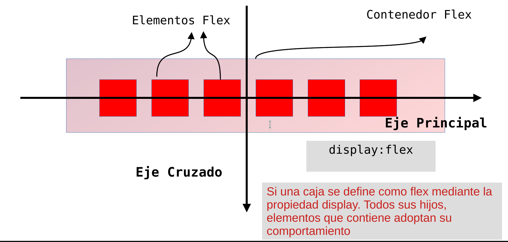
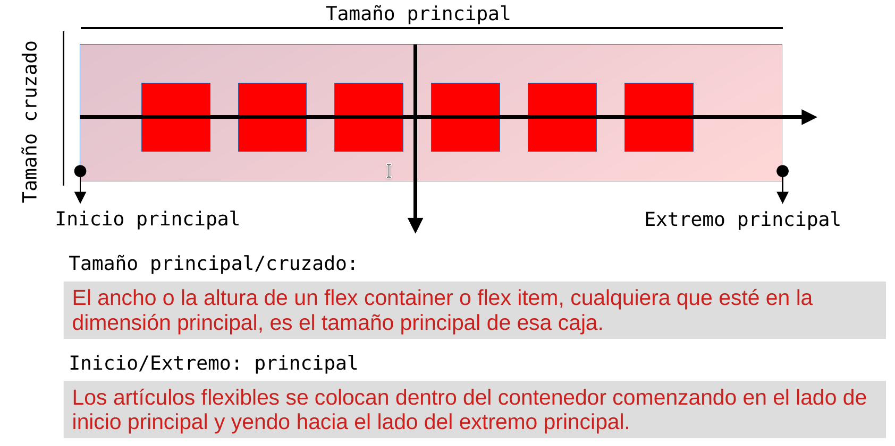
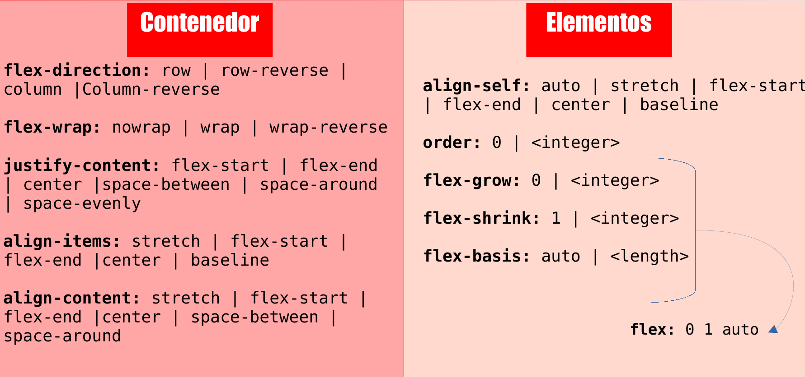
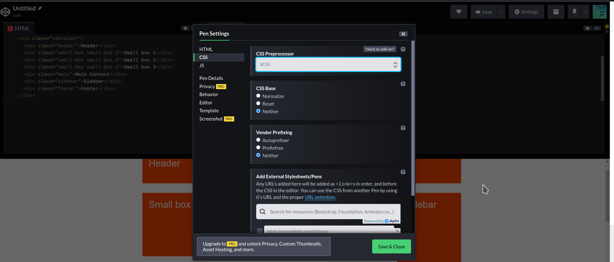
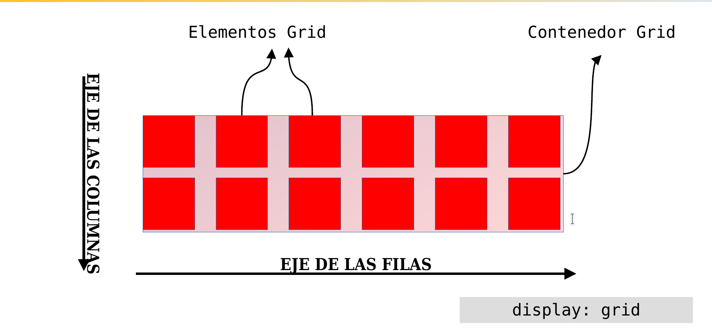
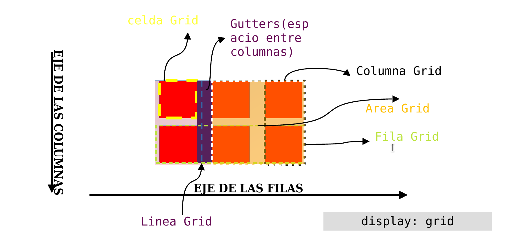

# Introducción

En este tema la mayoría de las explicaciones se añaden multitud de ejemplos que tenéis que ir probando ,para analizar el resultado, o bien realizar pequeños ejercicios para comprobar si lo habéis entendido. Para ello, os recomiendo que utilicéis la aplicación CODEPEN.

# Estructura de una Web

En este tema vamos a tratar sobre la estructura de una web. Cómo utilizando los elementos o conceptos básicos de los anteriores temas y otros nuevos, vamos a poder situar cada una de los elementos de nuestra web donde nosotros queramos.

## Diseño flotante

Veamos un diseño simplista para comprender el problema de la maquetación con cajas flotantes.
Este es el esquema de lo que queremos hacer:


Queremos que la distribución tenga un **ancho fijo**y que esté **centrada**. También queremos que las cajas tengan un color de fondo y que las cajas `<main>` y `<aside>` estén separadas por una línea vertical.

Esta es la estructura HTML:

```html
<div id="contenedor">
  <div id="cabecera">
    <h1>Non equidem invideo...</h1>
  </div>
  <div id="contenido">
    <div id="principal">
      <div id="articulo">
        <h2>Prima luce, cum quibus mons aliud consensu ab eo.</h2>
        <p>
          Pellentesque habitant morbi tristique senectus et netus. Excepteur
          sint obcaecat cupiditat non proident culpa. Inmensae subtilitatis,
          obscuris et malesuada fames. Cum sociis natoque penatibus et magnis
          dis parturient. Non equidem invideo, miror magis posuere velit
          aliquet. Cum ceteris in veneratione tui montes, nascetur mus.
          Excepteur sint obcaecat cupiditat non proident culpa. Ambitioni
          dedisse scripsisse iudicaretur.
        </p>
      </div>
      <div id="articulo">
        <h2>Morbi fringilla convallis sapien, id pulvinar odio volutpat.</h2>
        <p>
          Nec dubitamus multa iter quae et nos invenerat. Nec dubitamus multa
          iter quae et nos invenerat. Mercedem aut nummos unde unde extricat,
          amaras. At nos hinc posthac, sitientis piros Afros. Tu quoque, Brute,
          fili mi, nihil timor populi, nihil! Ab illo tempore, ab est sed
          immemorabili. Paullum deliquit, ponderibus modulisque suis ratio
          utitur. Ab illo tempore, ab est sed immemorabili. Cum ceteris in
          veneratione tui montes, nascetur mus. Etiam habebis sem dicantur magna
          mollis euismod. Prima luce, cum quibus mons aliud consensu ab eo.
        </p>
      </div>
      <div id="articulo">
        <h2>Ambitioni dedisse scripsisse iudicaretur.</h2>
        <p>
          Contra legem facit qui id facit quod lex prohibet. Vivamus sagittis
          lacus vel augue laoreet rutrum faucibus. Pellentesque habitant morbi
          tristique senectus et netus. Quam temere in vitiis, legem sancimus
          haerentia. Donec sed odio operae, eu vulputate felis rhoncus. Paullum
          deliquit, ponderibus modulisque suis ratio utitur. Excepteur sint
          obcaecat cupiditat non proident culpa. Inmensae subtilitatis, obscuris
          et malesuada fames. Non equidem invideo, miror magis posuere velit
          aliquet. Quae vero auctorem tractata ab fiducia dicuntur.
        </p>
      </div>
    </div>
    <div id="aside">
      <h3>Unam incolunt Belgae</h3>
      <p>
        Prima luce, cum quibus mons aliud consensu ab eo. A communi observantia
        non est recedendum.
      </p>
      <h3>Aliam Aquitani, tertiam</h3>
      <p>
        Curabitur blandit tempus ardua ridiculus sed magna. Inmensae
        subtilitatis, obscuris et malesuada fames. Paullum deliquit, ponderibus
        modulisque suis ratio utitur.
      </p>
    </div>
  </div>
  <div id="pie">
    <p>
      Etiam habebis sem dicantur magna mollis euismod. Prima luce, cum quibus
      mons aliud consensu ab eo.
    </p>
  </div>
</div>
```

Y estos son los primeros selectores aplicados para conseguir la estructura de la imagen:

```css
#contenedor {
  width: 960px;
  margin: 0 auto;
}
#principal {
  width: 760px;
  float: left;
}
#aside {
  width: 200px;
  float: left;
}
```

**_Revisa el resultado_**

No está para nada perfecta.

El pie de página ocupa el espacio disponible y está debajo de la caja `<aside>`. Hay que prohibirle cualquier elemento flotante adyacente.

```css
#pie {
  clear: both;
}
```

Primer problema resuelto.

**_Revisa el resultado_**

Ahora especificaremos los colores de fondo para el encabezado y el pie:

**_Revisa el resultado_**

A continuación, aplicaremos un color al fondo en la parte central (principal) y en la columna lateral derecha (`<aside>`):

```css
#principal {
  background-color: #ededed;
}
#aside {
  background-color: #a4a4a4;
}
```

**_Revisa el resultado_**

El problema es que mientras lo hacemos no sabemos (¡y nunca lo sabremos!) cuánto contenido habrá en estos dos elementos, no conoceremos la altura de los dos elementos y no podremos tener colores en los fondos a la misma altura. En nuestro esquema, también tenemos un borde que separa las dos cajas. Aplicaremos un borde a la derecha de la primera caja `<main>`.

Pero hay que modificar el ancho (`width`) de la primera caja para que aparezca correctamente en pantalla. Hay que quitar 1 píxel de ancho para tener en cuenta el borde de 1 píxel.

```css
#principal {
  width: 759px;
  float: left;
  border-right: 1px solid #000;
}
```

**_Revisa el resultado_**

Tenemos el mismo problema con el borde, que solo se aplica en una caja.

Para arreglarlo, la solución es "sencilla", pero costará su tiempo y recursos en caso de producirse algún cambio: utilizar la técnica de las "columnas falsas". **Crearemos una imagen que será el color de fondo de las dos cajas y se la aplicaremos a la parte inferior de la caja** `<div id="contenido">`.
Creamos una imagen de 1 píxel en altura, con un ancho de 960 píxeles y con los colores utilizados. La llamaremos linea-fondo.png y la puede descargar.

A continuación, borramos el borde de la derecha de la caja principal y restauramos el ancho a 760 píxeles:

```css
#principal {
  width: 760px;
  float: left;
}
```

Ahora aplicamos la imagen al fondo de la caja `<div id="contenido">`:

```css
#contenido {
  background-image: url(linea-fondo.png);
  background-repeat: repeat-y;
  overflow: auto;
}
```

**_Revisa el resultado_**

A partir de ahora, independientemente del contenido de las cajas `<main>` y `<aside>`, el color de fondo y el borde estarán equilibrados entre las dos "columnas" de este diseño:

Ahora nos gustaría tener un poco más espacio en las cajas `<main>` y `<aside>`. Hay que aplicar la propiedad padding y modificar consecuentemente el ancho para tener un total de 760 píxeles y 200 píxeles en el área de visualización.

```css
#principal {
  width: 740px;
  padding: 10px;
  float: left;
}
#aside {
  width: 180px;
  padding: 10px;
  float: left;
}
```

**_Revisa el resultado_**

Terminaremos la maquetación aplicando márgenes a 0 para los elementos en el encabezado y en el pie de página:

```css
header h1 {
  margin: 0;
}
#pie p {
  margin: 0;
}
```

**_Revisa el resultado_**

**Conclusión sobre diseñar con elementos flotantes**

Como acabamos de ver, diseñar con elementos flotantes puede causar ciertos "problemas".

- Problema con los colores en los fondos de las "columnas".
- Problema con los bordes de separación de las columnas.
- Utilizar muchas prohibiciones de flotación con un diseño más elaborado.
- Problema a la hora de calcular el ancho si queremos cambiar una propiedad de las cajas (margen, borde, relleno y contenido).
- Con la imagen de las "columnas falsas", habrá problemas si cambian las dimensiones, ya que será necesario rehacer la imagen.
- Problema con el tiempo de carga de las imágenes de fondo si son muchas y no están optimizadas.
  Esta técnica de diseño con elementos flotantes, que durante mucho tiempo fue la única que tuvimos a mano, tiene muchas limitaciones de construcción y mantenimiento. Aunque se siga utilizando mucho, en el capítulo siguiente veremos otra técnica, mucho más flexible y con mejores resultados.

## Diseño con tablas

En el anterior punto hemos diseñado con las técnicas de las cajas flotantes y de las cajas en posición relativa y absoluta y evaluamos los inconvenientes resultantes. Ahora veremos como podemos diseñar con la propiedad `display:table`

### La propiedad display

La propiedad display forma parte de la norma del W3C de las [CSS 2.1](http://www.w3.org/TR/CSS21/visuren.html#propdef-display).
Con respecto a la compatibilidad de los navegadores, solo las versiones 6 y 7 de Internet Explorer no reconocen los valores tabulares de la propiedad display.
Podemos comprobar la compatibilidad con los navegadores en el sitio [Can I use](http://caniuse.com/#feat=css-table).

Para el diseño con tablas, utilizaremos varios valores de la propiedad display.

Estos son los valores:

- **table**, muestra el elemento que utiliza esta propiedad en forma de tabla. El bloque ocupa solo el ancho del contenido.
- **Inline-table**, sirve para diseñar una tabla de tipo en línea. El elemento se incluirá en la línea donde esté ubicado.
- **table-row**,se consigue un diseño de tipo fila. Hace que cualquier elemento se muestre como si fuera una fila de una tabla.
- table-row-group, reagrupa una o varias filas
- **table-header-group**, muestra los elementos correspondientes antes de las filas de la tabla y después de la leyenda, si la hay. De este modo se pueden crear encabezados para la tabla.
- **table-footer-group**, muestra los elementos correspondientes después de las filas de las tablas y después de la leyenda, si la hay. De este modo se pueden crear pies de página para la tabla.
- **table-column**,muestra una columna en la tabla.
- **table-column-group**, reagrupa una o varias columnas de la tabla
- **table-cell**, crea y muestra una celda de una tabla.
- **table-caption**. crea y muestra la leyenda de la tabla. Aparece, por defecto, en la parte superior de la tabla, pero la posición se puede modificar con la propiedad caption-side

### Diseño simple con una tabla

Veamos cómo diseñar una tabla simple, con dos celdas. Esta es la estructura HTML:

```html
<!DOCTYPE html>
<html lang="es">
  <head>
    <title>Mi diseño</title>
    <meta charset="UTF-8" />
    <style>
      #tabla {
        display: table;
      }
      .celda1,
      .celda2 {
        display: table-cell;
      }
      .celda1 {
        background-color: lightgreen;
      }
      .celda2 {
        background-color: lightblue;
      }
    </style>
  </head>
  <body>
    <div id="tabla">
      <div class="celda1">
        <p>Prima luce, cum quibus mons aliud consensu ab eo.</p>
      </div>
      <div class="celda2">
        <p>Lorem ipsum dolor sit amet, consectetur adipisici elit.</p>
      </div>
    </div>
  </body>
</html>
```

La primera caja `<div>` tiene el identificador #tabla. El selector CSS #tabla hará que aparezca en forma de tabla: `display: table`;.
En esta caja tenemos que crear otras dos cajas `<div>` mediante dos clases: .celda1 y .celda2. Los dos selectores utilizan una diseño en forma de celda: `display: table-cell` y con colores en el fondo.

**¿cómo se verá el ejemplo anterior?**

### Ancho en pantalla de la tabla

Las celdas muestran todo su contenido. En este ejemplo no hay mucho texto, aparece al completo y las celdas no son muy anchas. Ahora veamos qué sucede si aumentamos la cantidad de texto.

**Para el primer párrafo añade:** “Prima luce, cum quibus mons aliud consensu ab eo. Tu quoque, Brute, fili mi, nihil timor populi, nihil! Quae vero auctorem tractata ab fiducia dicuntur. Vivamus sagittis lacus vel augue laoreet rutrum faucibus. Plura mihi bona sunt, inclinet, amari petere vellent”

**Y en le segundo añade:** “Lorem ipsum dolor sit amet, consectetur adipisici elit. Ut enim ad minim veniam, quis nostrud exercitation. Quam diu etiam furor iste tuus nos eludet? Me non paenitet nullum festiviorem excogitasse ad hoc. Morbi odio eros, volutpat ut pharetra vitae, lobortis sed nibh. Vivamus sagittis lacus vel augue laoreet rutrum faucibus. Ut enim ad minim veniam, quis nostrud exercitation. Quisque ut dolor gravida, placerat libero vel, euismod. Plura mihi bona sunt, inclinet, amari petere vellent. Ut enim ad minim veniam, quis nostrud exercitation. Sed haec quis possit intrepidus aestimare tellus”

**¿Cuál es el resultado?**

La tabla ocupa todo el ancho disponible en la ventana del navegador y las celdas también ocupan todo el espacio de su elemento padre: la tabla, mostrando así todo su contenido.

Pero lo más importante, como puede comprobar, la altura por defecto de las celdas es equilibrada, independientemente del ancho de la ventana del navegador. Es una particularidad de la vista table-cell.

### Elementos anónimos

Veamos otra característica de la vista tabular. En el ejemplo anterior no hemos creado la fila, table-row. En ese caso, los navegadores crean automáticamente los elementos que faltan para obtener una estructura completa. Ocurriría lo mismo si no hubiéramos definido la tabla con table, los navegadores la habrían creado. El hecho de eliminar la caja `<div id="tabla">` no repercute ni en la validez de la sintaxis ni en la visualización. Compruebalo
Sin embargo, te aconsejo que introduzca un elemento con un display: table, siempre es mejor tener una estructura mínima.
Otros elementos para las tablas
Párrafos en las celdas
En los ejemplos anteriores utilizamos cajas `<div>` para crear la tabla y las celdas. Para simplificar la estructura, puede utilizar cualquier otro elemento para crear las celdas, un párrafo `<p>`, por ejemplo.

```css
<!DOCTYPE html>
<html lang="es">
<head>
  <title>Mi diseño</title>
  <meta charset="UTF-8" />
  <style>
    #tabla {
      display: table;
    }
    .celda1, .celda2 {
      display: table-cell;
    }
    .celda1 {
      background-color: lightgreen;
    }
    .celda2 {
      background-color: lightblue;
    }
  </style>
</head>
<body>
<div id="tabla">
  <p class="celda1">Prima luce...</p>
  <p class="celda2">Lorem ipsum dolor...</p>
</div>
</body>
</html>
```

**¿Y el resultado es?**

El resultado puede verse de inmediato: los párrafos `<p>` no tienen el relleno superior e inferior por defecto. El texto está "pegado" a los bordes del bloque. Para un diseño simplificado puede ser bastante útil.
Listas en tablas

### Diseño de las filas

Ahora vamos a crear una tabla con filas con la propiedad display: table-row. Este es el código utilizado:

```css
<!DOCTYPE html>
<html lang="es">
<head>
  <title>Mi diseño</title>
  <meta charset="UTF-8" />
  <style>
    #tabla {
      display: table;
    }
    .fila1, .fila2 {
      display: table-row;
    }
    .fila1 {
      background-color: lightgreen;
    }
    .fila2 {
      background-color: lightblue;
    }
  </style>
</head>
<body>
<div id="tabla">
  <div class="fila1">
    <p>Prima luce...</p>
  </div>
  <div class="fila2">
    <p>Lorem ipsum dolor sit amet...</p>
  </div>
</div>
</body>
</html>
```

**¿Y obtenemos ?**

Las dos filas ocupan todo el espacio disponible en el ancho de la tabla padre, que en este ejemplo ocupa todo el ancho disponible en la ventana del navegador.

### Establecer el ancho de las celdas

#### Anchos fijos

En los ejemplos anteriores no habíamos establecido ni el ancho de la tabla ni el de las celdas. Los elementos ocupan el espacio disponible en sus elementos padre.
Ahora ya podemos establecer el ancho de la tabla y de las celdas.

Si solo establece el ancho de la tabla (`#tabla {display: table; width: 800px;}`), las celdas utilizarán un ancho calculado para mostrar el contenido de forma distribuida.

**¿Y se verá?**

Si establece un ancho para la celda mayor o menor que las de la tabla, se utilizará el ancho de la tabla.

Por el contrario, si no establece el ancho de la tabla y sí el de las celdas (width: 500px; para la primera y width: 300px; para la segunda), evidentemente, será el ancho que se va a utilizar.

**¿Y se verá?**

Si lo desea, puede establecer un único ancho fijo. En este ejemplo, se ha establecido un ancho para la primera celda de 500 píxeles (width: 500px;), para la segunda no se ha hecho. En ese caso, la primera celda tendrá siempre un ancho de 500 píxeles y la segunda ocupa el resto del espacio disponible en su elemento padre.

#### Anchos en porcentaje

Otra forma de establecer el ancho de las tablas y de las celdas es utilizar los porcentajes. Al cambiar el tamaño de la ventana del navegador, cambiarán todas las dimensiones.

Estos son los estilos aplicados a la tabla:

```css
#tabla {
  display: table;
  width: 60%;
}
yestosalasceldas: .celda1 {
  width: 70%;
  background-color: lightgreen;
}
.celda2 {
  width: 30%;
  background-color: lightblue;
}
```

### Diseño con una tabla más estructurada

Veamos ahora una tabla más estructurada con un encabezado y un pie de página. Le añadiremos el encabezado con la propiedad `display: table-header-group;` y el pie con `display: table-footer-group;`. Este es el código:

```css
<!DOCTYPE html>
<html lang="es">
<head>
  <title>Mi diseño</title>
  <meta charset="UTF-8" />
  <style>
    #tabla {
      display: table;
    }
    #encabezado {
      display: table-header-group;
      background-color: lightyellow;
    }
    #pie {
      display: table-footer-group;
      background-color: lightyellow;
    }
    .celda1, .celda2 {
      display: table-cell;
    }
    .celda1 {
      width: 500px;
      background-color: lightgreen;
    }
    .celda2 {
      width: 300px;
      background-color: lightblue;
    }
  </style>
</head>
<body>
<div id="tabla">
  <div class="fila">
    <div class="celda1">
      <p>Prima luce...</p>
    </div>
    <div class="celda2">
      <p>Lorem ipsum...</p>
    </div>
  </div>
  <div id="encabezado">
    <p>Encabezado. Inmensae subtilitatis...</p>
  </div>
  <div id="pie">
    <p>Pie de página. Quis aute iure...</p>
  </div>
</div>
</body>
</html>
```

El orden de los elementos no altera la visualización. En este ejemplo hemos declarado el encabezado y el pie de página y después las celdas, pero quizá prefiera una estructura más semántica y fácil de asimilar: encabezado, celdas y pie.

**¿Qué obtenemos?**

Como puede ver, solo hemos establecido el ancho de dos celdas, es más que suficiente para que se vean correctamente. Una vez más, le corresponde decidir si prefiere imponer todos los anchos de los elementos de la tabla.

### Otras propiedades de diseño

Veamos algunas propiedades específicas para el diseño en forma de tabla que influyen directamente en el resultado en el navegador.

#### Propiedad table-layout

La propiedad table-layout determina cómo se va a calcular el ancho de las celdas de una tabla que tenga un ancho fijo. Esta propiedad acepta dos valores:

- **table-layout: auto:**es el valor por defecto. En este caso se calcula el ancho de la celda para que la que tenga más contenido sirva como base para el cálculo de la altura de las celdas, para que sea igual en todas.
- **table-layout: fixed:** en este caso el ancho de las celdas es igual y su suma es igual al ancho fijo de la tabla. La altura de las celdas la determina la que tenga más texto.

Estas son las propiedades de la tabla del primer ejemplo:

```css
#tabla {
  display: table;
  width: 800px;
  table-layout: auto;
}
```

Y obtenemos esto:
Y estas las del segundo ejemplo:

```css
#tabla {
  display: table;
  width: 800px;
  table-layout: fixed;
}
```

Y obtenemos esto:

#### Alineación vertical

La alineación vertical en las cajas `<div>` siempre ha supuesto un "problema" para los maquetadores. La propiedad vertical-align definida en las celdas es nativa en el diseño con tablas. Sirve para centrar el contenido en una celda.
Veamos un ejemplo:

```css
<!DOCTYPE html>
<html lang="es">
<head>
  <Title>Mi página web</title>
  <meta charset="UTF-8" />
  <style>
    #tabla {
      display: table;
    }
    .celda1, .celda2 {
      display: table-cell;
      height: 200px;
      vertical-align: middle;
    }
    .celda1 {
      background-color: lightgreen;
    }
    .celda2 {
      background-color: lightblue;
    }
  </style>
</head>
<body>
<div id="tabla">
  <div class="celda1">
    <p>Prima luce, cum quibus mons aliud consensu ab eo.</p>
  </div>
  <div class="celda2">
    <p>Lorem ipsum dolor sit amet, consectetur adipisici elit.</p>
  </div>
</div>
</body>
</html>

```

**¿Cómo se verá?**

### Conclusión

El diseño con tablas con la propiedad display y el resto de valores son una verdadera ventaja para los diseñadores.
Veamos algunas:

- **La altura de las celdas es siempre la misma**. Dicho de forma más técnica, la altura de los elementos hermanos es idéntica. Con otros métodos, la altura de las celdas depende de la cantidad de contenido que tengan. Con este tipo de tablas no nos tenemos que preocupar por este aspecto.
- **La propiedad vertical-align** gestiona de forma nativa la alineación vertical. Una vez más, es una buena manera de aplicar un centrado vertical a un elemento en una celda.

## FlexBox

Fue diseñado como un modelo **unidimensional** de layout, y como un método que pueda ayudar a distribuir el espacio entre los ítems de una interfaz y mejorar las capacidades de alineación.

Cuando describimos a flexbox como unidimensional destacamos el hecho que flexbox maneja el layout en una sola dimensión a la vez — **ya sea como fila o como columna.** Esto contrasta con el modelo bidimensional del Grid Layout de CSS, el cual controla columnas y filas a la vez.

Ventajas de este diseño con respecto a los otros:

- Flexbox que **facilita la alineación** de elementos en uno otro, en diferentes direcciones y órdenes.
- La idea principal detrás de flexbox es darle al contenedor la capacidad de **expandirse y encoger** elementos para aprovechar mejor todo el espacio disponible.
- Flexbox reemplaza los diseños flotantes, usando menos código y más legible y lógico.
- Flexbox cambia completamente la forma en que construimos diseños unidimensionales.

### Los dos ejes de flexbox

Cuando trabajamos con flexbox necesitamos pensar en términos de dos ejes — el eje principal y el eje cruzado. El eje principal está definido por la propiedad `flex-direction`, y el eje cruzado es perpendicular a este.



El eje cruzado va perpendicular al eje principal, y por lo tanto si `flex-direction` (del eje principal) es row o row-reverse el eje cruzado irá por las columnas. Si el eje principal es `column o column-reverse` entonces el eje cruzado corre a lo largo de las filas.

### Líneas de inicio y de fin

Si flex-direction es row y estoy trabajando en un idioma que la escritura es de izquierda a derecha, entonces el margen inicial del eje principal quedará a la izquierda, y el margen final a la derecha.



Pensar en inicial y final en vez de izquierda y derecha es útil cuando veamos otros métodos de layout tales como el CSS Grid Layout que sigue los mismos patrones.

### El contenedor flex

Para crear un contenedor flex, establecemos la propiedad del área del contenedor display como `flex` o `inline-flex`. Los hijos directos de este contenedor se vuelven ítems flex. Como con todas las propiedades de CSS, se definen algunos valores iniciales, así que cuando creemos un contenedor flex todos los ítems flex contenidos se comportarán de la siguiente manera.

- Los ítems se despliegan sobre una fila (la propiedad flex-direction por defecto es row).
- Los ítems empiezan desde el margen inicial sobre el eje principal.
- Los ítems no se ajustan en la dimensión principal, pero se pueden contraer.
- Los ítems se ajustarán para llenar el tamaño del eje cruzado.
- La propiedad flex-basis es definida como auto.
- La propiedad flex-wrap es definida como nowrap.

El resultado es que todos los ítems se alinearán en una solo fila, usando el tamaño del contenedor como su tamaño en el eje principal. Si hay más ítems de los que caben en el contenedor, **estos no pasarán más abajo si no que sobrepasarán el margen** porque el valor de la propiedad flex-wrap es nowrap. Si hay ítems más altos que otros, todos los ítems serán ajustados en el eje cruzado para alcanzar al mayor.



Ahora vamos a ver algunos ejemplos de su utilización a partir del siguiente código html:

```html
<!DOCTYPE html>
<html lang="en">
  <head>
    <meta charset="UTF-8" />
    <meta http-equiv="X-UA-Compatible" content="IE=edge" />
    <meta name="viewport" content="width=device-width, initial-scale=1.0" />
    <title>Document</title>
    <link rel="stylesheet" href="styles.css" />
  </head>
  <body>
    <h1>Flexbox en Acción</h1>

    <div class="container">
      <div class="item it1">1</div>
      <div class="item it2">2</div>
      <div class="item it3">3</div>
      <div class="item it4">4</div>
      <div class="item it5">5</div>
    </div>
    <!-- Explicacion de como crece y decrece los elementos -->
    <div class="containter2">
      <div class="item2 t1">1</div>
      <div class="item2 t2">2</div>
      <div class="item2 t3">3</div>
      <div class="item2 t4">4</div>
      <div class="item2 t5">5</div>
    </div>
    <div class="container3">
      <div class="item3 b">B</div>
      <div class="item3 c">C</div>
    </div>
    <div class="container4">
      <div class="roja">roja</div>
      <div class="amarilla">amarilla</div>
      <div class="azul">azul</div>
    </div>

    <div class="container5">
      <div class="item5">1</div>
      <div class="item5 i52">2</div>
      <div class="item5">3</div>
      <div class="item5">4</div>
      <div class="item5">5</div>
      <div class="item5">6</div>
      <div class="item5">7</div>
      <div class="item5">8</div>
      <div class="item5">9</div>
    </div>
  </body>
</html>
```

Ahora disponemos el siguiente código css. Viene con comentarios, para probarlo lo único que tendrás que quitar y poner los comentarios.

```css
* Establecemos el reseteo  */
* {
  margin: 0;
  padding: 0;
  box-sizing: border-box;
}

.containter {
  background-color: rgb(245, 209, 7);
  padding: 10px;
  display: flex; /* Hemos creado un contenedor flex cuyos hijos (flex items)
   se adaptan al padre y se colocan unos detras de otros */

  /*flex-direction: row-reverse;  invertir el sentido, que hemos visto en las transparencias, en
  que se visualizan los elementos. */

  /* La propiedad flex-direction determina la orientación (Eje principal) de las cajas. Por defecto es row (fila) o column (columnas) */

  flex-direction: row;
  /* El módulo flex dispone de la propiedad justify-content que nos permite alinear */

  justify-content: center;

  /*
  justify-content define cómo el navegador distribuye el espacio entre y alrededor de los items flex,
   a lo largo del eje principal de su contenedor.
   El alineamiento se produce luego de que las longitudes y márgenes automáticos son aplicados.

   /space-between (mismo espacio entre items)
   / space-around (El tamaño entre items son el doble de espacio que
   entre el item y el borde)
    / space-evenly el mismo espacio entre los items y también el borde
    flex-end/start --> los coloca al final o al principio */

  align-items: center; /* Para alinear los elementos contenidos en el contenedor flex en el eje cruzado */.


  /* Como afectaría el hecho de cambiar el flex-direction a columns.
 Lo que pasaría es que cambiamos el eje principal.
 Para comprobarlo, cambiamos a  height: 3000px; y vamos cambiando las propiedades de dirección
 de alineamiento y justificación.
*/
}

.item {
  background-color: #f1425d;
  /* margin: 30px; */
  color: #fff;
  font-size: 40px;
  padding: 50px;
}

 /* Ahora vamos a ver como se comporta el alineamiento con diferentes tamaños.
  Para ello vamos a crear una clase diferente para cada uno de los items.
  Como vemos, al tener la propiedad strech, si  cambiamos el alto de uno todos los demás se adaptan al tamaño del otro.
  Baseline, hace referencia a la alineación respecto al renglón de las palabras.
  */
  .it2 {
  height: 200px;
}

.it4 {
  /*  font-size: 80px;  Esto lo cambiamos para baseline
   */

  /* Si queremos sobrescribir la propiedad alig-item para cada uno de ellos
   podemos hacerlo con align-self*/
  align-self: stretch;
  order: -1;
  /* Podemos cambiar el orden de aparición , todos los elementos
  tiene orden 0. flex lo ordena de menor a mayor, manteniendo el orden   de aparición de los elementos con el mismo valor en orden */
}
.it3 {
  order: 1;
}

```

Ahora vamos con el contenedor 2 para ver las siguientes propiedades. La propiedad `flex`, que es la sintaxis corta de tres propiedades: `flex-grow, flex-shrink y flex-basis`.
Estas propiedades determinan el comportamiento de los elementos hijos en lo que respecta a la adaptación del **tamaño del espacio dentro del padre**.

```css
.container2 {
  background-color: rgb(82, 245, 7);
  padding: 10px;
  display: flex;
  width: 1500px;
  flex-direction: row;
  justify-content: center;
}

.item2 {
  background-color: #f1425d;
  margin: 30px;
  color: #fff;
  font-size: 40px;
  padding: 50px;
  /* flex-grow: 1; */
  /* Lo que estamos aplicando es que cada uno crezca lo  que pueda dividiendose el espacio del padre 
   El valor por defecto es 0*/
}
.t3 {
  order: 1;
}
.t1 {
  /* flex-grow: 2; */
}
```

La propiedad de `flex-shrink` especifica cómo se reducirá el elemento en relación con el resto de los elementos flexibles dentro del mismo contenedor. Y la propiedad `flex-basis` toma el mismo valor que la propiedad `width` y establece el tamaño inicial del elemento antes de distribuir el espacio libre de acuerdo con los ratios de `flex-grow o flex-shrink`. Cuando se omite, su valor es ‘main-size’ anteriormente,
‘auto’).

```css
.containter3 {
  background-color: rgb(71, 7, 245);
  /* width: 170px; */
  width: 300px;
  display: flex;
  /* No tiene un ancho determinado*/
  flex-direction: row;
}
.item3 {
  color: #fff;
  font-size: 40px;
}
.b {
  flex: 3 1 100px;
  background-color: #f142b7;
}
.c {
  flex: 1 2 100px;
  background-color: #f14242;
}
```

En función del flex-grow: 3 partes para el elemento B (75px) y una parte para el elemento C (25px). Es decir, de inicio el elemento B ocupará 100px+75px = 175px de los 300px disponibles que mide el elemento A, y el elemento C ocupará 100px+25px=125px de los 300px disponibles del elemento padre

Ahora bien, supongamos que el elemento contenedor padre mide 170px y no 300px. Eso quiere decir que habrá espacio negativo, porque los elementos B y C tienen un `flex-basis` de 100px cada uno, es decir, 200px, que es 30px mayor que los 170px del contenedor. En este caso el ratio que se usa es el flex-shrink, que recordemos que era 1 para el elemento B y 2 para el elemento C. Esos 30px se restarán del ancho de los
elementos B y C en función de dicho ratio: al elemento B se le quitarán 10px y al elemento C se le quitarán 20px

El valor nowrap de la propiedad flex-wrap impone una visualización en una sola línea aun cuando los elementos hijos se desborden, incluso aunque sean más anchos que la caja flexible padre. La anchura de las cajas hijas se modificará para que estas quepan en la línea de la caja padre.

```css
.container4 {
  display: flex;
  text-align: center;
  flex-direction: row;
  width: 300px;
  flex-wrap: nowrap;
  border: 1px solid;
}
.roja {
  background-color: red;
  width: 150px;
}
.amarilla {
  background-color: yellow;
  width: 150px;
}
.azul {
  background-color: blue;
  width: 150px;
}
```

Otra forma de alinear en el eje vertical cuando hay más de un linea es mediante la propiedad align-content. Esta alinea distribuyendo las lineas igual que lo hace `justify-content`. Pero si está la propiedad wrap.

```css
.container5 {
  background: hsl(0, 0%, 95%);
  display: flex;
  flex-wrap: wrap;
  height: 300px;
  padding: 0;
  align-content: space-between;
}
.item5 {
  background-color: blue;
  height: 46px;
  margin: 2px;
  width: 30%;
}
.i52 {
  height: 98px;
}
```

En este caso, el contenedor tiene una altura de 300px. Todos los cuadros tienen 50 píxeles de alto, excepto el segundo, que tiene 100 píxeles de alto.

La primera línea tiene 100 píxeles de alto.
La segunda línea tiene 50 píxeles de alto.
El espacio restante es 150px
Este espacio restante se distribuye equitativamente entre las dos líneas:

La primera línea ahora tiene 175 px de alto
La segunda línea ahora tiene 125 píxeles de alto.

## CSS Grid layout

Hemos visto el diseño con Flex para una dimensión. Pero si necesitamos un diseño más complicado utilizaremos un diseño en dos dimensiones. El eje X e Y. Este tipo de tecnologia no desbanca la utilización de flex, al contrario son totalmente compatibles.

A Tener en cuenta: Los ejemplos que os muestro, el código css muchas veces va con la barra del comentario //. Ese tipo de comentario no exite en css.
Podemos hacer dos cosas:

1. poco a poco compiar el código en visual code y quitar las dos barras.
2. Si estáis utilizando codePen, en las sección de configuración del css (ruedecita). Poner, preprocesador scss, como muestra la siguiente imagen.



### Conceptos

Para utilizar Grid CSS necesitaremos tener en cuenta una serie de conceptos que utilizaremos a partir de ahora y que definiremos a continuación:

- Contenedor: El elemento padre contenedor que definirá la cuadrícula o rejilla.
- Elementos Grid: Cada uno de los hijos que contiene la cuadrícula (elemento contenedor).
- Celda (grid cell): Cada uno de los cuadritos (unidad mínima) de la cuadrícula.
- Area (grid area): Región o conjunto de celdas de la cuadrícula.
- Gutters : Espacio entre las columnas.
- Línea (grid line): Separador horizontal o vertical de las celdas de la cuadrícula.





Vamos a crear los ejemplos sobre el siguiente html.

```html
<!DOCTYPE html>
<html lang="en">
  <head>
    <meta charset="UTF-8" />
    <meta http-equiv="X-UA-Compatible" content="IE=edge" />
    <meta name="viewport" content="width=device-width, initial-scale=1.0" />
    <title>Document</title>
    <link rel="stylesheet" href="./css/styles.css" />
  </head>
  <body>
    <!-- Nuestro primer grid -->
    <!-- .container>.item.item--$*6 -->
    <div class="container">
      <div class="item item--1">1:Naranja</div>
      <div class="item item--2">2:Verde</div>
      <div class="item item--3">3:Violeta</div>
      <div class="item item--4">4:Rosa</div>
      <div class="item item--5">5:Azul</div>
      <div class="item item--6">6:Marrón</div>
    </div>
  </body>
</html>
```

Aquí tenemos el css base:

```css
.container {
  background-color: rgb(165, 95, 95);
  width: 1000px;
  margin: 30px auto;
}

.item {
  text-align: center;
  padding: 20px 0;
  font-size: 30px;
}
item--1 {
  background-color: orange;
}
item--2 {
  background-color: green;
}
item--3 {
  background-color: Violet;
}
item--4 {
  background-color: pink;
}
item--5 {
  background-color: blue;
}
item--6 {
  background-color: brown;
}
```

### Grid con filas y columnas

Es posible crear cuadrículas con un tamaño explícito. Para ello, sólo tenemos que usar las propiedades CSS `grid-template-columns y grid-template-rows`, que sirven para indicar las dimensiones de cada celda de la cuadrícula, diferenciando entre columnas y filas.

```css
.container {
  background-color: rgb(165, 95, 95);
  width: 1000px;
  margin: 30px auto;
  display: grid;
  // Para definir el número y el alto de las filas.
  // grid-template-rows: 150px 150px;
  // Lo anterior lo podemos poner
  // grid-template-rows: repeat(2, 150px);
  // grid-template-columns: 150px 150px 150px;
  // Lo anterior lo podemos poner
  // grid-template-columns: repeat(3, 150px);
  // pero si ahora lo quiero poner con diferentes tamaños.
  // grid-template-columns: repeat(2, 150px) 300px;
}
```

### Unidad fracción restante (fr)

En el ejemplo anterior he utilizado píxels como unidades de las celdas de la cuadrícula, sin embargo, también podemos utilizar otras unidades (o incluso combinarlas) como porcentajes, la palabra clave auto (que obtiene el tamaño restante) o la unidad especial de Grid CSS fr (fraction), que simboliza una fracción de espacio restante en el grid.

**Esta nueva medida sigue el concepto de la propiedad flex-grow.**

Veamos un ejemplo:

```css
.container {
  background-color: rgb(165, 95, 95);
  width: 1000px;
  margin: 30px auto;
  //height:1000px;
  display: grid;
  grid-template-columns: repeat(
    3,
    1fr
  ); // nos dara tamaños de columnas iguales. 1fracción del tamaño

  //  Ahora vamos a cambiar los tamaños de crecimiento
  // grid-template-columns: 1fr 2fr 1fr;
  // Podemos utilizar porcentajes
  // grid-template-columns: 50% 2fr 1fr;

  // Podemos utilizarlo en las filas si le ponemos el alto por ejemplo a 1000px
  grid-template-columns: 1fr 2fr 1fr;
  grid-template-rows: repeat(2, 1fr);
}
```

### Huecos en grid

Por defecto, la cuadrícula tiene todas sus celdas pegadas a sus celdas contiguas. Aunque sería posible darle un margin a las celdas dentro del contenedor, existe una forma más apropiada, que evita los problemas clásicos de los modelos de caja: los huecos (gutters).

Para especificar los huecos (espacio entre celdas) podemos utilizar las propiedades column-gap y/o row-gap. En ellas indicaremos el tamaño de dichos huecos.

Si añadimos al código anterior lo siguiente:

```css
.container {
  // grid-row-gap: 20px; // he introducido una separación entre las filas.
  // grid-column-gap: 10px;// he introducido una separación entre las columnas.
  // Esto anterior, lo podemos controlar con
  grid-gap: 50px;
}
```

### Propiedades para ítems hijos

Hemos visto propiedades CSS que se aplican solamente al contenedor padre de una cuadrícula. A continuación, vamos a ver ciertas propiedades que en su lugar, se aplican a cada ítem hijo de la cuadrícula, para alterar o cambiar el comportamiento específico de dicho elemento, que no se comporta como la mayoría.

Con respecto a la posición de los hijos de la cuadrícula donde va a comenzar o terminar una fila o columna. Las propiedades son las siguientes:

```css
item--1 {
  background-color: orange;
  // grid-row-start: 2;
  // grid-row-end: 3;
  // grid-column-start: 2;
  // grid-column-end: 2;
  // Date cuenta que cuando cambiamos de fila este naranja el rosa lo empuja a la fila de arriba
  //Pero esto es mucho código para posicionarlo,vamos a ver un shorthand.
  // grid-row: 2/3;
  // grid-column: 2/3;
  // Ahora vamos a expandir los elementos.
  // grid-row: 2/3;
  // grid-column: 2/4;
  //Vamos a dejarlo como estaba para seguir con el violeta
  //grid-row: 2/3;
  //grid-column: 2/3;
}
```

#### Ejercicio posicionamiento.

Ahora, vamos a utilizar lo que hemos aprendido de tal forma que, el **violeta** se posicione en la segunda fila y que empize por la primera linea. Si lo hemos conseguido,el naranja se queda por debajo. Para que el naranja se quede por encima hay que utilizar la propiedad z-index del naranja.

### Otras manera de expandir

```css
item--2 {
  background-color: green;
  // grid-column: 2 / span 2; // Empieza en el 2 y se espande 2 columnas
  // Podemos poner también
  // grid-column:2/span 3 // Ten encuenta que se crea  una nueva columna.
  // También podemos poner el final con signo negativo
  grid-column: 2/-1;
}
```

Ahora, vamos a utilizar un shorhand para expandir las filas y columnas determinado un área.

```css
&--5 {
  background-color: blue;
  // grid-row: 1/2;
  // grid-column: 3/4;
  //UN shortHand para el anterior
  // grid-area: 1/3/2/4;
  grid-area: 1/3/3/4;
}
```

### Nombrando lineas

Con Grid CSS también tenemos la posibilidad de ponerle nombre a las líneas de nuestro sistema grid. Vamos a verlo con un ejemplo, donde probablemente se vea mucho mejor. Partamos de esta estructura HTML.

```html
<div class="container">
  <div class="header">Header</div>
  <div class="small-box small-box-1">Small box 1</div>
  <div class="small-box small-box-2">Small box 2</div>
  <div class="small-box small-box-3">Small box 3</div>
  <div class="main">Main Content</div>
  <div class="sidebar">Sidebar</div>
  <div class="footer">Footer</div>
</div>
```

Podemos dar nombres a las líneas de la siguiente forma como muestra el siguiente código. Además, en cada [] puede haber más de un nombre.

```css
.container {
   width: 1000px;
   margin: 30px auto
   display: grid;
//   grid-template-rows: [header-start] 100px [header-end box-start] 200px [box-end main-start] 400px [main-end footer-start] 100px [footer-end];
//   grid-template-columns: repeat(3, [col-start] 1fr [col-end]) 200px [grid-end];
//   grid-gap: 30px;

//
//   .header {
//     grid-column: col-start 1 / grid-end;
//   }
//   .sidebar {
//     grid-column: col-end 3 / grid-end;
//     grid-row: box-start / main-end;
//   }
//   .main {
//     grid-column: col-start 1 / col-end 3;
//   }
//   .footer {
//     grid-column: col-start 1 / col-end 3;
//   }
// }

 .container > * {
     color: white;
     background-color: orangered;
     padding: 20px;
     font-size: 30px;
    font-family: sans-serif;
   }
```

### Grid por áreas

Mediante los grids CSS es posible indicar el nombre y posición concreta de cada área de una cuadrícula. Para ello utilizaremos la propiedad grid-template-areas, donde debemos especificar el orden de las áreas en la cuadrícula. Posteriormente, en cada ítem hijo, utilizamos la propiedad grid-area para indicar el nombre del área del que se trata.

Tenemos que tener tantos nombres como celdas. También podemos nombres vacíos mediante el punto (.). Ejemplo "head head head ."

```css
.container {
  width: 1000px;
  margin: 30px auto;
  display: grid;
  grid-template-rows: 100px 200px 400px 100px;
  grid-template-columns: repeat(3, 1fr) 200px;
  grid-gap: 30px;
  grid-template-areas:
    "head head head ."
    "box-1 box-2 box-3 side"
    "main main main side"
    "foot foot foot foot";


  .header {
    grid-area: head;
    //todo lo sea head
  }
  .sidebar {
    grid-area: side;
  }
  .main {
    grid-area: main;
  }
  .footer {
    grid-area: foot;
  }
  .small-box-1 {
    grid-area: box-1;
  }
  .small-box-2 {
    grid-area: box-2;
  }
  .small-box-3 {
    grid-area: box-3;
  }

 .container > * {
     color: white;
     background-color: orangered;
     padding: 20px;
     font-size: 30px;
    font-family: sans-serif;
   }
```

### Grid implícitos versus Grid explícitos

Como podemos ver en el siguiente ejemplo hemos construido un grid con dos columnas y dos filas.Esto es lo que se conoce como el grid **explicito**. Pero el navegador genera más filas **automaticamente**. Eso que se genera, se llama grid **implicito**.

```html
<div class="container">
  <div class="item item--1">Moderno</div>
  <div class="item item--2">CSS</div>
  <div class="item item--3">con</div>
  <div class="item item--4">Flexbox</div>
  <div class="item item--5">y</div>
  <div class="item item--6">Grid</div>
  <div class="item item--7">es</div>
  <div class="item item--8">fantástico</div>
</div>
```

```css

  .container {
    width: 1000px;
    margin: 30px auto;
    background-color: bisque;
    display: grid;
    grid-template-rows: repeat(2, 150px);
    grid-template-columns: repeat(2, 1fr);
    grid-gap: 30px;

    .item {
      padding: 10px;
      color: white;
      font-size: 30px;
      background-color: orangered;

      //alineación de items
      &--4 {
        background-color: orchid;

        //align-self: start;
      }
      &--7 {
        background-color: paleturquoise;
        grid-column: 1 / -1;
      }
    }
  }

}

```

Podemos modificar el tamaño las filas implicitas con la siguiente propiedad `grid-auto-rows: 80px;`.Pero la pregunta que nos podemos hacer es ¿porque crea row y no cols?. Es por la siguiente propiedad `grid-auto-flow` que tiene como valor por defecto rows. Sin embargo, lo podemos cambiar de la siguiente manera:

```css
grid-auto-flow: column;
grid-auto-columns: 0.5fr;
```

### Posición en el grid

Existen una serie de propiedades que se pueden utilizar para colocar los ítems dentro de la cuadrícula. Con ellas podemos distribuir los elementos de una forma muy sencilla y cómoda. Dichas propiedades son justify-items y align-items, que ya conocemos de Flexbox.
Por ejemplo, con el ejemplo anterior y en contenedor podemos probar las siguientes propiedades:

```css
align-items: center; //stretch(es por defecto.),end,start.
justify-items: center; //Alinea horizontalmente los elementos.//stretch(es por defecto.),end,start.
```

Estas propiedades se aplican sobre el elemento contenedor padre, pero afectan a los ítems hijos, por lo que actuan sobre la distribución de cada uno de los hijos. En el caso de que queramos que uno de los ítems hijos tengan una distribución diferente al resto, aplicamos la propiedad justify-self o align-self sobre el ítem hijo en cuestión, sobreescribiendo su distribución.

```css
.item--4 {
  background-color: orchid;
  //Aquí va a expandir en las implicitas
  //Aquí vamos a alinear con sus propiedades.
  align-self: start;
  justify-self: start;
}
```

### Ejercicio expandir

Expande de la primera columna a la última columna utilizando número negativos el item--7.

### Posicionamiento todo el contenido

Podemos utilizar las propiedades `justify-content o align-content` para modificar la distribución de todo el contenido en su conjunto, y no sólo de los ítems por separado:
De esta forma, podemos controlar prácticamente todos los aspectos de posicionamiento de la cuadrícula directamente desde los estilos CSS de su contenedor padre.

```css
.container {
// Del anterior ejercicio, cambiamos esta propiedad
    grid-template-columns: repeat(2, 200px);
 height: 1000px;
// justify-content: center; //space-between ,start, space-around,space-evenly
// align-content: center;
// grid-auto-flow: row dense;
&--4 {
 background-color: orchid;
 grid-row: 2 / span 3;
 }
 &--6 {
 background-color: lightcoral;
 grid-row: 2 / span 2;
//Al colocar este elemento. Podemos observar que crea elementos vacios.
// En este caso, elementos en las filas. Dado que flow está en row. Pero si ponemos dense, intenta compactarlo todo.
 }
 &--7 {
 background-color: paleturquoise;
   grid-column: 1 / -1;
  }
  }
 }
```

### Uso min-content,max-content y minmax

La propiedad CSS `grid-template-columns` define el nombre de las líneas y las funciones de tamaño de línea de grid columns. Pero hemos utilizado los valores de fr,%,px . Ahora, vamos a ver como se utiliza los valores `min-content, max-content,minmax`.

- `max-content:` establece el tamaño de la columan o fila con respecto a qué contenido es el mayor
- `min-content:` dispone su tamaño lo más pequeño posible para que no haya **overflow**.
- La función minmax() en CSS define un rango de tamaño mayor o igual que min y menor o igual que max

```css
.container {
  width: 1000px;
  margin: 30px auto;
  background-color: #ddd;
  display: grid;
  //Usando min-content y max-content
  grid-template-rows: repeat(2, 150px);
  grid-template-columns: max-content 1fr 1fr min-content;
  //podemos aplicarlo también a las filas
  //   grid-template-rows: repeat(2, min-content);

  ///-----------------

  //   grid-template-rows: 150px min-content;

  //Vamos a incluir en la caja cuyo contenido es  flexbox un lorem y veremos como, con las propiedades que tenemos arrriba, (comentanod la otra) nos aparece un overflow.

  //   Estando en la situación anterior. vamos a utilizar minmax

  //   grid-template-rows: repeat(2, minmax(150px, min-content));

  //Ahora vamos a ver como afecta el tamaño de la ventana a la siguiente relación que tenemos en el siguientes columnas.
  //   Para ello vamos a sobre escribir el tamaño de container y lo vamos a poner en %.
  //   width: 90%;
  //   grid-template-columns: minmax(200px, 1fr) repeat(3, 1fr);
  //Vemos que no cambia el valor de 200px, mientras los otros se adaptan.
}

.item {
  padding: 20px;
  color: white;
  font-family: sans-serif;
  font: serif 30px;
  background-color: orangered;

  &--1 {
    background-color: orangered;
  }
  &--2 {
    background-color: yellowgreen;
  }
  &--3 {
    background-color: blueviolet;
  }
  &--4 {
    background-color: palevioletred;
  }
  &--5 {
    background-color: royalblue;
  }
  &--6 {
    background-color: goldenrod;
  }
  &--7 {
    background-color: crimson;
  }
  &--8 {
    background-color: darkslategray;
  }
}
```

A partir del código anterior vamos a utilizar auto-fill y auto-fit.

- `auto-fill`:Esta palabra clave nos ayuda a decirle al navegador que inserte el número de columnas o filas que sea necesario para rellenar el espacio.
- `auto-fit`: La diferencia entre las funciones auto-fill y auto-fit en CSS Grid es que la primera pondrá el número de columnas que quepan, sin importar el número de elementos a ubicar. Esto quiere decir que, cuando usamos auto-fill, aun si tenemos pocos elementos, este seguirá poniendo columnas aunque estén vacías si el espacio es mayor a la suma de sus anchos.

La función auto-fit, en cambio, ajusta las columnas para ocupar todo el espacio disponible, sin dejar espacio restante. Ten presente que esta función respeta los anchos mínimos, al igual que auto-fill.

```css
.container {
  //añadimos
  //crea automaticamente tantas columnas de 100px hasta rellenar container.
  grid-template-columns: repeat(auto-fill, 100px);
  //crea automaticamente solo tantas columnas como elementos tenemos y deja un espacio.
  // grid-template-columns: repeat(auto-fit, 100px);

  //Con la el siguiente ejemplo lo que conseguimos es tener exactamente 8 columnas como mínimo de 200px y máximo 1fr,es decir, proporcional. Por lo que, se expandirá a todo el ancho.
  // Si ponemos el tamaño en % veremos el efecto al disminuir el tamaño de la ventana.
  // width: 90%;

  //grid-template-columns: repeat(auto-fit, minmax(100px, 1fr));
  // Si modificamos tando el ancho se crean filas implicitas. Para poder controlar su tamaño podemos poner lo siguiente.
  //width:5%;
  //grid-auto-rows: 150px;
}
```
