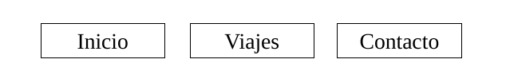
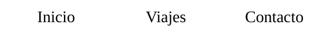
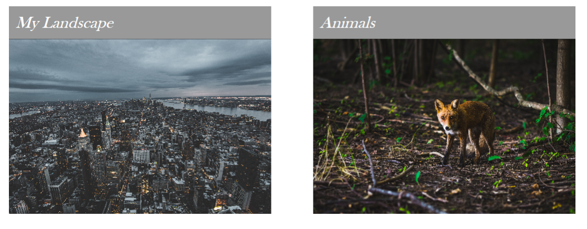
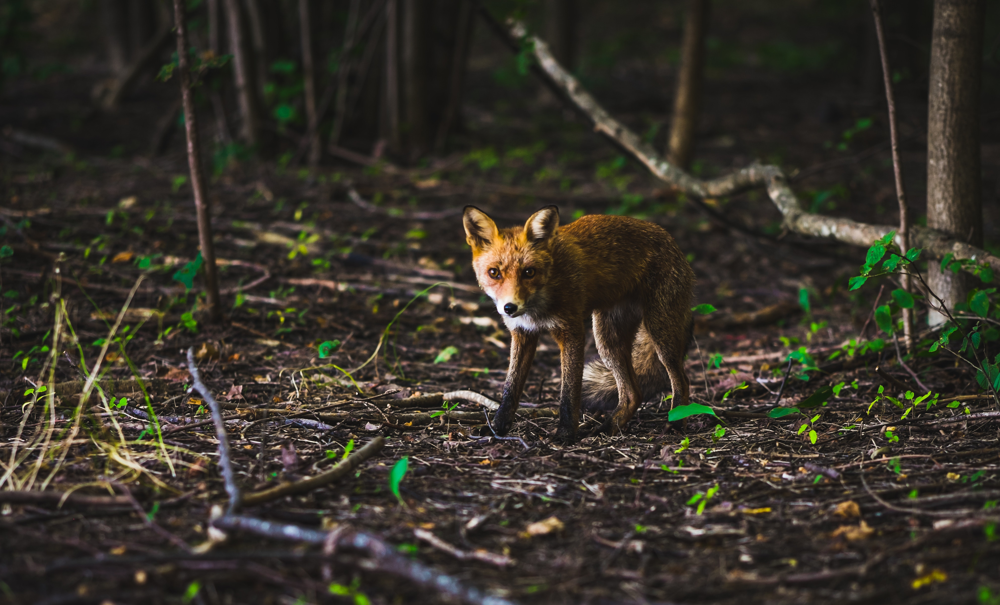

# Ejercicios de animaciones de CSS

## Video Explicación

Se encuentra en Aules en el apartado de videos de la Unidad

## Ejercicio 1

Crea un menú muy sencillo, de tal forma que cuando pase el ratón pase por encima de los
enlaces:

- El color de fondo pasará progresivamente del amarillo al azul,
- El color del texto va a pasar progresivamente del negro al blanco.

Con el siguiente código HTML:

```html
<ul id="navegacion">
  <li><a href="#">Inicio</a></li>
  <li><a href="#">Viajes</a></li>
  <li><a href="#">Contacto</a></li>
</ul>
```



## Ejercicio 2

Modifica el anterior menú y conviértelo en un menú como se ve en la imagen. Todos están juntos y sin bordes. De tal manera que cuando hagas focus sobre uno de ellos aparezca el borde lateral izquierdo de un color diferente para cada uno de ellos de forma progresiva.


## Ejercicio 3

Pon dos imágenes que este una al lado de otra con la etiqueta `figure`. Como ves `figcaption` esta en la parte de arriba. Cuando hagamos pasemos el ratón sobre las imágenes `figcaption` tiene que bajar de manera progresiva hasta la parte superior de la imagen, pero sin salirse de ella.



## Ejercicio 4

En el siguiente ejercicio, tenéis que crear una animación de tal manera que cuando pongamos el ratón por encima de una imagen se desvanezca y nos muestre otra . Tenéis que realizarla de las tres siguientes maneras.

1. Especifique la primera imagen como el fondo CSS de un elemento contenedor, con el segunda imagen dentro del elemento mismo.

   ```html
   <section id="ejer4" class="crossfade">
     
   </section>
   ```

2. Crear un elemento contenedor con posición relativa que contenga ambas imágenes, con la segunda imagen teniendo posición: absoluta.

   ```html
   <section id="ejer4.2" class="crossfade2">
     
     
   </section>
   ```

3. Especifique ambas imágenes como fondos y transición entre ellas.

   ```html
   <section id="ejer4.3" class="crossfade3"></section>
   ```

## Ejercicio 5

Vamos a crear una galería simple. A la derecha aparecen las imágenes en un formato pequeño de 150px\*150px y a la derecha nos muestra las imágenes en grande cuando pasemos el ratón por encima de cada una de las imágenes pequeñas.

Código html a utiliza:

```html
<section id="gallery">
  <ul class="gallery">
    <li>
      <a href="#thomas">
        </a>
    </li>
    <li id="thomas"></li>
    <li>
      <a href="#vladimir"
        ></a>
    </li>
    <li id="vladimir">
      
    </li>
    <li></li>
    <li></li>
  </ul>
</section>
```

Algunos consejos:

1. Crea una lista con todas las imágenes.
2. **NO se puede utilizar Jquery ni javascript**.
3. Cada imagen estará repetida dos veces. La primera hará de **thumbail**, situado en la parte izquierda, y la siguiente es la que se mostrará en la parte derecha de forma ampliada
   (con lo cual irá `visibility hidden`).
4. Utiliza `position relative` para `ul y li absolute` para el posicionamiento.
5. Las imágenes situadas en la parte izquierda pueden estar modificadas por programas de edición para que tengan un tamaño más pequeño o bien modificadas con las propiedades css. Ten cuidado que no se deformen.
6. Lo primero que tenemos que hacer es que cuando pasemos el ratón por cada una de las
   imágenes del lado derecho aparezcan en lado derecho. Después, aplicar una transición de
   opacidad.

## Ejercicio 6

Modifica el anterior ejercicio, de tal forma que creemos un lightBox gallery. Ahora cuando hagamos click en cada una de las imágenes nos saldrá una imagen por encima con una animación. NO se puede utilizar jquery, javascript.
Algunos consejos:

1. La estructura es la misma que el anterior. Con la lista creada.
2. Hay que utilizar el **pseudoelemento :target** de la etiqueta a. Para activar las animaciones.
3. Esta es una de las animaciones que tenéis que utilizar al mostrar la imagen.

   ```css
   @keyframes blowup {
     0% {
       width: 0;
       height: 0;
       opacity: 0;
     }
     30% {
       width: 340px;
       height: 0;
       opacity: 0;
     }
     60% {
       width: 340px;
       height: 280px;
       opacity: 0;
       margin: 20px;
     }
     100% {
       width: 340px;
       height: 280px;
       opacity: 1;
       margin: 20px;
     }
   }
   ```

4. Otra pista . li:nth-child(even) Son lo que se tiene que mostrar.

   ```css
   li:nth-child(even):target {
     visibility: visible;
     background: rgba(0, 0, 0, 0.6);
     transition: 2s background linear;
   }
   ```

5. Para los elementos a también podemos crear unos estilos.

   ```css
   li:nth-child(even):target a {
     box-shadow: 0 0 8px 8px rgba(0, 0, 0, 0.3);
   }
   ```

## Ejercicio 7

En este ejercicio vamos a utilizar las transformaciones 3d para crear leyendas sobre unas fotos. Las fotos tienen que rotar y posteriormente tiene que aparecer el label sobre el centro. Es muy parecido al que vimos en clase pero con algunas variaciones. Consejos:

1. Código html con el que tienes que empezar:

   ```html
   <figure>
     
     <figcaption>My Landscape</figcaption>
   </figure>
   <figure>
     
     <figcaption>Animals</figcaption>
   </figure>
   ```

2. Tienes que utilizar `perspective` del padre de las figuras para que la
   rotación de las imágenes en el eje Y salga bien.
3. Para ocultar el label tienes que jugar con `rotateY() translateZ();`
4. A cada figura le añadimos una sobra debajo con el elemento `after`.

   ```css
   figure:after {
     content: " ";
     display: block;
     height: 8vw;
     width: 100%;
     transform: rotateX(90deg);
     background-image: radial-gradient(
       ellipse closest-side,
       rgba(0, 0, 0, 0.05) 0%,
       rgba(0, 0, 0, 0) 100%
     );
   }
   ```
