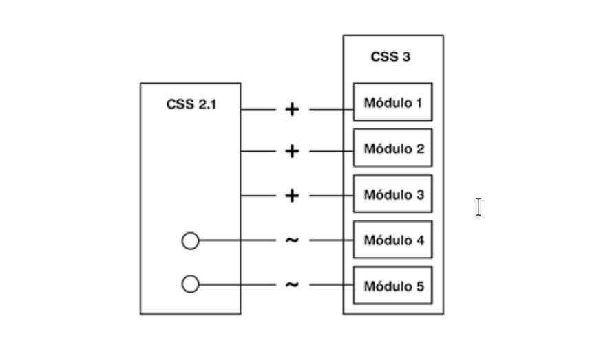
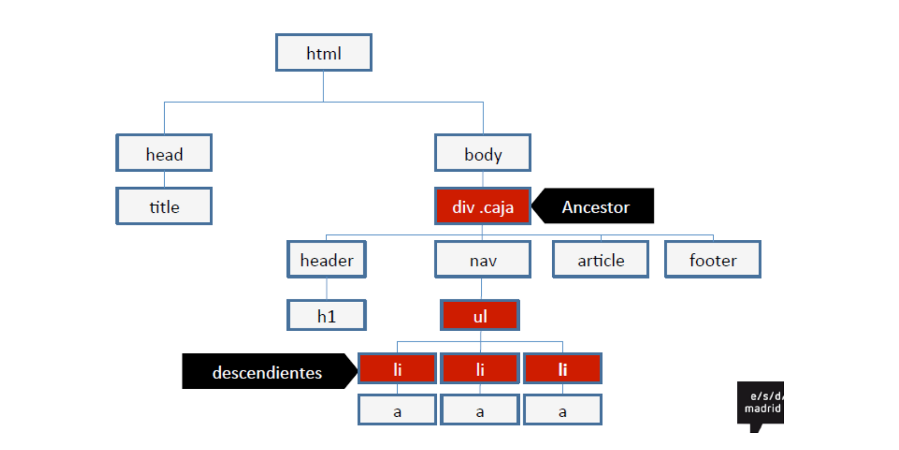

# CSS Básico

## Características del CSS3

### Los módulos CSS3

Las CSS tienen como objetivo separar la estructura de la página (con su contenido,creado con HTML) del diseño y el formato de la propia página.

Hubo distintas recomendaciones a lo largo de su creación **(1, 2 y 2.1)** que implicó un enorme trabajo, desde los **borradores (Working Draft)** hasta el documento finalizado (Recommendation). La recomendación final es un documento único con un número impresionante de páginas. Por lo que en su versión 3 se decidió de cambiar su modo de trabajo. De tal forma que las propiedades se han reagrupado en módulos funcionales
independientes que evolucionan a su propio ritmo. De este modo, los navegadores han podido probar e implementar las nuevas propiedades de forma progresiva, módulo a módulo. Y además, lo único que hacen las CSS3 es añadir nuevas propiedades y redefinir algunas de las que ya existían desde las CSS 2.1.



Cada módulo pasa por una serie de etapas perfectamente estandarizadas por el W3C.

1. borrador de trabajo, el Working Draft (WD) (propuestas).
2. En la etapa Last Call (LC) anuncia la fecha de finalización de las pruebas y toma en cuenta los comentarios de los grupos de trabajo.
3. La Candidate Recommendation (CR). El W3C ha revisado prolongadamente su copia.
4. La última etapa es la de Recommendation (REC).

### Los prefijos de los navegadores

La concepción de las CSS3 en módulos independientes supone para los navegadores un trabajo considerable de implementación de las nuevas propiedades en los motores de renderizado. Y, además, mientras los módulos no pertenezcan a la categoría Candidate Recommendation, las propiedades pueden cambiar, lo que complica
todavía más el trabajo de los navegadores.

He aquí estos prefijos (designación según proveedor):
• -moz-: para el motor de renderizado Gecko que utiliza Mozilla Firefox.
• -webkit-: para el motor de renderizado WebKit que utilizan Apple Safari y
Google Chrome, con sus bifurcaciones.
• -o-: para el motor de renderizado de Opera.
• -ms-: para el motor de renderizado de Microsoft Internet Explorer.
• -khtml-: para el motor de renderizado KHTML que usan varios navegadores
bajo Linux.

He aquí la sintaxis que se debe utilizar para que la reconozcan todos los navegadores:

```css
header {
-moz-border-radius: 10px;
-webkit-border-radius: 10px;
-23-
-o-border-radius: 10px;
-ms-border-radius: 10px;
-khtml-border-radius: 10px;
border-radius: 10px;
}
```

**El orden de las líneas es importante. Al ubicar la propiedad «estándar» en la última posición, se asegura de que esta se impone a las líneas precedentes.**

### El sitio Can I use

La página [Can I Use](http://caniuse.com), es una web colaborativa mediante la cuál se puede saber el estado actual, previo e incluso futuro de las propiedades CSS, elementos HTML, o características Javascript disponibles en cada navegador.

Se introduzca la propiedad CSS3 o el elemento HTML5 que desee utilizar. En este ejemplo, hemos probado con la propiedad hyphens.

Aquí dispone de la tabla de compatibilidad entre la propiedad introducida y las principales versiones de los navegadores actuales. La tabla emplea cuatro colores:

- Verde: Supported.
- Rojo: Not supported.
- Verde flojo: Partial support.
- Gris: Support unknown.

A continuación, dispone de cuatro pestañas que son también muy importantes para obtener toda la información técnica útil: **Notes, Known issues, Resources y Feedback**.

Finalmente, se indica, para cada navegador, si es necesario el uso de prefijos.

En este ejemplo (propiedad hyphens), el uso de prefijos es necesario para los navegadores que reconocen esta propiedad. Si pasa el puntero del ratón por la casilla, se le indicará el prefijo de estos navegadores.

### Herencia.

Para entender como funcionan los selectores y la herencia CSS es necesario entender qué es el árbol del documento. Si disponemos del siguiente ejemplo.


El antecesor es un elemento conectado pero más arriba en la estructura del documento:


Hijo es el elemento conectado y directamente debajo de un elemento en la estructura del documento.


Hijo es el elemento conectado y directamente debajo de un elemento en la estructura del documento.


Si definimos un estilo en el body, todos los elementos situados debajo en el árbol del documento, heredan esa propiedad.


### Selectores

#### Selector de tipo o etiqueta

El selector de etiquete aplica a todos los elementos HTML de la página con esa etiqueta (p).

```css
p {
  color: #f00;
}
```

El selector múltiple de CSS, incluye varios selectores separados por coma (,), aplicando el estilo a cualquier elemento con alguna de las marcas incluidas.

```css
h1,
,
h2,
h3 {
  color: #f00;
}
```

#### Selector descendente

El selector puede incluir etiquetas separadas solo por espacios. El selector aplicará solo a elementos con la última marca (ul), con los anteriores como ancestros, es decir header deberá ser ancestro de nav y nav deberá ser ancestro de ul.

```css
header nav ul {
  color: red;
}
```

#### Selector de clase

Una de las soluciones más sencillas para aplicar estilos a un solo elemento de la página, consiste en utilizar el atributo class de HTML sobre ese elemento para indicar directamente la regla CSS que se le debe aplicar.

`<p class="destacado">Lorem ipsum dolor sit amet...</p>`

A continuación, se crea en el archivo CSS una nueva regla llamada destacado con todos los estilos que se van a aplicar al elemento. Para que el navegador no confunda este selector con los otros tipos de selectores, se prefija el valor del atributo class con un punto (.), tal y como muestra el siguiente ejemplo:

```css
.destacado {
  color: red;
}
```

En ocasiones, es necesario restringir el alcance del selector de clase.

```html
<p class="destacado">Lorem ipsum dolor sit amet...</p>
<p>sed lacus et <a href="#" class="destacado">est adipiscing</a> accumsan</p>
```

¿Cómo es posible aplicar estilos solamente al párrafo cuyo atributo class sea igual a destacado? Combinando el selector de tipo y el selector de clase, se obtiene un selector mucho más específico:

```css
p.destacado {
  color: red;
}
```

El selector p.destacado se interpreta como "aquellos elementos de tipo `<p>` que dispongan de un atributo class con valor destacado". Es posible aplicar los estilos de varias clases CSS sobre un mismo elemento. La sintaxis es similar, pero los diferentes valores del atributo class se separan con espacios en blanco. En el siguiente ejemplo:

```html
<p class="especial destacado error">Párrafo de texto...</p>
```

Al párrafo anterior se le aplican los estilos definidos en las reglas .especial , .destacado y .error.

#### Selector universal\*

```css
* {
  margin: 0px;
  padding: 0px;
}
```

Afecta a todos los elementos. Podemos utilizarlo de la siguiente forma. Para la mayoría de los elementos, necesitamos personalizar los márgenes o, simplemente,mantenerlos al mínimo. Algunos elementos, por efecto, tienen márgenes que son diferentes de cero y, en la mayoría de los casos, demasiado amplios. A medida que
avanzamos en la creación de nuestro diseño, encontraremos que la mayoría de los elementos utilizados deben tener un margen de 0 píxeles. Para evitar tener que repetir estilos constantemente, podemos utilizar el selector universal.

Con la regla indicada anteriormente, nos aseguramos de que todo elemento tendrá un margen interno y externo de 0 píxeles. De ahora en adelante, sólo necesitaremos modificar los márgenes de los elementos que queremos que sean mayores que cero.

#### Selector de ID

Para aplicar estilos CSS a un único elemento de la página. El selector de ID permite seleccionar un elemento de la página a través del valor de su atributo id . Este tipo de selectores sólo seleccionan un elemento de la página, ya que el valor del atributo id no se puede repetir en dos elementos diferentes de una misma página.

```html
#destacado { color: red; }

<p>Primer párrafo</p>
<p id="destacado">Segundo párrafo</p>
<p>Tercer párrafo</p>
```

En el ejemplo anterior, el selector #destacado, solamente selecciona el segundo párrafo (cuyo atributo id es igual a destacado ).

#### Selector de hijos\>

Se trata de un selector similar al selector descendente, pero muy diferente en su funcionamiento. Se utiliza para seleccionar un elemento que es hijo directo de otro elemento y se indica mediante el "signo de mayor que" (>):

```css
p > span {
  color: blue;
}
<p><span>Texto1</span></p>
<p><a href="#"><span>Texto2</span></a></p>
```

En el ejemplo anterior, el selector `p > span` se interpreta como "cualquier elemento `<span>` que sea hijo directo de un elemento `<p>`, por lo que el primer elemento `<span>` cumple la condición del selector. Sin embargo, el segundo elemento `<span>` no la cumple porque es descendiente, pero no es hijo directo de un elemento `<p>` .

#### Selector adyacente'\+'

El selector adyacente utiliza el signo + y su sintaxis es:

```css
elemento1 + elemento2 {
  ...;
}
```

La explicación del comportamiento de este selector no es sencilla, ya que selecciona todos los elementos de tipo elemento2 que cumplan las dos siguientes condiciones:

1. elemento1 y elemento2 deben ser hermanos, por lo que su elemento padre debe
   ser el mismo.
2. Elemento2 debe aparecer inmediatamente después de elemento1 en el código
   HTML de la página.

En el siguiente ejemplo:

```css
h1 + h2 { color: red }

<body>
<h1>Titulo1</h1>
<h2>Subtítulo</h2>
...
<h2>Otro subtítulo</h2>
...
</body>
```

Los estilos del selector `h1 + h2` se aplican al primer elemento `<h2>` de la página, pero no al segundo `<h2>` , ya que: El elemento padre de `<h1>` es `<body>` , el mismo padre que el de los dos elementos `<h2>`.
Así, los dos elementos `<h2>` cumplen la primera condición del selector adyacente. El primer elemento `<h2>` aparece en el código HTML justo después del elemento `<h1>` , por lo que, este elemento `<h2>` también cumple la segunda condición del selector adyacente.
Por el contrario, el segundo elemento `<h2>` no aparece justo después del elemento `<h1>` , por lo que no cumple la segunda condición del selector adyacente y, por tanto, no se le aplican los estilos de `h1 + h2` .

#### Selector de atributos

Los selectores de atributos permiten seleccionar elementos HTML en función de sus atributos y/o valores de esos atributos.
Los cuatro tipos de selectores de atributos son:

- `[nombre_atributo]` , selecciona los elementos que tienen establecido el atributo llamado nombre_atributo independientemente de su valor.
- `[nombre_atributo=valor]` , selecciona los elementos que tienen establecido un atributo llamado nombre_atributo con un valor igual a valor .
- `[nombre_atributo~=valor]` , selecciona los elementos que tienen establecido un atributo llamado nombre_atributo y al menos uno de los valores del atributo es valor .
- `[nombre_atributo|=valor]` , selecciona los elementos que tienen establecido un atributo llamado nombre_atributo, cuyo valor es una serie de palabras separadas con guiones, pero que comienza con valor .Este tipo de selector sólo es útil para los atributos de tipo lang que indican el idioma del contenido del
  elemento.

A continuación, se muestran algunos ejemplos de estos tipos de selectores:

```css
/* Se muestran de color azul todos los enlaces que tengan un atributo "class",independientemente de su valor */ a[class] {
  color: blue;
}
/*
  Se muestran de color azul todos los enlaces que tengan un atributo "class" con el valor "externo"
  \*/
  a[class="externo"] {
  color: blue;
}
/* Se muestran de color azul todos los enlaces que apunten al sitio "http://www.ejemplo.com" */
a[href="http://www.ejemplo.com
{
  color: blue;
}
/*
  Se muestran de color azul todos los enlaces que tengan un atributo "class" en el que al menos uno de sus valores sea "externo" */
  a[class~="externo"] {
  color: blue;
}
/*  Selecciona todos los elementos de la página cuyo atributo "lang" sea igual a "en", es decir, todos los elementos en inglés  */

*[lang="en"] {
  ...;
}
/* Selecciona todos los elementos de la página cuyo atributo "lang" empiece por "es", es decir, "es", "es-ES", "es-AR", etc. */

*[lang|="es"] {
  color: red;
}
```

#### Pseudo-clases

El concepto pseudo-clase se introdujo para permitir la selección de elementos sobre la base de la información que se encuentra fuera de la estructura del documento, o que no se puede expresar con los otros selectores simples.

Una pseudo-clase se compone siempre de "dos puntos" (:) seguido del nombre de la pseudo-clase y, opcionalmente, por un valor entre paréntesis.

Las pseudo-clases pueden ser dinámicas, es decir, un elemento puede adquirir o perder una pseudo-clase, mientras que un usuario interactúa con el documento. Ya en CSS2 se definieron una serie de pseudo-clases dinámicas que nos permitían cambiar los estilos de los enlaces en función de su estado o de cómo interactuara el usuario con ellos:

- **:link** permite aplicar estilos para los enlaces que aún no han sido visitados.
- **:visited** aplica estilos a los enlaces que han sido visitados anteriormente.
- **:focus** estilos que se aplican al enlace cuando este tiene el foco (acepta eventos de ratón o de teclado
- **:hover** estilos que muestra el enlace cuando el usuario posiciona el puntero del ratón sobre el enlace.
- **:active** estilos que se aplican al enlace cuando el usuario está pinchando sobre el enlace (el tiempo durante el que se aplica este estilo es muy breve).

Las pseudo-clases :link y :visited solamente están definidas para los enlaces, pero las pseudo-clases :hover y :active se definen para todos los elementos HTML.

```css
a:hover {
  text-decoration: none;
}
```

En este ejemplo se elimina el subrayado del enlace cuando se sitúa el ratón sobre él.

#### Pseudo-elementos

Por último, CSS define unos elementos especiales llamados "pseudo-elementos" que permiten aplicar estilos a ciertas partes de un texto. En concreto, CSS permite definir estilos especiales
la primera frase de un texto y a la primera letra de un texto:

- El pseudo-elemento **`:first-line`** permite aplicar estilos a la primera línea de un texto.
- El pseudo-elemento \*_`:first-letter_`\* permite aplicar estilos a la primera letra del texto
- pseudo-elementos **`:before y :after`** que nos permiten insertar contenidos antes o después de un elemento determinado.
- **`::marker`** Aplica estilos a los elementos de cada ítem de una lista.
- **`::backdrop`** Aplica estilos al fondo exterior de un elemento (sin que afecte a este).
- **`::placeholder`** Aplica estilos a los textos de sugerencia de los campos `<input>`.
- **`::selection`** Aplica estilos al fragmento de texto seleccionado por el usuario.

Ejemplo:

Para ello utilizaremos la propiedad CSS content , en la que indicaremos los contenidos que serán insertados.

```css
a:after {
  content: " (" attr(href) ") ";
}
```

El código CSS anterior añade **después** de cada enlace de la página un texto formado por la dirección a la que apunta el enlace mostrada entre paréntesis. Si se quiere añadir las direcciones **antes** de cada enlace, se puede utilizar el pseudo-elemento :before :

```css
a:before { content: " (" attr(href) ") ";
```

La propiedad content admite parámetros de diverso tipo, incluso concatenando información mediante espacios. Podemos utilizar tres tipos de contenido:

| Valor          | Descripción                                    | Ejemplo                              |
| -------------- | ---------------------------------------------- | ------------------------------------ |
| "..."          | Añade el contenido de texto indicado. content: | "Contenido:";                        |
| attr(atributo) | Añade el valor del atributo HTML indicado.     | content: attr(href);                 |
| url(...)       | Añade la imagen indicada en la URL.            | content: url(icon.png);              |
| Gradient       | Añade un gradiente del tamaño indicado.        | content: linear-gradient(red, blue); |
| counter        | Define un contador CSS para mostrar.           | content: counter(item);              |

Ejemplo:

```css
p {
  font-family: Verdana, sans-serif;
  font-size: 16px;
  color: #333;
}

p::first-letter {
  font-family: "Times New Roman", serif;
  font-size: 42px;
  color: black;
}
```

### Prioridad

Cuando dos declaraciones afectan a un mismo elemento ¿ Cuál de ellas se interpreta en el navegador como más importante? Hay que calcular la tupla (A,B,C,D) ganadora de todas las reglas que compiten. Siendo A la que tiene mayor peso y D el mínimo. Si hay empate en A, se mira B y así sucesivamente.

- A = estilo en línea.
- B = número de Ids
- C= número de Clases
- D = número de marcas HTML


La ganadora es , #caja. Cabecera h1 =0,1,1,1.

**Cuando dos declaraciones tienen el mismo valor, será la última especificada.**

Hay reglas adicionales de prioridad de las declaraciones CSS ordenadas de **menor a mayor**:

- CSS por,defecto,del,Navegador (navegador)
- CSS en preferencias,de,usuario,del,navegador (usuario)
- CSS en página,HTML,o,script,CSS (diseñador),
- CSS en página,HTML,o,script,CSS con !important (diseñador), p. e. `body,{color:blue,!important;}`
- CSS en preferencias,de,usuario,del,navegador con !important (usuario), p. e.
  `body,{color:blue,!important;},`


### Unidades de medida

Existen varios tipos de unidades, vamos a desglosarlas en grupos y explicar cada una de ellas. Más delante veremos las propiedades de CSS que pueden utilizarlas.

#### Unidades absolutas

Las unidades absolutas son un tipo de medida fija que no cambia, que no depende de ningún otro factor. Son ideales en contextos donde las medidas no varían como pueden ser en medios impresos (documentos, impresiones, etc...), pero son unidades poco adecuadas para la web, ya que no tienen la capacidad de adaptarse a diferentes resoluciones o pantallas.

A continuación, podemos ver las diferentes unidades absolutas que pueden utilizarse en CSS son las siguientes (de mayor a menor tamaño):

| Unidad | Significado | Medida         |
| ------ | ----------- | -------------- |
| in     | Pulgadas    | 1in = 25.4mm   |
| cm     | Centímetros | 1cm = 10mm     |
| pc     | Picas       | 1pc = 4.23mm   |
| mm     | Milímetros  | 1mm = 1mm      |
| pt\*   | Puntos      | 1pt = 0.35mm   |
| px\*\* | Píxels      | 1px = 0.26mm ( |

\*El punto (pt) podría ser una medida ideal para documentos CSS en los que se fija el tamaño de las fuentes en medios impresos)
\*\*Esta se puede considerar también relativa desde la salida de la pantalla retina de Appel) |

#### Unidades relativas

Al contrario que las unidades absolutas, las unidades relativas dependen de algún otro factor (resolución, tamaño de letra, etc...). son ideales para trabajar en dispositivos con diferentes tamaños.

Las unidades relativas más conocidas son las siguientes:

| Unidad | Significado  | Medida aproximada                                                         | Ejemplo               |
| ------ | ------------ | ------------------------------------------------------------------------- | --------------------- |
| em     | «M»          | Multiplicador del tamaño font-size en ese elemento (o heredado)           | 1.5em \* 16px = 24px  |
| ex     | «x»          | Multiplicador de la mitad del tamaño font-size (altura de la x minúscula) | 1ex ~ 0.5em           |
| ch     | «zero width» | Multiplicador del tamaño de ancho del carácter cero ( 0 )                 | 1ch ~ 1 carácter      |
| re     | m «root M»   | Multiplicador del tamaño font-size del elemento raíz (<html> o similar)   |
| %      | Porcentaje   | Relativa a herencia (concretamente, al elemento padre)                    | 50% = mitad del padre |

La unidad** em** se utiliza para hacer referencia al **tamaño actual de la fuente** (body) en ese elemento HTML. Generalmente es de tamaño 16px (salvo que se modifique por el usuario).

La unidad **rem (root em)** es muy parecida a em, pero permitiendo establecer **un tamaño base** personalizado (estableciéndolo en la etiqueta `html` o la pseudoclase `:root`). De esta forma, podemos trabajar con múltiplos del tamaño base:

```css
:root {
  font-size: 22px; /* Tamaño base */
}

h1 {
  font-size: 2rem; /* El doble del tamaño base: 44px */
}
```

El elemento `h1` tendrá el valor de 44px.
De esta forma cambiando el tamaño de la fuente en la pseudoclase `:root` se modificarán todos los tamaños.

#### Unidades flexibles (viewport)

Estas unidades dependen del viewport (**región visible de la página web en el navegador)**. Con estas unidades podemos hacer referencia a un porcentaje concreto del tamaño específico que tengamos en la ventana del navegador, independientemente de si es redimensionado o no.

Estas unidades son las siguientes:

| Unidad | Significado      | Medida aproximada                      |
| ------ | ---------------- | -------------------------------------- |
| vw     | viewport         | width 1vw = 1% ancho de navegador      |
| vh     | viewport         | height 1vh = 1% alto de navegador      |
| vmin   | viewport minimum | 1vmin = 1% de alto o ancho (el mínimo) |
| vmax   | viewport maximum | 1vmax = 1% de alto o ancho (el máximo) |

### Modelo de caja

Hemos visto en la anterior unidad el modelo de caja y de los elementos que componenen una caja o element html. Para dar tamaños específicos necesitaremos asignarles valores a las propiedades `width` (ancho) y `height` (alto).

En el caso de indicar el valor **auto** a dichas propiedades, el navegador se encargará de darle el tamaño apropiado, dependiendo de su contenido. Ten en cuenta que este valor es el que tienen por defecto estas propiedades.

Otra forma de dar valores ancho y alto es mediante las propiedades de `width`: por un lado, **`min-width y max-width`** y por otro, sus equivalentes de heigh`t: `**min-height y max-height.**`

| Propiedad  | Valor | Significado                                |
| ---------- | ----- | ------------------------------------------ |
| max-width  | none  | Ancho máximo que puede ocupar un elemento. |
| min-width  | 0     | Ancho mínimo que puede ocupar un elemento. |
| max-height | none  | Alto máximo que puede ocupar un elemento.  |
| min-height | 0     | Alto mínimo que puede ocupar un elemento.  |

Con estas propiedades, en lugar de establecer un tamaño fijo, establecemos unos rangos máximos y mínimos, donde el ancho o alto podría variar entre esos valores:

```css
div {
  width: 10000px;
  height: 400px;
  background: red;
  max-width: 500px;
}
```

En este caso, por ejemplo, a pesar de estar indicando un tamaño de 800px, le aplicamos un max-width de 500px, por lo que estamos limitando el elemento a un tamaño de ancho de 500 píxeles como máximo y nunca superará ese tamaño.

#### La propiedad box-sizing

En CSS, existe una propiedad denominada `box-sizing` que permite alterar esta versión del **modelo de caja**.

| Valor       | Descripción                                                                              |
| ----------- | ---------------------------------------------------------------------------------------- |
| content-box | Las propiedades width y height no incluyen borde, relleno y/o margen. Valor por defecto. |
| border-box  | Las propiedades width y height incluyen borde y relleno.                                 |

Veamos un ejemplo donde utilizaremos:

- Tamaño `width y height` de 200px.
- Borde de 15px por cada lado.
- Relleno de 20px por cada lado.

Si usamos `box-sizing: content-box (modelo por defecto)`, los tamaños de borde y de relleno se suman al dado por anchos y altos, por lo que el tamaño total del elemento será de 270px.

Sin embargo, en el caso de utilizar `box-sizing: border-box`, los tamaños de borde y de relleno se restan al tamaño dado por anchos y altos, por lo que el tamaño total del elemento será de 200px, sin embargo, el tamaño disponible para el contenido es de 130px (200px - 15px - 15px - 20px - 20px).

#### la propiedad overflow

Sin indicar valores de ancho y alto para una caja, el elemento generalmente toma el tamaño que debe respecto a su contenido, mientras que si indicamos un ancho y alto concretos, estamos obligando mediante CSS a tener un aspecto concreto y podemos obtener resultados similares al siguiente
si su contenido es más grande que el tamaño que hemos obligado a tener:


Su contenido de texto es tan grande que no cabe dentro de ese elemento.

Podemos modificar ese comportamiento con la propiedad de CSS `overflow`, o con alguna de sus propiedades específicas `overflow-x o overflow-y`.

| Valor   | ¿Qué ocurre si se desborda el contenedor?                          | ¿Desbordamiento? |
| ------- | ------------------------------------------------------------------ | ---------------- |
| visible | Se muestra el contenido que sobresale (comportamiento por defecto) | Sí               |
| hidden  | Se oculta el contenido que sobresale.                              | No               |
| scroll  | Se colocan barras de desplazamiento (horizontales y verticales).   | No               |
| auto    | Se colocan barras de desplazamiento (sólo las necesarias).         | No               |

CSS3 añade las propiedades overflow-x y overflow-y para cada eje individual, que antiguamente solo era posible hacerlo con overflow para ambos ejes. Estas propiedades son útiles cuando no quieres mostrar alguna barra de desplazamiento, habitualmente, la barra de desplazamiento horizontal.

#### Márgenes (Margin) y Rellenos(Padding)

Los **márgenes (margin)** son los espacios exteriores de un elemento. Es decir, el espacio que hay entre el borde de un elemento y su exterior.

Los margins tienen varias propiedades para indicar el relleno de cada zona:

| Propiedad       | Valor | Significado                                   |
| --------------- | ----- | --------------------------------------------- |
| `margin-top`    | auto  | Establece un tamaño de margen superior.       |
| `margin-left`   | auto  | Establece un tamaño de margen a la izquierda. |
| `margin-right`  | auto  | Establece un tamaño de margen a la derecha.   |
| `margin-bottom` | auto  | Establece un tamaño de margen inferior.       |

Podemos aplicar diferentes márgenes a cada zona de un elemento utilizando cada una de estas propiedades, o dejando al navegador que lo haga de forma automática indicando el valor **auto**.

Para centrar horizontalmente un elemento en pantalla. Basta con aplicar un ancho fijo al contenedor: width: 500px (por ejemplo) y luego aplicar un margin: auto. De esta forma, el navegador, al conocer el tamaño del elemento (y por omisión, el resto del tamaño de la ventana) se encarga de repartirlo equitativamente entre el margen izquierdo y el margen derecho, quedando centrado el elemento.

Los **rellenos (padding)** son los espacios que hay entre los bordes del elemento en cuestión y el contenido del elemento (por la parte interior).

Los padding tienen varias propiedades para indicar el relleno de cada zona:

| Propiedad        | Valor | Significado                                                        |
| ---------------- | ----- | ------------------------------------------------------------------ |
| `padding-top`    | 0     | Aplica un relleno interior en el espacio superior de un elemento.  |
| `padding-left`   | 0     | Aplica un relleno interior en el espacio izquierdo de un elemento. |
| `padding-right`  | 0     | Aplica un relleno interior en el espacio derecho de un elemento.   |
| `padding-bottom` | 0     | Aplica un relleno interior en el espacio inferior de un elemento.  |

Además disponemos de dos propiedades que se denominan **atajos `margin y padding`**, generalmente suelen estar presentes en todas la propiedades.

Con estas propiedades evitamos tener que escribir los valores de cada parte (izquierda, derecha, arriba, abajo...), especialmente importante si es el mismo valor en las cuatro. Pero tenemos que acordarnos el significado del número de parámetros que asignamos.

**Todas las propiedades que se puedan asignar parámetros a cada una de las posiciones tienen el mismo sentido.**

| Propiedad        | Valores       | Significado                               |
| ---------------- | ------------- | ----------------------------------------- |
| margin o padding | 1 parámetro.  | Aplica el mismo margen a todos los lados. |
|                  | 2 parámetros. | Aplica margen top/bottom y left/right.    |
|                  | 3 parámetros. | Aplica margen top, left/right y bottom.   |
|                  | 4 parámetros. | Aplica margen top, right, bottom e left.  |

#### Bordes

Las propiedades básicas de los bordes en CSS son las siguientes:

| Propiedad      | Valor                | Significado                                                   |
| -------------- | -------------------- | ------------------------------------------------------------- |
| `border-color` | black                | Especifica el color que se utilizará en el borde.             |
| `border-width` | thin , medium ,thick | Especifica un tamaño predefinido para el grosor del borde.    |
| `border-style` | none                 | Define el estilo para el borde a utilizar (ver más adelante). |

Con `border-width` podemos establecer la anchura o grosor del borde utilizando tanto palabras clave predefinidas como un tamaño concreto con cualquier tipo de las unidades ya vistas. Tanto para esta propiedad como para la propiedad `border-color` ,**si disponemos más de un valor tendrá el mismo sentido que los atajos de margin y padding.**

La propiedad `border-style` podemos aplicar un estilo determinado al borde de un elemento. En estilo de borde podemos elegir cualquiera de las siguientes opciones:

| Valor  | Descripción                                                        |
| ------ | ------------------------------------------------------------------ |
| hidden | Oculto. Idéntico a none, salvo para conflictos con tablas.         |
| dotted | Establece un borde basado en puntos.                               |
| dashed | Establece un borde basado en rayas (línea discontínua).            |
| solid  | Establece un borde sólido (línea contínua).                        |
| double | Establece un borde doble (dos líneas contínuas).                   |
| groove | Establece un borde biselado con luz desde arriba.                  |
| ridge  | Establece un borde biselado con luz desde abajo. Opuesto a groove. |
| inset  | Establece un borde con profundidad «hacia dentro».                 |
| outset | Establece un borde con profundidad «hacia fuera». Opuesto a inset. |


De la misma forma, podemos hacer exactamente lo mismo con las propiedades `border-width` cuando tenemos diferentes valores para cada borde, lo podemos tener para `border-style y border-color`

La propiedad de atajo es `border`.

| Propiedad | Valor                | Significado                                  |
| --------- | -------------------- | -------------------------------------------- |
| border    | tamaño,estilo, color | Propiedad de atajo para simplificar valores. |

Por ejemplo:

```css
div {
  border: 1px solid #000000;
}
```

Así pues, estamos aplicando un borde de 1 píxel de grosor, estilo sólido y color negro a todos los bordes del elemento,**ahorrando mucho espacio y escribiéndolo todo en una sola propiedad**.

He aquí un ejemplo sencillo de cajas con bordes: la primera caja posee un borde idéntico para todos los lados, mientras que la segunda incluye bordes diferentes.

```html
<!DOCTYPE html>
<html lang="es">
<head>
<title>Los bordes de las cajas</title>
<meta charset="UTF-8" />
<style>
.caja-1 {
width: 300px;
padding: 20px;
border: 3px double #333;
}
.caja-2 {

width: 300px;
padding: 20px;
border-top: 5px dotted red;
border-right: 3px solid green;
border-bottom: 10px dashed blue;
border-left: medium outset purple;
}
</style>
</head>
<body>
<div class="caja-1">Praesent commodo...</div>
<p>&nbsp;</p>
<div class="caja-2">Aenean lacinia bibendum...</div>
</div>
</body>
</html>
```

#### Bordes redondeados

Se especifica un radio para el borde de las esquinas de la caja. Por defecto, este borde es de tamaño 0, por lo que no hay borde redondeado. A medida que se aumenta este valor, el borde se redondea más.

Para indicar este radio, utilizaremos la propiedad `border-radius`. Hay varias formas de utilizarla:

| Propiedad       | Valor         | Significado                                            |
| --------------- | ------------- | ------------------------------------------------------ |
| `border-radius` | 1 parámetro.  | Aplica el radio a todas y cada una de las esquinas.    |
|                 | 2 parámetros: | top-left + bottom-right y a top-right + bottom-left.   |
|                 | 3 parámetros: | top-left, a top-right y bottom-left y a bottom-right.  |
|                 | 4 parámetros. | Orden de las agujas del reloj, empezando por top-left. |

Veamos el siguiente ejemplo:

```css
.esquinas-iguales {
  width: 300px;
  padding: 10px;
  border: 1px solid #333;
  border-radius: 10px;
}
.esquinas-diferentes {
  width: 300px;
  padding: 10px;
  border: 1px solid #333;
  border-radius: 10px 20px 20px 40px;
}
```

También es posible aplicar elipses en vez de círculos a las esquinas de las cajas. Basta con indicar valores separados por una barra: /. El primer valor corresponde al radio horizontal (x), y el segundo, al radio vertical (y).

```css
.elipse {
  width: 300px;
  padding: 10px;
  border: 1px solid #333;
  border-radius: 40px/20px;
}
```

### Reseteos de CSS

Para la eliminación de las particularidades CSS de todos los navegadores y que sea más fácil de escribir CSS, muchos programadores deciden utilizar **reseteos**.

Tradicionalmente, han habido muchos sistemas de reset en CSS, pero sólo algunos se han quedado hasta estos días. Los más conocidos y relevantes:

| Sistema de reseteo                                                   | Descripción                                                |
| -------------------------------------------------------------------- | ---------------------------------------------------------- |
| [Reset CSS](https://meyerweb.com/eric/tools/css/reset/)              | El reset de Eric Meyer, históricamente, quizás el primero. |
| [Normalize.css](https://necolas.github.io/normalize.css/)            | Uno de los reset más tradicionales y populares.            |
| [A Modern CSS Reset](https://piccalil.li/blog/a-modern-css-reset/)   | El reseteo CSS de Andy Bell.                               |
| [Josh W. Comeau ](https://www.joshwcomeau.com/css/custom-css-reset/) | Un reset moderno, explicado paso a paso.                   |

Utilizar un sistema de reset CSS es decisión del desarrollador y no es algo obligatorio. En algunos casos, quizás pueda ayudar a que el desarrollador realice pasos en sus diseños de forma mucho más intuitiva.

### Colores,fondos e imágenes

Las propiedades CSS que podemos utilizar para cambiar el color de texto y el color de fondo de un elemento HTML:

| Propiedad          | Valor | Significado                                                       |
| ------------------ | ----- | ----------------------------------------------------------------- |
| `color`            | color | Cambia el color del texto que está en el interior de un elemento. |
| `background-color` | color | Cambia el color de fondo de un elemento.                          |

Hay varias formas de indicar el color:

| Esquema   | Nombre                                | Descripción                                                       |
| --------- | ------------------------------------- | ----------------------------------------------------------------- | -------- |
| red       | Palabra clave predefinida             | Establece un color mediante una palabra clave predefinida.        |
| `rgb()`   | Función RGB                           | Utiliza una función rgb() (rojo, verde, azul).                    |
| `rgba()`  | Función RGB con canal alfa            | Función rgb() o rgba() con un canal alfa (transparencia) añadido. |
| `#rgb`    | Código RGB hexadecimal                | Notación RGB abreviada en hexadecimal.                            |
| `#rrggbb` | Código RGB hexadecimal con canal alfa | Notación RGB abreviada en hexadecimal con un canal alfa           | añadido. |
| `hsl()`   | Función HSL                           | Función hsl() (matiz de color, saturación y brillo).              |
| `hsla()`  | Función HSL con canal alfa            | Función hsl() o hsla() con un canal alfa añadido.                 |

Si utilizas la función RGB. se deben indicar los valores r, g y b. Significan rojo, verde y azul, respectivamente, y hacen referencia a la cantidad de color que poseen estos canales para generar otro color. Para especificarlo se puede hacer de dos formas:

- Como números, desde el 0 al 255, siendo el primero el más oscuro y el segundo el más claro.
- Como porcentajes, desde el 0% al 100%, siendo el primero el más oscuro y el segundo el más claro.

Si utilizamos una cantidad `rgb(0, 0, 0)` de cada canal, obtenemos el color negro (todos los canales están en su valor más oscuro). En cambio, si utilizamos una cantidad `rgb(255, 0, 0)`, obtendremos el color rojo (solo el canal rojo está en el más oscuro)

Pero por otra parte el sistema Hexadecimal es el más utilizado, de tal forma que para el ejemplo `rgb(255, 0, 0)`. Si queremos pasarlo al formato RGB abreviado, debemos convertir cada valor a hexadecimal, quedando FF (255), 00 (0) y 00 (0). Es decir, en hexadecimal: #FF0000. El formato abrevido de este sería especificando sólo las primeras tres cifras de cada par. Por ejemplo,#F00.

Aunque la función hsl() sonr mucho más intuitivos para la mayoría de los desarrolladores que otros como hexadecimal o RGB.

En algunos casos, es muy posible que deseemos indicar un color que tenga cierto grado de transparencia, y de esta forma, refleje el contenido, color o imágenes que se encuentren detrás parcial o completamente. Como vemos en la tabla podemos indicar un grado de transparencia.

Veamos algunos ejemplos de cada caso:

```css
.element {
background-color: rgb(0, 0, 0, 0.5); /_ Notación clásica _/
background-color: rgb(0 0 0 / 50%); /_ Notación moderna _/
background-color: hsl(180deg, 50%, 25%, 0.75); /_ Notación clásica _/
background-color: hsl(180deg 50% 25% / 75%); /_ Notación moderna _/
background-color: #aa44bb77;
background-color: #a4b7; /_ Notación abreviada _/
}

```

#### Opacidad

Para indicar la opacidad podemos indicar tanto valores numéricos entre 0 (completamente transparente) y 1 (completamente visible), pasando por valores como 0.25 o 0.75. Si lo preferimos, podemos usar valores porcentuales entre 0% (completamente transparente) y 100% (completamente visible).

Recuerda que la propiedad `opacity`**afecta al elemento indicado y a todos sus hijos**. En algún caso podemos hacer un elemento semitranparente con la modificación del canal alfa del color pero esto no afectará al los elementos hijos, como el texto que haya dentro.

#### Fondos

La propiedad `background-image` nos permite indicar imágenes de fondo o, como veremos más adelante, incluso gradientes o degradados de varios colores.

| Propiedad          | Valor             | Significado                                                                                   |
| ------------------ | ----------------- | --------------------------------------------------------------------------------------------- |
| `background-image` | none              | No utiliza ninguna imagen de fondo ugar se mostrará el color establecido con background-color |
| `background-image` | url("imagen.jpg") | Usa la imagen indicada como fondo. Las comillas no son obligatorias.                          |
| `background-image` | gradient          | Utiliza un gradiente de tipo lineal, radial o cónico. (Ver más adelante)                      |

Una vez establecida una imagen de fondo con `background-image`, se puede personalizar la forma en la que se mostrará dicha imagen mediante propiedades como `background-repeat`,`background-attachment` o `background-position`, entre otras:

| Propiedad               | Descripción                                                                           |
| ----------------------- | ------------------------------------------------------------------------------------- |
| `background-repeat`     | Establece el modo en el que se repite la imagen de fondo de ser muy pequeña.          |
| `background-attachment` | Indica si la imagen de fondo permanece fija o se desplaza al hacer scroll.            |
| `background-position`   | Establece una posición para la imagen de fondo, de modo que podemos moverla de sitio. |
| `background-clip`       | Modo de relleno de la imagen de fondo.                                                |
| `background-origin`     | Origen de la imagen de fondo si se utiliza                                            |

| `background-size` | Establece un tamaño diferente a la imagen de fondo. |

##### background-repeat

La propiedad `background-repeat` especifica si la imagen se repetirá horizontalmente (repeat-x), si se repetirá verticalmente (repeat-y), si lo hará en ambas direcciones (repeat) o en ninguna (no-repeat). Por defecto, si no se indica nada, esta propiedad está ajustada en repeat.

Existen también dos valores interesantes, space y round, los cuales asumen implícitamente que se repite el fondo. En el caso de que tengamos una imagen de fondo que se repita varias veces en mosaico, space evita que se corte la imagen, introduciendo un espacio entre las repeticiones individuales.

Por su parte, round lo que hace es ajustar la imagen individual, de modo que la expande o contrae para ajustarla al espacio disponible. En ambos casos la repetición de los fondos nunca se mostrará cortada.

Podemos ver un ejemplo en el siguiente [link](https://developer.mozilla.org/en-US/docs/Web/CSS/background-repeat).

##### background-attachment

La propiedad `background-attachment` especificará si la imagen de fondo seguirá el desplazamiento del usuario al hacer scroll por la página, es decir, si el usuario al hacer scroll y bajar para ver el contenido de la página, la imagen de fondo de desplazará hacia arriba siguiendo el flujo normal de una página. Este comportamiento se consigue con la opción scroll, que es la que viene establecida por defecto.

Por el contrario, si indicamos el valor fixed, la imagen de fondo se quedará fijada y no se moverá mientras el usuario se desplaza por la página, algo que puede ser útil en muchos escenarios.

##### background-position

La propiedad `background-position` permite desplazar la imagen en la zona especificada por y por . Por defecto, esos valores son 0% 0%, y pueden especificarse tanto con unidades (porcentajes, píxels, etc...) como mediante palabras clave que representan zonas predefinidas (top, left, right, bottom y center).

Si sólo se especifica un valor, se tomará para el eje x, mientras que el valor del eje Y será automáticamente establecido a center (o 50%).

##### background-clip

La propiedad `background-clip` indica como cubrirá la imagen de fondo al elemento seleccionado para darle estilo.

Estas propiedades son las siguientes:

| Propiedad         | Valor                                 | Significado                           |
| ----------------- | ------------------------------------- | ------------------------------------- |
| background-clip   | border-box, padding-box , content-box | Modo de relleno de la imagen de fondo |
| background-origin | border-box, padding-box , content-box | Origen del modo de relleno del fondo  |

La propiedad background-clip establece la forma en la que el color o la imagen de fondo cubrirá el elemento, mientras que la propiedad background-origin intenta posicionar el comienzo de la imagen de fondo, útil con imágenes. La primera utiliza border-box como valor por defecto, mientras que la segunda utiliza padding-box.

Podemos ver un ejemplo en el siguiente [link](https://www.w3schools.com/cssref/tryit.php?filename=trycss3_background-clip)

Ambas propiedades pueden tomar uno de los siguientes valores:

| Valor          | Significado                                                                  |
| -------------- | ---------------------------------------------------------------------------- |
| `padding-box ` | La imagen o color de fondo cubrirá la zona del espaciado y contenido.        |
| `border-box`   | La imagen o color de fondo cubrirá la zona del borde, espaciado y contenido. |
| `content-box`  | La imagen o color de fondo cubrirá sólo la zona del contenido.               |

##### background-size,

Permite dar un tamaño a la imagen de fondo. Podemos ajustar tanto el tamaño de ancho como el de alto, e incluso tenemos algunas palabras clave predefinidas para obtener un resultado específico.
Veamos la sintaxis:

| Valor         | Significado                                                                                    |
| ------------- | ---------------------------------------------------------------------------------------------- |
| tamaño        | 1 parámetro. Aplica un de (ancho × auto) a la imagen de fondo. Mantiene la proporción.         |
| tamaño tamaño | 2 parámetros. Aplica un de (ancho × alto) a la imagen de fondo. Hay que vigilar la proporción. |

Por defecto, una imagen de fondo toma automáticamente el tamaño de la imagen (que podría ser demasiado grande, por ejemplo).

```css
.element {
  background-image: url(https://manz.dev/manz-logo.png);

  /* La imagen es de 320x320 píxels, la cambiamos a 48x48 */
  background-size: 48px 48px;
}
```

con background-size puedes utilizar los siguientes valores:

| Valor   | Significado                                                                      |
| ------- | -------------------------------------------------------------------------------- |
| auto    | No escala la imagen. Utiliza el tamaño original. Es el valor por defecto.        |
| unidad  | Indicamos el tamaño específico que queremos usar (píxels o porcentaje, por ej.). |
| cover   | Escala el ancho de la imagen de fondo al ancho del elemento.                     |
| contain | Escala el alto de la imagen de fondo al alto del elemento.                       |

##### Fondos múltiples

CSS permite establecer múltiples fondos separando por comas:

| Propiedad                                           | Descripción                                        |
| --------------------------------------------------- | -------------------------------------------------- |
| ` background-image:url(imagen1), url(imagen2), ...` | Establece varias imágenes de fondo en un elemento. |

Hay que tener en cuenta que la primera imagen establecida es la que permanecerá al frente, la siguiente imagen añadida aparecerá detrás de la primera y así con todas las imágenes que se vayan indicando. Esto podemos utilizarlo a nuestro favor si colocamos una imagen en formato .png o .webp, las cuales soportan transparencias:

```css
.element {
  background-image: url(image.png), url(image.webp), url(fondo.jpg);
  background-repeat: no-repeat, repeat-x, repeat-x;
}
```

Las propiedades derivadas de background-\* pasan a ser múltiples también, ya que cada valor se aplica en orden a su respectiva imagen de fondo. En el caso de dejar sólo un valor, se aplicará a todas las imágenes de fondo:

```css
.element {
  background-image: url(image.png), url(image.webp), url(fondo.jpg);
  background-repeat: no-repeat;   /* En este caso, las 3 imágenes no se repiten */
```

##### Atajo Background

La propiedad background y sigue la siguiente estructura:

| Atajo      | Orden                                                    |
| ---------- | -------------------------------------------------------- |
| background | color imagen position/size repeat attachment origin clip |

El parámetro / es opcional. Si lo indicas el carácter /, la propiedad background se esperará el valor background-size a continuación. Veamos varios ejemplos del uso de la propiedad background:

```css
.element {
/_ Atajo simple _/
background: #fff url(imagen.jpg) top center repeat-x;

/_ Atajo completo _/
background: deeppink url(imagen.jpg) 0 0 / 150px space scroll padding-box padding-box;

/_ Atajo múltiple _/
background:
url(primer-plano.jpg) center center / cover,
deeppink url(imagen.jpg) 0 0 / 150px space scroll padding-box padding-box;
}
```

**Recuerda que si alguno de los valores no los necesitamos, podemos simplemente omitirlo.**

#### Imágenes y objetos

Algunos objetos como imágenes a través de la etiqueta ``, elementos multimedia a través de `<video>` u otros como `<textarea> o <input>`, dichos elementos tienen su propia forma de mostrarse en pantalla ya que tienen características ajenas a CSS. Por dicha razón, muchas veces tienen un tamaño inicial que no encaja con el uso que queremos darle, no se adapta a las cajas o contenedores que usamos o no funciona como tenemos previsto que lo haga.

Algunas propiedades en CSS que nos permiten modificar ciertos aspectos de estos elementos:

| Propiedad            | Valores                                                | Descripción                       |
| -------------------- | ------------------------------------------------------ | --------------------------------- |
| `object-fit`         | fill ,contain , cover ,none , scale-down               | Modo de relleno del elemento.     |
| `object-position`    | porcentje porcentaje                                   | Posición (x,y) del elemento.      |
| `image-rendering`    | auto , smooth , high-quality , crisp-edges , pixelated | Algoritmo de escalado a utilizar. |
| `image-orientation1` | from-image , none , ángulo [flip]                      | Orientación de la imagen.         |
| `aspect-ratio`       | auto , number/number                                   | Define la proporción de aspecto.  |

##### La propiedad object-fit

En el siguiente [link](https://developer.mozilla.org/es/docs/Web/CSS/object-fit) tenéis un ejemplo de `object-fit`.

##### La propiedad object-position

Además, tenemos la propiedad `object-position` que nos sirve para utilizar junto a la propiedad object-fit y cambiar la posición donde aparece la imagen, especialmente cuando está recortada y sólo aparece un fragmento o parte de la imagen.

| Valor   | Descripción                                                |
| ------- | ---------------------------------------------------------- |
| 50% 50% | Por defecto, la imagen está centrada tanto en X como en Y. |

También se pueden indicar palabras clave como top, left, right, bottom o center para indicar en que zona quieres centrar la imagen, incluso, añadiendo un porcentaje tras ellos para ajustar más concretamente:

En el siguiente [link](https://developer.mozilla.org/en-US/docs/Web/CSS/object-position) tenéis un ejemplo de `object-position`.

##### La propiedad aspect-ratio

La propiedad aspect-ratio permite cambiar la proporción de aspecto entre los valores width y height de una imagen u objeto desde CSS. De esta forma, podemos asegurarnos de que las imágenes no se deformarán o tendrán una relación de aspecto no adecuada en nuestras páginas, sin necesidad de darle un tamaño concreto de ancho y alto al elemento.

En el siguiente [link](https://developer.mozilla.org/en-US/docs/Web/CSS/aspect-ratio) de `aspect-ratio`

### La fuentes

#### Propiedades básicas

Las propiedades CSS más básicas para aplicar a cualquier tipo de tipografía:

| Propiedad     | Valor                     | Significado                                           |
| ------------- | ------------------------- | ----------------------------------------------------- |
| `font-family` | font o fontlist           | Indica el nombre de la fuente (o una lista de ellas). |
| `font-size`   | size                      | Indica el tamaño de la fuente.                        |
| `font-style`  | normal , italic , oblique | Indica el estilo de la fuente.                        |
| `font-weight` | peso                      | Indica el peso (grosor) de la fuente (100-800).       |

Esta es la forma más básica de indicar una tipografía. Sin embargo, hay que tener en cuenta un detalle muy importante: estas fuentes sólo se visualizarán si el usuario las tiene instaladas en su sistema o dispositivo. En caso contrario, se observarán los textos con otra tipografía «suplente» que esté disponible en el sistema, pero que puede ser visualmente muy diferente.

Dentro del tamaño de la fuente podemos establecer varios tipos de valores:

- **Medidas predefinidos**: Palabras clave como medium que representan un tamaño medio (por defecto), small: tamaño pequeño, x-small: tamaño muy pequeño, etc...
- **Medidas relativas**: Palabras clave como smaller que representan un tamaño un poco más pequeño que el actual, o larger que representa un tamaño un poco más grande que el actual.
- **Medida específica**: Simplemente, indicar píxeles, porcentajes u otra unidad para especificar el tamaño concreto de la tipografía. Para tipografías se recomienda empezar por píxeles (más fácil) o utilizar estrategias con unidades rem (mejor, pero más avanzado).

Y del estilo podemos establecer:

| Valor     | Significado                                                                              |
| --------- | ---------------------------------------------------------------------------------------- |
| `normal`  | Estilo normal, por defecto. Sin cambios aparentes.                                       |
| `italic`  | Cursiva. Estilo caracterizado por una ligera inclinación de las letras hacia la derecha. |
| `oblique` | Oblícua. Idem al anterior, salvo que esta inclinación se realiza de forma artificial.    |

Con respecto al peso:


- **Valores predefinidos**: Palabras claves para indicar el peso de la fuente: normal y bold. Normal es el valor por defecto.
- **Valores relativos**: Bolder (más gruesa) o Ligther (más delgada).
- **Valor numérico**: Un número del 100 (menos gruesa) al 900 (mas gruesa). Generalmente, se incrementan en valores de 100 en 100.

#### Textos y alineaciones

centrándose más en objetivos de alineación o tratamiento de espaciados.Veamos algunas de estas propiedades:

| Propiedad                                 | Valor                                       | Significado                                  |
| ----------------------------------------- | ------------------------------------------- | -------------------------------------------- |
| `letter-spacing`                          | normal,size                                 | Espacio entre letras (tracking)              |
| `word-spacing`                            | normal,size                                 | Espacio entre palabras                       |
| `line-height`                             | normal,size                                 | Altura de una línea (interlineado)           |
| `text-indent`                             |                                             | Indentación de texto (sangría)               |
| `white-space`                             | normal , nowrap , pre , pre-line , pre-wrap | Comportamiento de los espacios               |
| `tab-size`                                | number,size                                 | Ancho de las tabulaciones (espacio o tamaño) |
| direction 1 ltr , rtl Dirección del texto |

La propiedad `line-height` especifica la altura que tendrá cada línea de texto, una característica que puede facilitar muchísimo la lectura, puesto que un interlineado excesivo puede desorientar al lector, mientras que uno insuficiente puede hacer perder al visitante el foco en el texto.

La propiedad `word-spacing` permite establecer el espacio que hay entre una palabra y otra en un texto determinado, lo que puede facilitar la legibilidad de los textos de una página web y da flexibilidad y control sobre ciertas tipografías.

La propiedad `text-indent` establece un tamaño de indentación (por defecto, 0), o lo que es lo mismo, hace un sangrado, desplazando el texto la longitud especificada hacia la derecha (o izquierda en cantidades negativas).

Al utilizar `white-space` podemos indicar el comportamiento que tendrán los espacios en blanco en una página web. Por defecto, el valor es **normal** (transforma múltiples espacios en blanco en un solo espacio consecutivo)pero tiene otras opciones posibles:

| Valor    | Espacios en blanco consecutivos                                     | Contenido                |
| -------- | ------------------------------------------------------------------- | ------------------------ |
| normal   | Los espacios se transforman en uno solo.                            | Se ajusta al contenedor. |
| nowrap   | Los espacios se transforman en uno solo.                            | Ignora saltos de línea.  |
| pre      | Respeta literalmente los espacios.                                  | Ignora saltos de línea.  |
| pre-wrap | Respeta literalmente los espacios.                                  | Se ajusta al contenedor. |
| pre-line | Respeta literalmente los espacios y suprime los espacios del final. | Se ajusta al contenedor. |

En el siguiente [link](https://developer.mozilla.org/en-US/docs/Web/CSS/white-space)

##### Alineaciones

Existen varias propiedades CSS que permiten modificar las diferentes alineaciones de los textos:

| Propiedad     | Valor                                   | Significado                                                   |
| ------------- | --------------------------------------- | ------------------------------------------------------------- |
| text-align    | left , center , right , justify         | Justificación del texto.                                      |
| text-justify  | auto ,inter-word,inter-character , none | Método de justificación de textos Todavía muy poco soportada. |
| text-overflow | clip ,ellipsis , texto                  | Comportamiento cuando el texto no cabe «[...]»                |

En el siguiente [link](https://developer.mozilla.org/en-US/docs/Web/CSS/text-overflow)

También existe la propiedad vertical-align , que se encarga de la alineación vertical de un elemento,pudiendo establecer como valor las siguientes opciones:

| Valor         | ¿Cómo hace la alineación?                                                                |
| ------------- | ---------------------------------------------------------------------------------------- |
| `baseline`    | La base del elemento con la base del elemento padre.                                     |
| `sub`         | El elemento como un subíndice.                                                           |
| `super`       | El elemento como un superíndice.                                                         |
| `top`         | La parte superior del elemento con la parte superior del elemento más alto de la línea.  |
| `middle`      | El elemento en la mitad del elemento padre.                                              |
| `bottom`      | La parte inferior del elemento con la parte inferior del elemento más bajo de esa línea. |
| `text-top`    | La parte superior del elemento con la parte superior del texto padre.                    |
| `text-bottom` | La parte inferior del elemento con la parte inferior del texto padre.                    |
| `tamaño`      | Sube o baja un elemento el tamaño o porcentaje especificado.                             |

##### Variaciones

Por último, existen varias propiedades aplicables a los textos para variar su naturaleza. Echemos un vistazo:

| Propiedad         | Valor                                     | Significado                                   |
| ----------------- | ----------------------------------------- | --------------------------------------------- |
| `text-decoration` | none , underline ,overline , line-through | Indica el tipo de subrayado (decoración)      |
| `text-transform`  | none , capitalize , uppercase , lowercase | Transforma a mayús/minús o texto capitalizado |

### Representación de datos

#### Listas

Las propiedades principales de las listas:

| Propiedad             | Valor                                                                     | Significado                                       |
| --------------------- | ------------------------------------------------------------------------- | ------------------------------------------------- |
| `list-style-image`    | none , url(image.png)                                                     | Indica una imagen para usar como viñeta de ítem.  |
| `list-style-position` | inside , outside Establece o elimina indentación de ítems sobre la lista. |
| list-style-type       | disc , decimal , type , none                                              | Establece el tipo de viñeta que se va a utilizar. |

En el siguiente [link](https://developer.mozilla.org/en-US/docs/Web/CSS/list-style-image) tenemos un ejemplo de `list-style-image`

En el siguiente [link] (https://developer.mozilla.org/en-US/docs/Web/CSS/list-style-position) tenemos un ejemplo de `list-style-position`.

La propiedadd shorhand que nos permite asignar los valores es la siguiente:

```css
li {
  /* list-style: <type> <position> <image> */
  list-style: circle inside none;
}
```

El orden es el siguiente: list-style-type, list-style-position, list-style-image.

#### Contadores

Para crear un contador CSs, lo único que tenemos que hacer es asignarle **un id o nombre**, que nos permitirá hacer referencia a él posteriormente. Veamos que propiedades podemos utilizar para esto:

| Propiedades         | Valores                 | Descripción                                                      |
| ------------------- | ----------------------- | ---------------------------------------------------------------- |
| `counter-reset`     | id valor inicial , none | Resetea el contador id al valor inicial (0 por defecto).         |
| `counter-increment` |                         | Incrementa un contador, indicándole su id de referencia.         |
| counter-set         | id valor inicial ,none  | Similar a `counter-reset`, pero no realiza incremento si existe. |

En primer lugar, tenemos las propiedades `counter-reset` y `counter-increment` que no hacen otra cosa más que resetear a cero o incrementar un contador CSS, indicándole el nombre o id del mismo.
La función counter()

Sin embargo, necesitamos mostrarlo de alguna forma o sería inútil. Para ello, podemos utilizar la **función CSS counter()**, que se suele utilizar junto a la propiedad content en pseudoelementos `::before , ::after o ::marker` como vemos en el siguiente ejemplo.

| Función          | Descripción                                      |
| ---------------- | ------------------------------------------------ |
| counter(id,type) | Usa el contador con id aplicando un estilo type. |

Aquí tenemos un ejemplo:

```css
<style>
.double-list li::marker {
     content: counter(count, decimal) ') ';
}
.double-list li {
    counter-increment: count 2;
}
.double-list {
    counter-reset: count -1;
}

</style>

<ol class="double-list">
    <li>manzanas</li>
    <li>peras</li>
    <li>caramelos</li>
    <li>patatas</li>
    <li>pan</li>
</ol>
```

##### Creación de contadores

Si necesitamos algún tipo de contador personalizado y no nos bastan con los que incorpora CSS, es posible crearlo y customizarlo a nuestro gusto, mediante la regla @counter-style. Básicamente, te permite crear un tipo de contador, y decirle los símbolos que vamos a utilizar.
Aquí tenemos un ejemplo:

```css
@counter-style thumbs {
  system: cyclic;
  symbols: "\1F44D";
  suffix: " ";
}

ul {
  list-style: thumbs;
}
```

###### La propiedad system

Un sistema de numeración puede comportarse de varias formas. Tenemos una propiedad denominada system que permite indicar uno de los siguientes valores y determinar su comportamiento:

| `Valor`      | Descripción                                                                                  | Ejemplo                                            |
| ------------ | -------------------------------------------------------------------------------------------- | -------------------------------------------------- |
| `cyclic`     | Establece un comportamiento cíclico                                                          | . A B C -> A, B, C, A, B, C, A...                  |
| `fixed`      | Establece una numeración de un número finito de elementos.                                   | A B C -> A, B, C, 4, 5, 6...                       |
| `symbolic`   | Estable un patrón repetible y acumulable.                                                    | A B C -> A, B, C, AA, BB, CC, AAA...               |
| `alphabetic` | Estable un patrón alfabético repetible y acumulable.                                         | A B C -> A, B, C, AA, AB, AC, BA, BB, BC, CA...    |
| `numeric`    | Establece un patrón numérico repetible con cero.                                             | A B C -> B, C, BA, BB, BC, CA, CB, CC, BAA, BAB... |
| `additive`   | Establece un patrón añadiendo símbolos asociados y acumulables.                              | ⚀, ⚁, ⚂, ⚃, ⚄, ⚅, ⚅⚀, ⚅⚁, ⚅⚂, ⚅⚃, ⚅⚄, ...          |
| `extends`    | Simplemente extiende un sistema con un sufijo o prefijo. ") " -> 1), 2), 3), 4), 5), 6), ... |

A continuación, observa la combinación de un system: additive junto a la propiedad additive-symbols para crear combinaciones de símbolos, ya que es ligeramente diferente a las anteriores:

```css
@counter-style upper-roman {
  system: additive;
  range: 1 3999;
  additive-symbols: 1000 M, 900 CM, 500 D, 400 CD, 100 C, 90 XC, 50 L, 40 XL,
    10 X, 9 IX, 5 V, 4 IV, 1 I;
}

ul {
  list-style: upper-roman;
}
```

Mediante la propiedad symbols, o la propiedad additive-symbols, podemos establecer una lista de símbolos para crear nuestro sistema de numeración. Además de establecer una lista de símbolos, también es posible añadir una lista de imágenes, mediante la función url(imagen.png), por ejemplo.

### Sombras

Las sombras son un recurso muy importante en el mundo del desarrollo web.

#### Sombras de texto

Para crear sombras en los textos utilizaremos la propiedad `text-shadow.` Esta propiedad permite los siguientes parámetros:

| Propiedad     | Valor                | Significado                                                                            |
| ------------- | -------------------- | -------------------------------------------------------------------------------------- |
| `text-shadow` | none                 | No aplica ninguna sombra en el texto (o la quita si existía previamente).              |
| `text-shadow` | posX posY            | Aplica una sombra de color negro, desplazándola posX en horizontal y en vertical posY. |
| `text-shadow` | posX posY size       | Idem a la anterior, pero establece un desenfoque a la sombra (0 sin desenfoque).       |
| `text-shadow` | posX posY size color | Idem al anterior, pero indicando un personalizado para la sombra.                      |

veamos el siguiente ejemplo en el que se incluyen más de una sombra al texto disponiendola en una posición diferente.

```css
.text {
  color: white;
  font-size: 4rem;
  text-shadow: -1px -1px 3px #999, 0 0 1px darkred, 1px 1px 1px red, 2px 2px 1px
      #555, 3px 3px 1px #222, 4px 4px 1px #000;
}
```

#### Sombras en elementos

se utiliza la propiedad `box-shadow`, que funciona de forma muy similar a la que vimos en las sombras de texto.

Veamos un resumen de valores que podemos indicar a esta propiedad de sombras:

| Propiedad    | Valor                      | Significado                                                                          |
| ------------ | -------------------------- | ------------------------------------------------------------------------------------ |
| `box-shadow` | none                       | Elimina (o simplemente no establece) sombra sobre un elemento.                       |
| `box-shadow` | posX posY                  | Crea una sombra color negro desplazándola ligeramente en horizontal y/o vertical.    |
| `box-shadow` | posX posY size             | Idem a la anterior, pero desenfocando o difuminando la sombra.                       |
| `box-shadow` | posX posY size size        | Idem a la anterior, pero además aplicando un factor de crecimiento a la sombra.      |
| `box-shadow` | posX posY size color       | Idem a la anterior, cambiando el color de la sombra.                                 |
| `box-shadow` | posX posY size color inset | inset Idem a la anterior, pero estableciendo una sombra interna en lugar de externa. |

.

Veamos un ejemplo.

```css
.element {
  background: black;
  width: 32px;
  height: 32px;
  box-shadow: -5px -5px 0; /* Sombra sin desenfoque  con valores negativos*/
  box-shadow: 5px 5px 2px; /* Sombra con ligero desenfoque */
  box-shadow: 5px 5px 10px; /* Sombra desenfocada */
  box-shadow: 5px 5px 40px; /* Sombra con un desenfoque casi disipado */
  box-shadow: 0 0 10px 5px; /*justo detrás del elemento, tenga un nivel de desenfoque de 10px y, además, la hagamos crecer unos 5px por cada lado.*/
  box-shadow: 15px 5px 10px #48529944; /* color de la transparencia con  el color #485299 con una transparencia en hexadecimal de 44, teniendo en cuenta que los valores de canal alfa en hexadecimal van desde 00 (totalmente transparente) hasta ff (totalmente opaco).*/

  box-shadow: -10px -10px 5px black inset; /* Sombra interior que se desplaza hacia la zona inferior-derecha . Para ver este ejemplo, tienes que poner background:white */
}
```

#### sombras idénticas

Las sombras idénticas son muy similares a las sombras generadas con la propiedad box-shadow, en algunos casos, incluso puede que no observes la diferencia, porque las crea exactamente iguales.

Se debe utilizar la función `drop-shadow()` que es una función que puede utilizarse en la propiedad `filter` (no es una propiedad independiente).

| Función                            | Descripción                                                       |
| ---------------------------------- | ----------------------------------------------------------------- |
| drop-shadow(posX posY )            | Crea una sombra idéntica utilizando la propiedad filter.          |
| drop-shadow(posX posY size )       | Idem a la anterior, con un desplazamiento y además un desenfoque. |
| drop-shadow( posX posY size color) | Idem a la anterior, pero indicando un color específico.           |

La diferencia entre drop-shadow() y box-shadow es que, mientras la última realiza una sombra de la caja, la primera realizará una sombra idéntica «como una gota de agua» (drop).

En el siguiente [link](https://developer.mozilla.org/en-US/docs/Web/CSS/filter-function/drop-shadow) tienes ejemplos.

Se ve claramente la diferencia entre una sombra y otra, si el elemento al que le vamos a aplicar la sombra es una imagen .png que contiene transparencias. Aunque, la imagen tenga transparencia si aplicamos la sombra con la propiedad `box-shadow` se le aplica a la caja entera.
