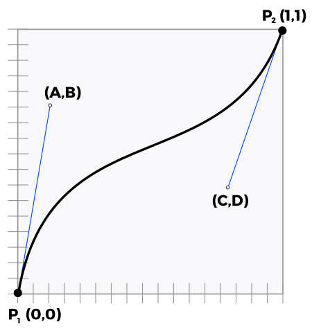

# Propiedades Avanzadas

## selectores avanzados

### Selector general de elementos hermanos

Su sintaxis es elemento1 ~ elemento2 y selecciona el elemento2 que es hermano de elemento1 y se encuentra detrás en el código HTML. Vamos a ver con un ejemplo al diferencia que hay con el adyacente.

```css
h1 + h2 {
  /* selector adyacente */
}

h1 ~ h2 {
  /* selector general de hermanos */
}
```

```html
<h1>...</h1>
<h2>...</h2>
<p>...</p>
<div>
  <h2>...</h2>
</div>
<h2>...</h2>
```

El primer selector (h1 + h2) sólo selecciona el primer elemento `<h2>` de la página, ya que es el único que cumple que es hermano de `<h1>` y se encuentra justo detrás en el código HTML. Por su parte, el segundo selector (h1 ~ h2) selecciona todos los elementos `<h2>` de la página salvo el segundo. Aunque el segundo `<h2>` se encuentra detrás de `<h1>` en el código HTML no son elementos hermanos, ya que no tienen el mismo elemento padre.

### Nuevos selectores de atributo

CSS3 permite combinar "=" con otros para hacer una selección más específica:

```css
p[name^="mi"] {
  font-size: 20px;
}
p[name$="mi"] {
  font-size: 20px;
}
p[name*="mi"] {
  font-size: 20px;
}
```

- La regla con el selector ^= será asignada a todo elemento <p> que contenga un atributo name con un valor que comience en "mi" (por ejemplo, "mitexto","micasa").
- La regla con el selector $= será asignada a todo elemento <p> que contenga un atributo name con un valor que acabe en "mi" (por ejemplo "textomi","casami").
- La regla con el selector \*= será asignada a todo elemento <p> que contenga un atributo name con un valor que incluya el texto "mi" (en este caso, el texto podría también encontrarse en el medio, como en textomicasa"). En estos ejemplos usamos el elemento <p>, el atributo name, y una cadena de texto al azar como "mi", pero la misma técnica puede ser utilizada con cualquier atributo y valor que necesitemos.

### Elementos hijos

A continuación se muestra un pequeño resumen de estas pseudoclases:

| Pseudoclase        | Descripción                                                   |
| ------------------ | ------------------------------------------------------------- |
| :first-child       | Primer elemento hijo (de cualquier tipo).                     |
| :last-child        | Último elemento hijo (de cualquier tipo).                     |
| :nth-child(n)      | N-elemento hijo (de cualquier tipo).                          |
| :nth-last-child(n) | N-elemento hijo (de cualquier tipo) partiendo desde el final. |

Para ello, volvamos a utilizar una estructura en el ejemplo para ver donde están los elementos que seleccionamos.

#### Las pseudoclases de primer y último hijo

```html
<style>
  li:first-child {
    font-weight: bold;
    color: green;
  }
</style>

<ul>
  <li>Manzana</li>
  <li>Plátano</li>
  <li>Fresa</li>
  <li>Cereza</li>
  <li>Pera</li>
  <li>Kiwi</li>
  <li>Mango</li>
</ul>
```

Cuando se visualice este código, el primer ítem <li> (Manzana) se mostrará en verde y negrita.

#### La pseudoclase de primeros hijos

La pseudoclase :nth-child(x) permite apuntar a los x primeros hijos de un elemento padre.

```css
li:nth-child(2) {
  font-weight: bold;
  background-color: gold;
}
```

Siguiendo con el código html de arriba. Cuando se visualice este código, el segundo ítem `<li>` (Plátano) se mostrará con resaltado gold y en negrita.

El valor puede referirse a los hijos pares (`even`) o a los impares (`odd`).Veamos el ejemplo anterior con `li:nth-child(odd)`.

Cuando se visualice este código, los impares `<li>`(Manzana,Fresa,Pera,Mango) se mostrará con resaltado gold y en negrita.

El valor x también puede ser un cálculo en formato: an+b. n representa un valor que comienza por 0 y que se incrementa en 1 con cada paso, y puede ser positivo o negativo.

**Primer ejemplo :**

`:nth-child(n+3)` permite dejar al margen los dos primeros hijos.

Este es el cálculo:

1. 0+3=3, el tercer hijo,
2. 1+3=4, el cuarto hijo,
3. 2+3=5, el quinto hijo...

Cuando se visualice este código, los `<li>`(Cereza,Pera,Kiwi,Mango) se mostrará con resaltado gold y en negrita.

**Segundo ejemplo :**

`:nth-child(3n+1)` permite apuntar a un hijo de cada 3 comenzando por el primero.

Este es el cálculo:

1. (3x0)+1=1, el primer hijo,
2. (3x1)+1=4, el cuarto hijo,
3. (3x2)+1=7, el séptimo hijo,
4. (3x3)+1=10, el décimo hijo...

Cuando se visualice este código, los `<li>`(Manzana,Cereza,Mango) se mostrará con resaltado gold y en negrita

#### La pseudoclase de últimos hijos

La pseudoclase `:nth-last-child()` permite apuntar a los x últimos hijos de un elemento padre. Funciona del mismo modo que `:nth-child()`.

#### Las pseudoclases del primer y del último hijo de un tipo

Las nuevas pseudoclases :first-of-type y :last-of-type permiten apuntar al primer y al último elemento de un tipo especificado.

He aquí un ejemplo de la lista `<ul>` anterior, tomando como elementos de destino el primer y el último ítem `<li>`.

```css
li:first-of-type,
li:last-of-type {
  background-color: gold;
}
```

Cuando se visualice este código, los `<li>`(Manzana,Mango) se mostrará con resaltado gold.

#### Las pseudoclases de los primeros y los últimos hijos de un tipo

La pseudoclase `:nth-of-type()` permite apuntar al enésimo elemento de un tipo especificado. Los argumentos posibles son idénticos a los que hemos visto con la pseudoclase :nth-child().

He aquí un ejemplo, muy sencillo, con la aplicación de formato (`<strong> y <em>`) a determinadas palabras en un párrafo (`<p>`):

```css
strong:nth-of-type(2) {
  background-color: gold;
}
```

```html
<p>
  Donec ullamcorper <strong>nulla</strong> non metus auctor <em>fringilla</em>.
  Fusce dapibus, tellus ac cursus commodo, <strong>tortor</strong> mauris
  condimentum nibh, ut fermentum massa justo sit amet risus. Cum sociis natoque
  <strong>penatibus</strong> y magnis dis parturient montes.
</p>
```

El elemento `<p>` tiene como primer elemento hijo un `<strong>`, como segundo un `<em>`, como tercero y cuarto otro `<strong>`. Deseamos apuntar al segundo `<strong>`, y no al segundo elemento hijo.

La clase `:nth-last-of-type()` permite apuntar al enésimo último elemento de un tipo dado.

#### La pseudoclase de los elementos sin hermanos

La pseudoclase `:only-child` apunta a los elementos que no tienen hermanos.

Tomemos el ejemplo de un texto (`<p>`) en el que resaltamos algunos términos con `<strong>`. Deseamos destacar los párrafos que incluyen un único resalte `<strong>`. Este es el código de este ejemplo . El segundo párrafo `<p>` incluye dos `<strong>`; el primero, uno solo.

```css
strong:only-child {
  background-color: gold;
}
```

```html
<p>
  Donec sed odio dui. Aenean <strong>lacinia bibendum</strong> nulla sed
  consectetur.Donec id elit non mi porta gravida at eget metus. Nullam id dolor
  id nibh ultricies vehicula ut id elit.
</p>
<p>
  Nullam id dolor id <strong>nibh</strong> ultricies vehicula ut id elit. Cum
  sociis natoque penatibus et magnis dis parturient montes,
  <strong>nascetur</strong> ridiculus mus.
</p>
```

#### La pseudoclase de los elementos sin hermanos de un tipo

La pseudoclase `:only-of-type` apunta a los elementos de un tipo dado que no tienen hermanos.

Retomemos el anterior ejemplo el principio precedente añadiendo un resalte `<em>` en el primer párrafo.

El estilo modificado:

```css
strong:only-of-type {
  background-color: gold;
}
```

Con el estilo CSS anterior, el `<strong>` del primer párrafo ya no aparece con un fondo de color, ya que este párrafo contiene ahora dos resaltes. El `<strong>` no está solo; también hay un `<em>`. Con la pseudoclase `:only-of-type` ahora podemos especificar el tipo de elemento de forma aislada.

#### La pseudoclase de los elementos vacíos

La pseudoclase :empty apunta a elementos que están vacíos, que no contienen ningún elemento. Esto puede resultar práctico si trabaja en una página web que se construye dinámicamente; puede incluir elementos (`<li>, <td>, <strong>...`) que están vacíos. Con esta pseudoclase es posible resaltarlas.

Veamos el siguiente ejemplo:

```html
li:empty { background-color: gold; }

<ul>
  <li>Manzana</li>
  <li>Plátano</li>
  <li></li>
  <li>Cereza</li>
  <li></li>
  <li>Kiwi</li>
  <li>Mango</li>
</ul>
```

Cuando se visualice este código, los `<li>`donde no haya nada o haya un comentario se mostrará con resaltado gold. **Ten cuidado que un espacio en blanco si que es contenido.**

#### La pseudoclase de negación

La pseudoclase de negación `:not` permite apuntar a todos los elementos HTML que no son el especificado.

```css
p:not(u)
 {
  background-color: gold;
  }
<p>
  Donec sed odio dui. Aenean <strong>lacinia bibendum</strong> nulla sed
  <u>consectetur</u>. Donec id elit non mi porta gravida at eget metus. Nullam
  id dolor id <em>nibh ultricies</em> vehicula ut id elit. Nullam id dolor id
  <strong>nibh</strong> ultricies vehicula ut id elit. Cum sociis natoque
  <u>penatibus</u> et magnis dis parturient montes, <em>nascetur</em> ridiculus
  mus.
</p>
```

En el párrafo `<p>`, hay tres tipos de formato: negrita (`<strong>`), cursiva (`<em>`) y subrayado (`<u>`). El selector va a apuntar, en el párrafo `<p>`, a todos los elementos hijos que no están subrayados `<u>: p :not(u)`. Todos estos elementos aparecerán con un fondo dorado.

Todos los elementos hijos tienen un fondo dorado, excepto los subrayados.

### Reglas CSS

Una **regla-at** es una declaración CSS que comienza con el símbolo arroba, '@' , seguido por un identificador, e incluye todo el contenido hasta el siguiente punto y coma, ';' , o el siguiente bloque CSS, lo que sea primero.

Hay varias **reglas-at**, designadas por sus identificadores, cada una con sintaxis distinta, veremos algunas de ellas.

#### La regla @import

Es una regla de CSS que permite cargar un fichero .css externo, leer sus líneas de código e incorporarlo al archivo actual. Estas reglas CSS se suelen indicar en las primeras líneas del fichero, ya que deben figurar antes de otras reglas CSS o contenido CSS similar.

La sintaxis de la regla @import es la siguiente:

```css
@import url;                      or
@import url list-of-media-queries;
```

Existen dos formas de cargar ficheros externos mediante la regla @import: utilizando la función url() o indicando simplemente un con el archivo o dirección URL:

| Formato                    | Descripción                                                |
| -------------------------- | ---------------------------------------------------------- |
| @import url("fichero.css") | Importa el fichero.css utilizando la función url() de CSS. |
| @import "fichero.css"      | Importa el fichero.css utilizando un string                |

Como se puede ver a continuación, se pueden utilizar tanto los nombres de los archivos, como rutas relativas o absolutas:

```css
@import url("menu.css"); /_ Fichero en la misma ruta _/
@import url("menu/sidebar.css"); /_ Ruta relativa, dentro de menu/ _/
@import "https://manz.dev/index.css"; /_ Ruta absoluta, URL completa _/
```

##### Importaciones condicionales

Existen tipos de importaciones condicionales que nos permitirá que esa hoja de estilos externa se descargue y procese sólo si estamos en un navegador que cumple las condiciones.

Observa como podemos indicar una media query, para que ese archivo .css se importe sólo en el caso de que se cumpla:

```css
@import url("mobile.css") screen and (max-width: 640px);
@import url("print.css") print;
```

En el primer caso, el archivo mobile.css se descargará sólo si se está utilizando una pantalla que tenga como máximo 640px de ancho, presumiblemente un dispositivo móvil. En el segundo caso, el archivo print.css se aplicará sólo si estamos imprimiendo con el navegador la página actual, de lo contrario, no se descargará ni se aplicará.

Esto es un mecanismo bastante interesante para reducir la cantidad de estilos CSS que se descargarán y procesarán.

Existe otra forma de importar condicionalmente código CSS, y es utilizando `supports` tras la url de nuestra regla `@import`. Esto permite que descarguemos y procesemos dicho archivo .css sólo si se cumple la condición del `supports`, basada en la regla `@supports`:

```css
@import url("flex-fallback.css") supports(not (display: grid));
@supports (display: grid) {
  /* ... */
}
```

En este caso, si estamos en un navegador antiguo que no soporta grid, descargará y procesará el fichero flex-fallback.css donde colocaremos los estilos alternativos (utilizando flex, por ejemplo). En el caso de que lo soporte, hará lo que tenemos en la regla @supports, que aunque se indica en este ejemplo, no tiene relación directa con el `@import` y no es obligatorio utilizarlo en conjunto.

#### La regla @media

La regla `@media` permite aplicar estilos de forma condicional, por ejemplo segun el ancho de la pantalla. Es la base del responsive design en CSS.

Sintaxis basica:

```css
@media (max-width: 768px) {
  /* reglas para pantallas pequenas */
}
```

Ejemplo sencillo: cambiamos un layout de dos columnas a una sola.

```css
.layout {
  display: flex;
  gap: 16px;
}
@media (max-width: 768px) {
  .layout {
    flex-direction: column;
  }
}
```

Si necesitas mas contexto practico, en la unidad de layout (UD2) tienes un ejemplo completo con flex y media queries.

### Modelo de caja

#### Bordes con imágenes

CSS3 permite crear bordes de fantasía en los que se incluyen imágenes; la imagen se repetirá en el borde siguiendo el motivo definido.

El sistema para utilizar imágenes en los bordes se denomina **9-slice** y se basa en delimitar una imagen trazando cuatro líneas (en rojo). Esto hará que la imagen quede dividida en 9 fragmentos, donde el fragmento central es descartado y el resto es utilizado de molde para los bordes de un elemento:


De esta forma, los fragmentos 1, 3, 7 y 9 se utilizarán para las esquinas y los fragmentos 2, 4, 6 y 8 se utilizarán para los bordes laterales, pudiendo expandirlos si se requiere y considera necesario con alguna de las propiedades que veremos a continuación.

Las propiedades que podemos utilizar para crear bordes con imágenes son las siguientes:

| Propiedad             | Descripción                                                                    |
| --------------------- | ------------------------------------------------------------------------------ |
| `border-image-width`  | Especifica el grosor de la imagen utilizada para el borde.                     |
| `border-image-source` | Imagen a utilizar para los bordes con imágenes mediante la técnica 9-slice.    |
| `border-image-slic`e  | Distancia donde se hace el punto de corte en la imagen.                        |
| `border-image-outset` | Tamaño en el que el borde crece hacia fuera. Una especie de padding del borde. |

Ahora vamos a detallar algunas de las propiedades más difíciles de comprender.

##### La propiedad border-image-slice

La propiedad `border-image-slice` define el desplazamiento de las líneas divisorias de la imagen, o lo que es lo mismo, el tamaño de los bordes. Por defecto, el valor es de 100% (tamaño de ancho completo de la imagen), pero también podemos usar números sin unidad , que simbolizan píxeles de recorte. Se pueden especificar 1, 2, 3 ó 4 parámetros.

| Propiedad                      | Valor              |
| ------------------------------ | ------------------ |
| `border-image-slice` (1,2,3,4) | 100% ,number, fill |

Por otro lado, añadiendo la palabra clave opcional fill, indicaremos que queremos rellenar el elemento con el fondo del fragmento **5**, que por defecto es descartado. Útil en casos que quieras aprovechar el fondo.

En nuestro caso, nos podría valer tanto con 110 (110 píxeles de recorte) como con 23%, ya que es más o menos la cantidad apropiada para establecer el límite tanto de ancho como de alto.

##### La propiedad border-image-repeat

La forma en que se repite la imagen se puede variar mediante la propiedad `border-image-repeat`:

| Propiedad             | Valor                   | Significado                                              |
| --------------------- | ----------------------- | -------------------------------------------------------- |
| `border-image-repeat` | [repetición en X e Y]   | 1 parámetro. Comportamiento de repetición en ambos ejes. |
|                       | [rep. en X] [rep. en Y] | 2 parámetros. Comportamiento de repetición por separado. |

Con dicha propiedad se establece como deben comportarse los fragmentos del borde y el tipo de repetición que deben efectuar. Se puede usar la modalidad de un parámetro en la que se aplica a todos los bordes, o la modalidad de dos parámetros donde estableces diferente comportamiento para los bordes horizontales y verticales.

Esta propiedad puede tomar los siguientes valores:

| Valor   | Significado                                                                                   |
| ------- | --------------------------------------------------------------------------------------------- |
| stretch | Los bordes se estiran hasta rellenar el área. Es el valor por defecto.                        |
| repeat  | Los bordes se repiten hasta rellenar el área.                                                 |
| round   | Igual que repeat, pero estira los fragmentos individualmente hasta rellenar el área completa. |
| space   | Igual que repeat, pero añade espacios hasta rellenar el área completa.                        |

Para verlo más claramente, echemos un vistazo a este [link](https://css-tricks.com/almanac/properties/b/border-image/).

### Colores y fondos

#### Gradientes

##### Gradientes Lineales

La sintaxis de linear-gradient(), a utilizar debe ser una de las siguientes:

| Función y modalidad                                                   | Significado                                            |
| --------------------------------------------------------------------- | ------------------------------------------------------ |
| `linear-gradient(color ,color , ... )`                                | Gradiente de colores (hacia abajo).                    |
| `linear-gradient(direction ,color ,color , ... )`                     | Gradiente con dirección específica.                    |
| `linear-gradient(direction ,color size ,color size, ... )`            | Gradiente indicando donde comienza a cambiar el color. |
| `linear-gradient( direction ,color size size ,color size size, ... )` | Gradiente indicando inicio y fin de cada color.        |

Pero hay otros parámetros que se pueden indicar para hacer gradientes más flexibles y personalizables a parte de la lista de colores. Son los siguientes parámetros:

| Parámetros      | Valor                                                                                            |
| --------------- | ------------------------------------------------------------------------------------------------ |
| direction       | Dirección que tendrá el gradiente lineal. El valor por defecto es to bottom.                     |
| Angle           | La dirección también se puede indicar con un número de grados. Alternativa a la opción anterior. |
| color           | Uno de los colores del gradiente                                                                 |
| color size      | Opcional: Se puede indicar a que altura se encuentra el centro del color que lo precede.         |
| color size size | Opcional: Se puede indicar a que altura comienza y acaba el color que lo precede.                |

La dirección del gradiente se puede establecer con ángulos predefinidos. Como nos muestra la siguiente imagen:


Un ejemplo de su utilización es el siguiente:

```css
.element {
  /* Básico, con colores con distancias equilibradas */
  background: linear-gradient(to right, black, blue, gold, green, red);

  /* Equivalente al anterior */
  background: linear-gradient(
    to right,
    black 0%,
    /* Color 100% negro en el punto 0% y comienza a cambiar */ blue 25%,
    /* Color 100% azul en el punto 25% y comienza a cambiar */ gold 50%,
    /* Color 100% dorado en el punto 50% y comienza a cambiar */ green 75%,
    /* Color 100% verde en el punto 75% y comienza a cambiar */ red 100%
      /* Color 100% rojo en el punto 100% */
  );
}
```

En el siguiente [link](https://developer.mozilla.org/en-US/docs/Web/CSS/gradient/linear-gradient) podemos ver muchos más ejemplos.

**Los valores también pueden indicarse con porcentajes .**

##### Gradientes radiales

Tenemos diferentes modalidades. Como mínimo, debemos escoger una forma específica entre **circle y ellipse** (por defecto se usará ellipse), y los colores del gradiente a utilizar.

Las diferentes modalidades:

| Función y modalidad                                                          | Significado                              |
| ---------------------------------------------------------------------------- | ---------------------------------------- |
| `radial-gradient(color,color , ...)`                                         | Gradiente básico entre colores.          |
| `radial-gradient(forma,color ,color , ...)`                                  | Gradiente con forma circular o elíptica. |
| `radial-gradient(forma size ,color ,color , ...)`                            | Gradiente con tamaño o dimensión.        |
| `radial-gradient(forma size at ubicación, color,color , ...)`                | Gradiente con colocación inicial.        |
| `radial-gradient(forma at ubicación,color size , color size , ...)`          | Gradiente con tamaños entre colores.     |
| `radial-gradient(forma at ubicación, color size size, color size size, ...)` | Gradiente con tamaños de inicio y fin.   |

Veamos el siguiente ejemplo:

```css
div {
  width: 400px;
  height: 400px;
  border: 1px solid black;
  /* Modalidad básica */
  background: radial-gradient(gold, red, black);

  /* Gradiente elíptico */
  background: radial-gradient(ellipse, gold 50%, red 55%, black 75%);

  /* Gradiente circular */
  background: radial-gradient(circle 200px, gold 50%, red 55%, black 75%);

  /* Gradiente circular con posición */
  background: radial-gradient(
    circle 400px at left,
    gold 50%,
    red 55%,
    black 75%
  );
}
```

Hemos cambiado de forma, tamaño y color. Pero ahora nos fijamos en la posición de inicio del degradado.

A cualquiera de las formas del gradiente se le puede indicar una posición específica para colocarlo en el fondo. Para ello, solo tenemos que indicar la palabra **clave at**, seguido del lugar donde queremos colocarlo:

| Parámetros  | Valor                                                                                    |
| ----------- | ---------------------------------------------------------------------------------------- |
| size,size   | Indica la ubicación en x e y de la forma del gradiente, por ejemplo, con porcentajes.    |
| [ubicación] | center , top , left , right , bottom , top left , top right , bottom left , bottom right |

Existe un tercer tipo de gradiente en CSS, visualmente muy similar al gradiente radial, pero haciendo referencia a una figura cónica **vista desde un plano superior**, incluyendo sus sombras y brillos.
`conic-gradient()`

Su sintaxis es la siguiente:

| Función y modalidad                                                    | Significado                               |
| ---------------------------------------------------------------------- | ----------------------------------------- |
| conic-gradient(color,color , ...)                                      | Gradiente básico entre colores.           |
| conic-gradient(from Angle,color size ,color size , ...)                | Gradiente indicando posición de color.    |
| conic-gradient(from at ubicación,color size ,color size, ...)          | Gradiente indicando ubicación del inicio. |
| conic-gradient(from at ubicación,color size size ,color size size ...) | Gradiente con posición de inicio y fin.   |

Recuerda que es posible indicar varios tipos de unidades de los ángulos, entre las que se encuentran **grad, rad o turn, a parte de deg**.

Además que la posición la podemos indicar con los siguientes valores:

| Parámetros  | Valor                                                                                    |
| ----------- | ---------------------------------------------------------------------------------------- |
| size        | Indica la ubicación en x e y de la forma del gradiente, por ejemplo, con porcentajes.    |
| [ubicación] | center , top , left , right , bottom , top left , top right , bottom left , bottom right |

Veamos el siguiente ejemplo:

```css
div {
width: 600px;
height: 400px;

/_ Gradiente cónico que comienza arriba, centrado en horizontal _/
background-image: conic-gradient(at 50% 0%, blue, black);
}
```

### Fuentes

Veamos el siguiente ejemplo con la problemática que hay

```css
p {
  font-family: Vegur, Georgia, "Times New Roman", sans-serif;
}
```

Las tipografías especificadas en CSS mediante la propiedad font-family deben estar instaladas en el sistema donde se visualiza la página web. De lo contrario, no se visualizarán.

En el ejemplo se irá probando desde la izquierda a derecha que fuente está instalada. Recordemos que la última Times New Roman es de Windows. ¿Qué pasa si el usuario está utilizando un SO Linux o Mac?.Ese usuario,finalmente, utilizaría la tipografía segura «sans-serif» y cargará una tipografía sin serifa.

Además, muchas tipografías genéricas tienen derechos de autor y no se deberían utilizar en nuestra página web si no hemos pagado su licencia.

#### La regla @font-face

Esta regla permite descargar una fuente o tipografía de una página web, cargarla en el navegador y utilizarla en nuestras páginas aunque no esté instalada en el sistema.

De este modo, los diseñadores no quedan limitados al uso de fuentes genéricas. No obstante, ten siempre en cuenta estos tres grandes principios:

- La mayoría de las fuentes «profesionales» están sujetas a derechos de uso y difusión.
- Cuando «incrusta» una fuente tipográfica, se incorpora al archivo todo el juego de caracteres, lo que puede hacer que sus páginas pesen considerablemente más.
- Por lo general, el antialiasing (un método que evita que los caracteres se vean
  pixelados) no se aplica a las páginas web.

Ahora hemos de enfrentarnos al problema de la compatibilidad de los formatos de fuentes tipográficas con las distintas versiones de los navegadores.

He aquí los formatos de fuentes reconocidos por los navegadores:

- TrueType: extensión .ttf.
- OpenType: extensión .otf.
- Web Open Font: extensión .woff y woff2
- SVG Font: extensión .svg y .svgz.
- Embed OpenType: extensión .eot. Pero cuidado: es un formato propietario de Microsoft y, por lo tanto, solo compatible con Internet Explorer.

Estas son las compatibilidades con los formatos .ttf y .otf (http://caniuse.com/#feat=ttf) según el sitio Can I use. Y estas son las compatibilidades con el formato .woff (http://caniuse.com/#feat=woff).

Además de la compatibilidad tenemos que saber, que no todos los formatos tienen el mimos peso en los archivos. Por ejemplo, el formato woff2 el que genera archivos de menos peso. Generalmente se tendrá el archivo ttf y este lo tendremos que transformar en los distintos formatos. Hay una [página] (https://transfonter.org/) que los convierte por nosotros.

Veamos un ejemplo de como se puede utilizar:

```css
@font-face {
  font-family: "Open Sans";
  font-style: normal;
  font-weight: 400;
  src: local("Open Sans"), url("/fonts/opensans.woff2") format("woff2"), url("/fonts/opensans.woff")
      format("woff"), url("/fonts/opensans.ttf") format("truetype"), url("/fonts/opensans.otf")
      format("opentype");
}
```

La regla @font-face suele colocarse al principio del fichero CSS para avisar al navegador que vamos a utilizar una tipografía que es muy posible que no tenga instalada. En el hemos definido varios sources, no significa que va a descargar todos los ficheros, si no que la primera que encuentra en el listado y que es compatible será la que utiliza. En este caso buscará en el sistema la tipografia **Open Sans**.

Algunos sitios dónde podemos descargar fuentes:

- https://www.dafont.com/es/
- https://www.1001freefonts.com/
- https://dribbble.com/tags/font
- https://fonts.google.com/

#### Las fuentes en línea

Es muy común utilizar Google Fonts como repositorio proveedor de tipografías para utilizar en nuestros sitios web por varias razones:

- **Gratuitas:** Disponen de un amplio catálogo de fuentes y tipografías libres y/o gratuitas.
- **Cómodo:** Resulta muy sencillo su uso: Google nos proporciona un código y el resto lo hace él.
- **Rápido:** El servicio está muy extendido y utiliza un CDN,

> > A partir de Chrome 86+ (finales de 2020), este y otros navegadores han comenzado a cambiar su política de caché, que elimina la ventaja de velocidad de CDN que se venía utilizando hasta ahora.

Puede utilizar los filtros que aparecen a la derecha de la pantalla para elegir una fuente.

Seleccionamos una fuente y nos aparecerá las especificaciones de esta, en una nueva pantalla. Que nos indica :

- La sintaxis que se ha de utilizar para enlazar esta fuente tipográfica a las páginas web.
- La sintaxis que se ha de usar en las reglas CSS
- El impacto de carga de la página.

Ejemplo, una vez que hemos seleccionado la fuente que queremos:

```html
<!DOCTYPE html>
<html lang="es">
  <head>
    <title>Las fuentes de Google</title>
    -40-
    <meta charset="UTF-8" />
    <link href=’http://fonts.googleapis.com/css? family=Pacifico’
    rel=’stylesheet’ type=’text/css’>
    <style>
      h1,
      h2 {
        font-family: ’Pacifico’, cursive;
      }
    </style>
  </head>
  <body>
    <h1>Título de mi página</h1>
    <h2>Subtítulo</h2>
    <p>Donec ullamcorper nulla...</p>
  </body>
</html>
```

#### Propiedades avanzadas

Se trata de algunas propiedades específicas para controlar la forma en la que se ven o aparecen las tipografías en la página.

##### Compactación de la tipografía

Con la propiedad `font-stretch` podemos definir el grado de compactación o expansión de los carácteres de la tipografía, desde valores muy condensados (para ocupar menos espacio) a valores muy expandidos (para ocupar más espacio):

| Propiedad      | Valor                                                                                                                              |
| -------------- | ---------------------------------------------------------------------------------------------------------------------------------- |
| `font-stretch` | ultra-condensed , extra-condensed , condensed , semi-condensed , normal semi-expanded , expanded , extra-expanded , ultra-expanded |
| `font-stretch` | size                                                                                                                               |

También se puede especificar el tamaño, por ejemplo en porcentajes. Para que la propiedad `font-stretch` funcione correctamente, la tipografía seleccionada debe poseer una versión «condensada» o «expandida» para así poderla aplicar.

##### Ajuste de tamaño

Con la propiedad `font-size-adjust` podemos ajustar el tamaño de la tipografía indicando la diferencia de tamaño entre la x minúscula y la X mayúscula. Con esta característica, podemos conseguir reducir la proporción de tamaño entre mayúsculas y minúsculas de nuestros textos, si consideramos que no es adecuada:

| Propiedad          | Valor        | Significado                                                            |
| ------------------ | ------------ | ---------------------------------------------------------------------- |
| `font-size-adjust` | none ,number | Ajusta el aspecto de los carácteres (diferencia de tamaño entre x y X) |

Por defecto, el valor de esta propiedad es none, que establece el tamaño indicado por el diseñador de la tipografía.**Ojo a la compatibilidad, ya que es una característica que aún está en fase experimental**

### Efectos

#### Filtros CSS

Los filtros de CSS nos proporcionan un amplio abanico de funciones, listas para utilizar mediante la propiedad filter y aplicarlas a los elementos que queramos de nuestra página. Estos filtros permiten alterar los colores, tonalidades o diferentes aspectos visuales, tal como se harían desde un programa de diseño gráfico:

| Función      | Significado                       | Valor          | Mínimo             | Máximo             | >100%  |
| ------------ | --------------------------------- | -------------- | ------------------ | ------------------ | ------ |
| `grayscale`  | Escala de blanco y negro          | percent,numero | 0% (sin cambios)   | 100% = Grayscale   | = 100% |
| `blur`       | Grado de desenfoque Gausiano      | size           | 0px (sin cambios)  |                    |
| `sepia`      | Grado de color sepia              | percent,numero | 0% (sin cambios)   | 100% = sepia       | = 100% |
| `saturate`   | Grado de saturación               | percent,numero | 0% = desaturado    | 100% (sin cambios) | Sí     |
| `opacity`    | Grado de transparencia            | percent,numero | 0% = invisible     | 100% (sin cambios) | = 100% |
| `brightness` | Brillo                            | percent,numero | 0% = negro         | 100% (sin cambios) | Sí     |
| `contrast`   | Contraste                         | percent,numero | 0% = gris          | 100% (sin cambios) | Sí     |
| `hue`        | -rotate Rotación de color (matiz) | Angle          | 0deg (sin cambios) |                    |        |
| `invert`     | Invertir                          | percent,numero | 0% (sin cambios)   | 100% = invertido   | = 100% |

Observa que las funciones de filtros g`rayscale(), sepia(), saturate(), opacity(), brightness(), contrast() e invert()` toman un ó un como valor, esto ocurre porque es posible proporcionar dicho valor de dos formas diferentes.

> > Así pues, indicar filter: contrast(0.5) sería lo mismo que indicar filter: contrast(50%).

Cuando utilizamos la función `hue-rotate()`, proporcionaremos como parámetro una cantidad de ángulos. Esa cantidad realiza una rotación de colores (hue-rotate) que se puede ver facilmente si observamos una rueda de colores. El número de grados definido por parámetro especifica la rotación aplicada a los colores:


En el siguiente [link](https://desarrolladoresweb.org/css3/filtros-css3/) tenemos algunos ejemplos.

#### Fusión de dos elementos

Los filtros aveces se quedan cortos por lo que se creo la fusión de dos elementos. Se realiza sumando la información de color de los píxeles de cada uno de ellos.

Mediante las propiedades mix-blend-mode y background-blend-mode podemos utilizar modos de fusión en los diferentes elementos que seleccionemos en una página web, aplicando composición para mezclar los colores, superponiendo dos elementos, consiguiendo una variación como resultado final.

Dichas propiedades son las siguientes:

| Propiedad             | Valor        | Significado                                        |
| --------------------- | ------------ | -------------------------------------------------- |
| mix-blend-mode        | normal,blend | Aplica un modo de fusión específico a un elemento. |
| background-blend-mode | normal,blend | Aplica un modo de fusión específico a un fondo.    |
| isolation             | auto,isolate | Establece si un elemento debe aislarse del resto.  |

La diferencia entre ambas propiedades es que la primera de ellas, mix-blend-mode, se utiliza para elementos, mientras que la segunda, background-blend-mode, se utiliza para aplicar modos de fusión en fondos. Por ejemplo, usándola con una imagen:

```css
body {
  background: green;
}

img {
  mix-blend-mode: multiply;
}
```

El resuiltado del anterior ejemplo aplicado a una imagen será:


Entre los diferentes modos de fusión que podemos utilizar en dichas propiedades, se encuentran las siguientes:

- **multiply (multiplicar)**
- **screen (trama)**
- **overlay (superponer)**
- **darken (oscurecer)**
- **lighten (aclarar)**
- **color-dodge (sobreexponer color)**
- **color-burn (subexponer color)**
- **hard-light (luz fuerte)**
- **soft-light (luz suave)**
- **difference (diferencia)**
- **exclusion (exclusión)**
- **hue (tono)**
- **saturation (saturación)**
- **color**
- **luminosity (luminosidad)**

En el siguiente [link](https://developer.mozilla.org/en-US/docs/Web/CSS/mix-blend-mode) tenemos algunos ejemplos.

### Mascaras y recortes

#### La propiedad clip-path

La propiedad clip-path permite realizar un recorte con una forma concreta, ocultando toda la región externa del recorte.

La sintaxis de la propiedad es la siguiente:

| Propiedad   | Valor                          | Descripción                                |
| ----------- | ------------------------------ | ------------------------------------------ |
| `clip-path` | none,shape, url(file.svg#name) | Efectua un recorte con una forma concreta. |

La propiedad `clip-path` en general puede tomar 3 tipos de valores: none, el valor por defecto, donde no utilizamos ningún tipo de recorte (o lo desactivamos si lo había), un valor shape , es decir, una forma básica específica de las que veremos a continuación, o usar url(), donde indicamos una imagen SVG para utilizar un recorte personalizado usado en su interior mediante <clipPath>.

Dentro de los valores podemos utilizar cualquiera de los siguientes:

| Valores                                     | Descripción                                                           |
| ------------------------------------------- | --------------------------------------------------------------------- |
| `inset(top right bottom left)`              | Recorta en forma rectangular hacia dentro.                            |
| `inset(top right bottom left round radius)` | Idem al anterior, con bordes redondeados, tamaño radius.              |
| `circle(size at x y)`                       | Recorta en forma circular con un tamaño size con centro en x,y.       |
| `ellipse(sx sy at x y)`                     | Idem al anterior, pero diferenciando tamaño de ancho sx y de alto sy. |
| `polygon(x y, x y, ...)`                    | Recorta un polígono siguiendo las coordenadas establecidas.           |
| `path(coords)`                              | Recorta siguiendo los datos de un trayecto SVG.                       |

Veamos como funcionan cada una de estas funciones de formas básicas.

En el siguiente ejemplo:

```css
img {
  clip-path: inset(0 0 50% 50%);
}
```

`inset(0% 0% 50% 50%)` parte desde el 0% de la parte superior, desde el 0% de la parte derecha, desde la mitad (50%) de la parte inferior y desde la mitad (50%) de la parte izquierda y el resultado es un trozo de la imagen
.
.

Además podemos redondear las esquinas de la imagen 50px con el siguiente código:

```css
img {
  clip-path: inset(400px round 20px);
}
```

Vemos como queda:


Observa que en este caso, hemos establecido sólo un valor para los parámetros, es decir, equivalente a inset(400px 400px 400px 400px), pero además incluimos round 20px, por lo que va a establecer un border-radius de 20px en cada esquina, es decir, algo similar a border-radius: 20px 20px 20px 20px.

En los siguientes ejemplos vamos a utilizar el método de recorte con ellipse y circle.

Con circle:

```css
img {
  clip-path: circle(50% at 50% 0);
}
```

Así pues, en este caso, observa que indicamos `circle(50% at 50% 0)`. El primer parámetro indica el tamaño del recorte en forma de círculo (50%), y las coordenadas después de at es el punto central del círculo: 50% en x y 0% en y. Quedaría algo así:


Y si utilizamos una elipse en lugar de un circulo, tenemos que asignarle el alto y ancho.

Con elipse:

```css
img {
  clip-path: circle(50% at 50% 0);
}
```

Quedaría algo así:


Ahora vamos a utilizar **el recorte poligonal utilizando `polygon()`**. Su funcionamiento es muy sencillo, pero a la vez muy flexible, simplemente hay que indicar los puntos de corte deseados e iremos realizando el recorte:

```css
img {
  clip-path: polygon(0 0, 100% 0, 50% 100%);
}
```

Y quedaría de la siguiente manera:


En este ejemplo, `polygon()` tiene 3 puntos de corte separados por comas (cada uno con sus coordenadas en X e Y), formando un triángulo, pero se pueden indicar tantos puntos de corte como se quiera (incluso con valores negativos o superiores a 100%).

En los siguientes ejemplos vamos a utiliza la función `path()`. Con ella, podemos definir un trayecto SVG para aplicar como recorte, consiguiendo formas mucho más complejas, imposibles (o muy difíciles) de conseguir con sólo HTML/CSS.

```css
<div class="box" > </div > .box {
  width: 300px;
  height: 300px;
  background: url("./img/baby-g05963ce70_1920.jpg") center / cover;
  clip-path: path(
    "m4,87l93,0l29,-84l29,84l93,0l-76,52l29,84l-76,-52l-76,52l29,-84l-76,-52z"
  );
}
```

Con lo que quedaría de la siguiente manera:


Además de las formas básicas, también podemos utilizar código SVG (o una imagen SVG externa) que contengan una definición de un elemento `<clipPath>`. De esta forma, desde CSS le indicamos que utilice dicho recorte en una zona de nuestra página, pudiendo ayudarnos de SVG para hacer formas mucho más específicas.

La sintaxis es la siguiente, donde se hace referencia a un fichero externo mediante url():

| Valores            | Descripción                                                   |
| ------------------ | ------------------------------------------------------------- |
| url(#name)         | Recorta una forma siguiendo un <clipPath> SVG con el id name. |
| url(file.svg#name) | Idem al anterior, pero desde un fichero SVG externo file.svg. |

Así pues, un ejemplo podría ser el siguiente:

```html
<svg> <clipPath id="shape1"
  > <path
  d="M 0,0 H 29 L 7,26 H 58 L 34,0 H 65 V 72 L 32,100 0,72 Z"
  /
  > </clipPath
  > </svg
  > <div
  class="box"
  > </div
  > <style
  > .box {
  background: hotpink;
  width: 200px;
  height: 200px;
  clip-path: url(#shape1);
}
```

Además de las formas básicas, también podemos utilizar código SVG (o una imagen SVG externa) que contengan una definición de un elemento `<clipPath>`. De esta forma, desde CSS le indicamos que utilice dicho recorte en una zona de nuestra página, pudiendo ayudarnos de SVG para hacer formas mucho más específicas.

La sintaxis es la siguiente, donde se hace referencia a un fichero externo mediante url():

| Valores              | Descripción                                                     |
| -------------------- | --------------------------------------------------------------- |
| `url(#name)`         | Recorta una forma siguiendo un `<clipPath>` SVG con el id name. |
| `url(file.svg#name`) | Idem al anterior, pero desde un fichero SVG externo file.svg.   |

Observa que en la primera de ellas no se indica el nombre del fichero SVG, sino que solamente se indica el identificador del elemento, es decir, el nombre del id del elemento a referenciar. En este caso, se buscará el `<clipPath>` en un código SVG en línea en el propio documento HTML.

En el segundo caso, indicamos tanto el nombre del fichero .svg como el id, por lo tanto, buscará el `<clipPath>` con el id indicado en un archivo externo.

Así pues, un ejemplo podría ser el siguiente:

Con el html:

```html
<svg>
  <clipPath id="shape1">
    <path d="M 0,0 H 29 L 7,26 H 58 L 34,0 H 65 V 72 L 32,100 0,72 Z" />
  </clipPath>
</svg>

<div class="box"></div>
```

Y el css

```css
.box {
  background: hotpink;
  width: 200px;
  height: 200px;
  clip-path: url(#shape1);
}
```

De esta forma, hemos indicado que utilice el recorte del fichero .svg con el id shape1. En el caso de tenerlo en un fichero .svg externo, simplemente habría que indicar el nombre antes del id: `url(file.svg#shape1).`

> > Al realizar recortes, toda la región que quede fuera del mismo no se dibujará en el navegador. En Clippy (BennettFeely) tienes una fantástica herramienta para crear recortes personalizados de forma gráfica y rápida.

### Animaciones CSS

#### Transiciones

Las transiciones se basan en un principio muy básico: conseguir un efecto suavizado entre un **estado inicial y un estado final** al realizar una acción. Cambiando una propiedad en un periodo de tiempo.

En la propiedad transition el orden es irrelevante siempre y cuando tenga el número de duración especificado antes del número de retardo.

| Propiedades                | Descripción                                  | Valor                      |
| -------------------------- | -------------------------------------------- | -------------------------- |
| transition-property        | Propiedades CSS afectadas por la transición. | all , none , propiedad css |
| transition-duration        | Tiempo de duración.                          | 0,time                     |
| transition-timing-function | Ritmo de la transición.                      | Ver funciones de tiempo    |
| transition-delay           | Tiempo de retardo inicial.                   | 0,time                     |

Ejemplo:

```css
a {
  background: #ddd;
  color: #222;
  padding: 8px;
}

a:hover {
  background: #fff;
  color: #666;
  padding: 25px;
  border: 1px solid #888;

  transition-property: all;
  transition-duration: 0.5s;
  transition-timing-function: linear;
}
```

En este ejemplo, con all hemos determinado animar todas las propiedades que cambien:

- La propiedad `background` de color de fondo cambiará de #ddd a #fff
- La propiedad `color` de color de texto cambiará de #222 a #666
- La propiedad `padding` del tamaño del relleno cambiará de 8px a 25px
- La propiedad `border` cambiará de 0 a 1px solid #888.

Este último es un caso especial, puesto que cambia de estilos porque toma el estilo inicial por defecto, que es un borde de 0px de grosor. Cada una de estas transiciones se realizarán a un ritmo lineal, durante 0.5s de duración.

Vamos a ver un ejemplo mas complicado. En el ejemplo se realiza una **transición de lugar**. Cogemos el botón y cuando pasemos el ratón por encima(hover) cambia el color y su contenido.


Veamos el código:

```html
<section>
  <a class="btn">
    <span class="top content"> ¡compralo ahora! </span>
    <span class="bottom content"> por solo 59€ </span>
  </a>
</section>
<style>
  .btn {
    background-color: #00a0d6;
    color: #fff;
    border-bottom: 4px solid rgba(0, 0, 0, 0.1);
    border-radius: 40px;

    font: 16px arial, sans-serif;
    transition: background-color 1s;
    /* transition: background-color 0.4s , color 0.4s ; */ /*más de una propiedad*/
    /* transition: all 0.4s; */
    position: relative;
    display: inline-block;
    line-height: 3;
    overflow: hidden;
    height: 50px;
    width: 200px;
    text-align: center;
  }
  .btn:hover {
    background-color: red;
  }
  span.content {
    display: block;
    width: 100%;
    text-align: center;
  }

  .content {
    position: absolute;
    transition: top 1s;
  }

  .top {
    top: 0px;
  }
  .bottom {
    top: 100px;
  }
  .btn:hover .top {
    top: -50px;
  }
  .btn:hover .bottom {
    top: 0px;
  }
</style>
```

En este ejemplo hemos utilizado el atajo `transition` y si te das cuenta lo hemos puesto en el estado inicial. Eso nos lleva a que no importa cuando lo pongamos al principo del estado o al final, si es la unica transición que qeremos hacer.

Sin enmbargo, podemos hacer transiciones de entrada como en las transiciones de salida. Veamos el siguiente ejemplo:

```css
a {
  background: black;
  color: white;
  padding: 8px;
  transition: background 0.2s linear;
}

a:hover {
  background: red;
  transition: background 2s linear;
}
```

En este caso, cuando mueves el ratón encima del enlace, la transición tardará 2 segundos en ponerse en rojo. Sin embargo, cuando quitemos el ratón del elemento, se producirá en 0.2 segundos ya que se efectua la transición del primer bloque.

#### Funciones del tiempo

Quizás, la forma más sencilla de indicar el ritmo de una animación, sería especificar una de las siguientes palabras clave que existen. Cada una de ella, realiza la animación a un ritmo diferente:

| Valor                      | Inicio | Transcurso | Final  | Equivalente en cubic-beizer      |
| -------------------------- | ------ | ---------- | ------ | -------------------------------- |
| `ease`                     | Lento  | Rápido     | Lento  | cubic-bezier(0.25, 0.1, 0.25, 1) |
| `linear`                   | Normal | Normal     | Normal | cubic-bezier(0, 0, 1, 1)         |
| `ease-in`                  | Lento  | Normal     | Normal | cubic-bezier(0.42, 0, 1, 1)      |
| `ease-out`                 | Normal | Normal     | Lento  | cubic-bezier(0, 0, 0.58, 1)      |
| `ease-in-out`              | Lento  | Normal     | Lento  | cubic-bezier(0.42, 0, 0.58, 1)   |
| `cubic-bezier(A, B, C, D)` | -      | -          | -      | Transición personalizada         |

Si no se indica ninguna función de tiempo concreta, CSS utilizará la función de tiempo `ease`.

La función de tiempo viene determinada por cuatro puntos de una función cúbica.



Todo esto se puede ver muy fácilmente utilizando la herramienta [Cubic Bezier](https://cubic-bezier.com/#.17,.67,.83,.67), donde puedes crear de forma interactiva el ritmo de las transiciones o animaciones, estableciendo visualmente los parámetros deseados.

#### Animation

Una vez conocemos las transiciones CSS, es muy fácil adaptarnos al concepto de animaciones CSS, el cual amplia lo que ya sabemos de transiciones, convirtiéndolo en algo mucho más flexible y potente, en el que no es necesario que el usuario interactue de alguna forma (cómo pasa en las transiciones).

Para crear animaciones CSS es necesario realizar **2 pasos**:

- Utilizar la propiedad animation (o derivadas) para indicar que elemento HTML vamos a animar.
- Definir mediante la regla @keyframes la animación en cuestión y su comportamiento.

Las propiedades correspondiente CSS:

| Propiedades                 | Descripción                               | Valor                                            |
| --------------------------- | ----------------------------------------- | ------------------------------------------------ |
| `animation-name`            | Nombre de la animación a aplicar.         | none ,nombre                                     |
| `animation-duration`        | Duración de la animación.                 | 0 ,time                                          |
| `animation-timing-function` | Ritmo de la animación.                    | Ver funciones de tiempo                          |
| `animation-delay`           | Retardo en iniciar la animación.          | 0 ,time                                          |
| `animation-iteration-count` | Número de veces que se repetirá.          | 1 , infinite ,number                             |
| `animation-direction`       | Dirección de la animación.                | normal , reverse , alternate , alternate-reverse |
| `animation-fill-mode`       | Como se quedará la animación al terminar. | none , forwards , backwards , both               |
| `animation-play-state`      | Estado de la animación.                   | running , paused                                 |

La propiedad `animation-name` permite especificar el nombre del fotograma (definido con la regla @keyframes que veremos más adelante) a utilizar. Por otro lado, las propiedades animation-duration, `animation-timing-function` y `animation-delay` funcionan exactamente igual que en el tema anterior de transiciones.

Es posible encadenar múltiples animaciones, separando con comas las animaciones individuales y estableciendo un tiempo de tardo a cada animación posterior:

```css
.animated {
  animation: move-right 5s linear 0s, /* Comienza a los 0s */ look-up 2.5s
      linear 5s, /* Comienza a los 5s */ move-left 5s linear 7.5s, /* Comienza a los 7.5s (5 + 2.5) */
      dissapear 2s linear 9.5s; /* Comienza a los 9.5s (5 + 2.5 + 2) */
}
```

#### La regla @keyframes.

Es una lista de lo que debe suceder durante el transcurso de la animación qué propiedades deben cambiar, cómo y cuándo.

Las partes principales por las que debemos comenzar son:

| Parte                          | Descripción                                                                 |
| ------------------------------ | --------------------------------------------------------------------------- |
| `@keyframes name`              | Regla para darle un nombre y definir los fotogramas clave de una animación. |
| `from , to , percentage, time` | Momento en el que se van a activar los estilos CSS en la animación          |

Con un ejemplo se ve mejor

```css
@keyframes change-color {
  from {
    background: red;
  } /* Primer fotograma */
  to {
    background: green;
  } /* Segundo y último fotograma */
}
.animated {
  background: grey;
  color: #fff;
  width: 150px;
  height: 150px;
  animation: change-color 2s ease 0s infinite;
  /* animation: <name> <duration> <timing-function> <delay>
                <iteration-count> <direction> <fill-mode> <play-state> */
}
```

Los selectores from y to son muy similares a colocar 0% y 100%. Vamos a añadir un fotograma intermedio e indentando, ahora sí, correctamente el código:

```css
@keyframes change-color {
  0% {
    background: red; /* Primer fotograma */
  }
  50% {
    background: yellow; /* Segundo fotograma */
    width: 400px;
  }
  100% {
    background: green; /* Último fotograma */
  }
}

.animated {
  background: grey;
  color: #fff;
  width: 150px;
  height: 150px;
  animation: change-color 2s ease 0s infinite;
}
```

> Si tienes fotogramas que van a utilizar los mismos estilos que uno anterior, siempre puedes separarlos con comas, por ejemplo: 0%, 75% { ... }, que utilizarían dichos estilos al inicio de la animación y al 75% de la misma

#### Otros ejemplos

- Rebote encadenado: tres bolas comparten el mismo `@keyframes bounce`, pero con `animation-delay` distintos para escalonar el salto:

```css
.bola { animation: bounce 1.5s ease-in-out infinite; }
.bola:nth-child(2) { animation-delay: 0.15s; }
.bola:nth-child(3) { animation-delay: 0.3s; }

@keyframes bounce {
  0%, 100% { transform: translateY(0) scale(1); }
  50% { transform: translateY(-110px) scale(1.05); }
}
```

- Efecto máquina de escribir: se anima el ancho (`width`) con `steps()` para simular que las letras aparecen a golpe de tecla y un cursor intermitente con otra animación:

```css
@keyframes escribir{
    0%{ width: 0; }
    40%,60%{ width: 36ch; }
    100%{ width: 0; }
}
@keyframes cursor{
    0%,40%{ border-color: transparent; }
    50%,100%{ border-color: #6cf0ff; }
}
.typewriter {
  max-width: 36ch;
  white-space: nowrap;
  border-right: 3px solid #6cf0ff;
  animation: escribir 6s steps(36) infinite, cursor 0.8s step-end infinite;
}
```

- Tarjeta giratoria 3D: el contenedor usa `transform-style: preserve-3d` y la cara trasera se rota 180º; al hacer hover se anima el giro en Y:

```css
.flip-card-inner { transform-style: preserve-3d; transition: transform 0.8s ease; }
.flip-card:hover .flip-card-inner { transform: rotateY(180deg); }
.flip-card-face.back { transform: rotateY(180deg); backface-visibility: hidden; }
```

- Progreso infinito y botón con latido: la barra desplaza un gradiente con `translateX` para simular carga y el botón late con escalado:

```css
.progress-fill { animation: loading 2.5s ease-in-out infinite; }
@keyframes loading { 0% { transform: translateX(-60%); } 50% { transform: translateX(0%); } 100% { transform: translateX(60%); } }
.pulse-btn { animation: latido 1.6s ease-in-out infinite; }
```

Puedes verlos funcionando en `docs/UD3/cssEjemplos/index.html` (y la copia en `docs/UD3/cssEjemplos/cssEjemplos/index.html`) junto con el resto de demos de la unidad.

### Transformaciones

Estas transformaciones se pueden efectuar en CSS mediante la propiedad `transform` que permite recibir una función de transformación determinada, la cuál será aplicada en el elemento HTML en cuestión seleccionado mediante CSS. Dicho elemento HTML se verá transformado visualmente.

Podemos realizar las siguientes transformaciones:


Si realizas más de una transformación en un mismo elemento con diferentes funciones, la herencia la que va a derteminar que transformación se aplica. Veamos un ejemplo:

```css
.element {
  transform: rotate(5deg); /* No hace efecto */
  transform: scale(2); /* Sobreescribe la anterior */
}
```

Para evitar este comportamiento, se pueden emplear múltiples transformaciones separándolas mediante espacio. En el siguiente ejemplo, aplicamos una función de rotación, una función de escalado y una función de traslación de forma simultánea:

```css
.element {
  transform: rotate(5deg) scale(2) translate(25px, 150px);
}
```

Otro detalle que conviene tener en cuenta a la hora de aplicar múltiples transformaciones es que **el orden de transformación importa**. No es lo mismo realizar una rotación y luego una translación, que la misma translación primero y luego la misma rotación.

#### La propiedad transform-origin

Nos permite cambiar el **punto de origen** de una transformación ya que por defecto es la **esquina superior izquierda**. Que podemos indicar, por ejemplo, con porcentajes, y que por defecto, está establecida a 50% 50%

Vemos un ejemplo, donde se ve claramente:

```css
.element {
  width: 50px;
  height: 150px;
  background: grey;

  transform-origin: 0% 0%;
  transform: translate(50px, 0) rotate(45deg);
}
```

#### Translaciones

Por ejemplo, la propiedad transform: translate(20px, -30px) traslada el elemento 20 píxeles a la derecha y 30 píxeles hacia arriba, que es equivalente a utilizar transform: translateX(20px) translateY(-30px).

<div class="page"/>

> > En las translaciones, si utilizamos los porcentages, podemos hacer referencia al propio tamaño del elemento. Por ejemplo, si indicamos transform: translateX(100%) estaremos desplazando horizontalmente exactamente el tamaño de ancho del elemento.

Además de realizar translaciones en 2D, podemos realizar animaciones en 3D con la misma función pero indicandole el eje z.

#### Rotaciones

Las funciones de rotación simplemente giran el elemento una cierta cantidad respecto al eje involucrado.

Por ejemplo, con `transform: rotate(5deg)` realizamos una rotación de 5 grados del elemento sobre si mismo. Utilizando `rotateX() y rotateY()` podemos hacer lo mismo respecto al eje X o el eje Y respectivamente.

> > Es posible que las rotaciones en X e Y no queden exactamente como buscas y parezcan simplemente más pequeñas o grandes (estiradas), ya que estamos haciendo una rotación 2D. En el apartado de perspectivas hablaremos más más sobre esto.

Para ver este resultado que te he comentado utiliza el siguiente ejemplo y ves cambiando los valores.

```css
.element {
  transform: rotateX(30deg);
}
```

#### Escalado

Las funciones de escalado son aquellas que realizan una transformación en la que aumentan o reducen el tamaño de un elemento. Para ello, las utilizaremos en el interior de la propiedad CSS transform y elegiremos una de las siguientes funciones de escalado.

Por ejemplo, la propiedad transform: scale(2, 0.5) realiza una transformación de escalado del elemento, ampliándolo al doble de su tamaño original en el eje X (horizontal) y a la mitad en el eje Y (vertical).

En el siguiente ejemplo podemos hacer un efecto mirror y darle la vuelta poniendo -1 en el valor. Si 1 representa a la imagen tal cual está, -1 es la imagen invertida.

```css
img {
  transform: scale(-1);
}
```

Veamos el resultado:


> > También es posible utilizar porcentajes en lugar de números. Por ejemplo, scale: 50% 100% sería equivalente a scale: 0.5 1.

Vamos a ver un ejemplo en el que se rota y escala un elemento:

Con el siguiente html:

```html
<section>
  <figure>
    
    
  </figure>
</section>
```

Y el css :

```css
#gorro {
  transform-origin: top;
  animation: swing 2s 2 ease-in-out, trasladarY 2s 4s ease,
    trasladarX 2s 4s ease;
}
@keyframes swing {
  0%,
  100% {
    transform: rotate(-30deg), scale(0.95);
  }
  20% {
    transform: scale(0.95);
  }
  50% {
    transform: rotate(30deg);
  }
}

@keyframes trasladarY {
  50% {
    transform: translateY(-100px);
  }
}
@keyframes trasladarX {
  50% {
    transform: translateX(100px);
  }
}
```

Para probarlo utiliza dos imagenes. Yo he cogido estas:


#### Deformaciones

Las funciones de deformación disponibles en CSS son las siguientes:

| Funciones     | Significado                                                                   |
| ------------- | ----------------------------------------------------------------------------- |
| `skewX(xdeg)` | Establece un ángulo de Angulo xdeg para una deformación 2D respecto al eje X. |
| `skewY(ydeg)` | Establece un ángulo de Angulo ydeg para una deformación 2D respecto al eje Y. |

Algunos ejemplos de uso de estas funciones, serían las siguientes:

```css
.element {
  transform: skewX(-5deg);
  transform: skewY(25deg);
  transform: skewX(5deg) skewY(15deg);
}
```

### Transformaciones 3D

Estas funciones, en la mayoría de los casos, no son más que la incorporación del eje Z a las anteriores que ya habíamos visto, además de la adición de una función de atajo 3D para poder utilizarlas todas de una sola vez.


Para utilizar transformaciones 3D es necesario conocer algunas propiedades derivadas de transformaciones, como por ejemplo, las siguientes:

| Propiedades        | Formato              | Significado                                                   |
| ------------------ | -------------------- | ------------------------------------------------------------- |
| `transform-style`  | `flat , preserve-3d` | Modifica el tratamiento 3D de los elementos hijos.            |
| `transform-origin` | posX,posY,posZ       | Cambia el punto de origen del elemento en una transformación. |

Por defecto, la propiedad `transform-style` está establecida a `flat`, o lo que es lo mismo, trata los elementos como elementos 2D, por lo que no podemos usar 3D, salvo que lo indiquemos expresamente con el valor preserve-3d

Cuando trabajamos con 3D en CSS, en muchas ocasiones es necesario dotar a nuestro trabajo de perspectiva. Con la propiedad perspective de CSS podemos establecer un **punto de fuga** con una cierta distancia:

| Propiedades          | Formato                     | Significado                                   |
| -------------------- | --------------------------- | --------------------------------------------- |
| `perspective`        | none ,size, distance        | Punto de fuga para los elementos hijos.,size, |
| `perspective-origin` | 50% 50% ,position posX posY | Punto de origen de la perspectiva.            |

La propiedad `perspective` nos permite darle un determinado punto de fuga al elemento hijo de un contenedor (debemos utilizarlo desde el contenedor padre), y se le aplica una cierta distancia, por ejemplo 400px.

Mediante la propiedad `perspective-origin` podemos cambiar el punto de origen de la perspectiva. Al margen de cantidades, por ejemplo, en píxeles, también podemos indicar o valores como top, bottom, left, right o center. Y con `backface-visibility`, podemos ocultar la cara «trasera» de un elemento, como explicaremos más adelante.

Veamos un pequeño ejemplo donde utilizamos `perspective`, este se puede ir disminuyendo y ampliando el valor, para ver como influye y se utilizan las propiedades 3d que hemos visto anteriormente:

```html
<section id="starwars">
  <div id="crawl">
    <h1>El Despertar de la Fuerza</h1>
    <p>
      Luke Skywalker ha desaparecido. En su ausencia, la siniestra PRIMERA ORDEN
      ha surgido de las cenizas del Imperio y no descansará hasta que Skywalker,
      el último Jedi, haya sido destruido. Con el apoyo de la REPÚBLICA, la
      General Leia Organa dirige una valiente RESISTENCIA. Desesperadamente
      busca a su hermano Luke con el fin de obtener su ayuda para restaurar la
      paz y la justicia en la galaxia. Leia ha enviado a su piloto más audaz en
      una misión secreta a Jakku, donde un viejo aliado ha descubierto una pista
      del paradero de Luke....
    </p>
  </div>
</section>
```

Con el siguinte css

```css
section#starwars {
  background-color: black;
  width: 1900px;
  height: 1400px;
  margin: 0 auto;
  perspective: 700px;
}
div#crawl {
  width: 80%;
  text-align: center;
  color: #fff;
  font-family: "Franklin Gothic Medium", sans-serif;
  font-size: 2rem;
  margin: 0 auto;
  transform: rotateX(40deg) translateY(1000px);
  animation: crawl 30s linear infinite;
}

@keyframes crawl {
  100% {
    transform: rotateX(50deg) translateY(-2000px);
  }
}
```

En el siguiente ejemplo hacemos que de vueltas dos imagenes superpuestas y uso de `backface-visibility` .

```css
 <div class="container">
      
      
    </div>

<style>
.container {
  width: 256px;
  height: 256px;
  position: relative;
  animation: spin 2s linear infinite;
  transform-style: preserve-3d;
  perspective: 400px;
}

.container img {
  width: 100%;
  height: 100%;
  position: absolute;
}

@keyframes spin {
  0% {
    transform: rotateY(0);
  }
  100% {
    transform: rotateY(360deg);
  }
}

</style>
```

Si nos fijamos en este ejemplo, hemos creado dos imágenes dentro de un contenedor. Ambas están posicionadas de forma que estarán **superpuestas** y si les aplicamos una animación que rote el contenedor en 360 grados sobre el eje Y, podremos comprobar que siempre veremos la **imagen B**, la última de ellas puesto que es la que tiene **preferencia** porque es la última que aparece en el orden de HTML.

Si ahora le añadimos la propiedad `backface-visibility` a `hidden`, ya que está por defecto a Visible, en la **imagen B**, entonces el navegador la ocultará cuando detecte que se encuentra en la cara posterior, simulando el 3D real:

```css
img.b-side {
  backface-visibility: hidden;
}
```
